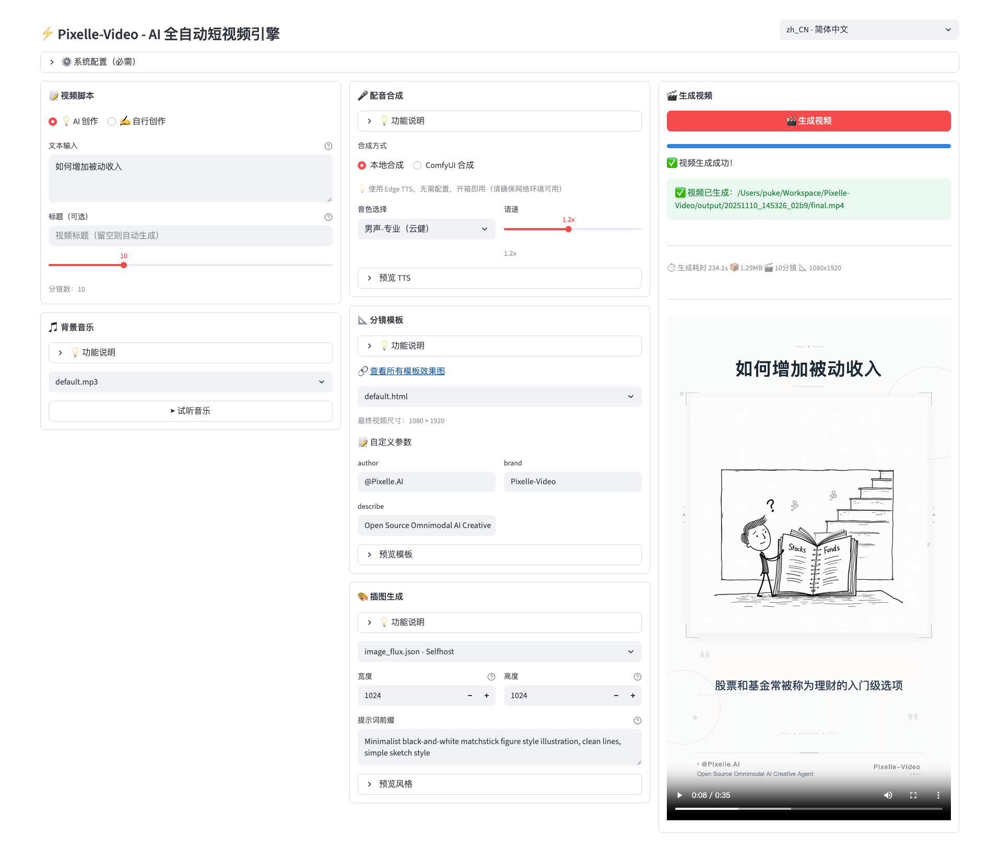

<h1 align="center">🎬 Pixelle-Video —— AI 全自动短视频引擎</h1>

<p align="center"><a href="README_EN.md">English</a> | <b>中文</b></p>

<p align="center">
  <a href="https://www.bilibili.com/video/BV1WzyGBnEVp/?vd_source=e7e7d4ca8db9a18c80f17a24a6582fca" target="_blank"></a>
  <a href="https://github.com/AIDC-AI/Pixelle-Video/releases" target="_blank"></a>
  <a href="https://aidc-ai.github.io/Pixelle-Video/zh" target="_blank"></a>
  <a href="https://github.com/AIDC-AI/Pixelle-Video/stargazers"></a>
  <a href="https://github.com/AIDC-AI/Pixelle-Video/issues"></a>
  <a href="https://github.com/AIDC-AI/Pixelle-Video/network/members"></a>
  <a href="https://github.com/AIDC-AI/Pixelle-Video/blob/main/LICENSE"></a>
</p>

https://github.com/user-attachments/assets/a42e7457-fcc8-40da-83fc-784c45a8b95d

<br/>

只需输入一个 **主题**，Pixelle-Video 就能自动完成：
- ✍️ 撰写视频文案  
- 🎨 生成 AI 配图/视频  
- 🗣️ 合成语音解说  
- 🎵 添加背景音乐  
- 🎬 一键合成视频  

**零门槛，零剪辑经验**，让视频创作成为一句话的事！


## 🖥️ Web 界面预览




## 📋 最近更新

> 📖 [查看完整更新日志](CHANGELOG.md) - 包含738+提交记录和详细功能说明

### 2026-04-26 最新功能
- ✅ **故事板生成合约** - 引入自动化分镜规划系统，支持从主题到完整视频的脚本生成 ([详情](CHANGELOG.md#2026-04-26-更新))
- ✅ **视频渲染后端架构** - 新增 ffmpeg 渲染后端选项，支持更灵活的渲染方式 ([详情](CHANGELOG.md#1-视频渲染后端架构设计))
- ✅ **模板视觉物化器** - 将视觉模板转换为可渲染的实际素材，支持动态元素 ([详情](CHANGELOG.md#4-模板视觉物化器))
- ✅ **标准语音时序合约** - 强制执行音频与视频内容的精确同步 ([详情](CHANGELOG.md#6-标准语音时序合约))

### 2026-04-25 重要更新
- ✅ **API 文件流和下载端点** - 支持大文件的高效传输，增强安全防护 ([详情](CHANGELOG.md#2026-04-25-更新))
- ✅ **任务分页列表** - 实现任务分页浏览，支持大量任务管理 ([详情](CHANGELOG.md#4-任务分页列表))
- ✅ **文本渲染安全合约** - 引入文本渲染安全机制，支持自定义字幕样式 ([详情](CHANGELOG.md#3-文本渲染安全合约))

### 2026-01 更新
- ✅ **2026-01-26**: 新增「动作迁移」模块，上传参考视频和图片进行动作迁移
- ✅ **2026-01-14**: 新增「数字人口播」和「图生视频」流水线，新增多语言 TTS 音色支持
- ✅ **2026-01-06**: 新增 RunningHub 48G 显存机器调用支持

### 2025-12 更新
- ✅ **2025-12-28**: 支持 RunningHub 并发限制可配置，优化 LLM 返回结构化数据的逻辑
- ✅ **2025-12-17**: 支持 ComfyUI API Key 配置，支持 Nano Banana 模型调用，API 接口支持模板自定义参数
- ✅ **2025-12-10**: 侧边栏内置 FAQ，锁定 edge-tts 版本修复 TTS 服务不稳定问题
- ✅ **2025-12-08**: 支持固定脚本多种分割方式(段落/行/句子)，优化模板选择交互逻辑支持直接预览选择
- ✅ **2025-12-06**: 修复视频生成 API 返回 URL 路径处理，支持跨平台兼容
- ✅ **2025-12-05**: 新增 Windows 整合包下载，优化图片与视频反推工作流
- ✅ **2025-12-04**: 新增「自定义素材」功能，支持用户上传自己的照片和视频，AI 智能分析生成脚本

### 2025-11 更新 (项目初期)
- ✅ **2025-11-18**: 优化 RunningHub 服务调用支持并行处理，新增历史记录页面，支持批量创建视频任务 ([详情](CHANGELOG.md#2025-11-18--2025-11-19-更新))
- ✅ **2025-11-12**: 分镜模板支持视频功能，WebUI 适配视频功能 ([详情](CHANGELOG.md#2025-11-12--2025-11-17-更新))
- ✅ **2025-11-07**: 项目初始化，核心架构搭建，Capability层重构 ([详情](CHANGELOG.md#2025-11-07--2025-11-11-更新))


## ✨ 功能亮点

- ✅ **全自动生成** - 输入主题，自动生成完整视频
- ✅ **AI 智能文案** - 根据主题智能创作解说词，无需自己写脚本
- ✅ **AI 生成配图** - 每句话都配上精美的 AI 插图
- ✅ **AI 生成视频** - 支持使用 AI 视频生成模型（如 WAN 2.1）创建动态视频内容
- ✅ **AI 生成语音** - 支持 Edge-TTS、Index-TTS 等众多主流 TTS 方案
- ✅ **背景音乐** - 支持添加 BGM，让视频更有氛围
- ✅ **视觉风格** - 多种模板可选，打造独特视频风格
- ✅ **灵活尺寸** - 支持竖屏、横屏等多种视频尺寸
- ✅ **多种 AI 模型** - 支持 GPT、通义千问、DeepSeek、Ollama 等
- ✅ **原子能力灵活组合** - 基于 ComfyUI 架构，可使用预置工作流，也可自定义任意能力（如替换生图模型为 FLUX、替换 TTS 为 ChatTTS 等）


## 📊 视频生成流程

Pixelle-Video 采用模块化设计，整个视频生成流程清晰简洁：


从输入文本到最终视频输出，整个流程简洁清晰：**文案生成 → 配图规划 → 逐帧处理 → 视频合成**

每个环节都支持灵活定制，可选择不同的 AI 模型、音频引擎、视觉风格等，满足个性化创作需求。


## 🎬 视频示例

以下是使用 Pixelle-Video 生成的实际案例，展示了不同主题和风格的视频效果：

### 📱 扩展模块视频展示

<table>
<tr>
<td width="33%">
<h3>👤 数字人口播</h3>
<video src="https://github.com/user-attachments/assets/7c122563-c2e0-4dcd-a73c-25ba1d4fa2dd" controls width="100%"></video>
<p align="center"><b>韩语数字人口播</b></p>
</td>
<td width="33%">
<h3>🖼️ 图生视频</h3>
<video src="https://github.com/user-attachments/assets/5b4eef17-07d0-4bde-9748-2ed68cc9888e" controls width="100%"></video>
<p align="center"><b>卡通视频</b></p>
</td>
<td width="33%">
<h3>💃 动作迁移</h3>
<video src="https://github.com/user-attachments/assets/7b1240bc-e965-434c-b343-118ec4793d4f" controls width="100%"></video>
<p align="center"><b>跳舞小猫</b></p>
</td>
</tr>
</table>


### 📱 竖屏视频展示

<table>
<tr>
<td width="33%">
<h3>🌄 人文纪实类 - 视频默认模版</h3>
<video src="https://github.com/user-attachments/assets/e6716c1d-78de-453d-84c2-10873c8c595f" controls width="100%"></video>
<p align="center"><b>旅行路上的风景让人流连忘返</b></p>
</td>
<td width="33%">
<h3>🔍 文化解构类 - 视频默认模版</h3>
<video src="https://github.com/user-attachments/assets/f5de75f6-135a-4ab4-9f5f-079f649764d5" controls width="100%"></video>
<p align="center"><b>Santa ID</b></p>
</td>
<td width="33%">
<h3>🔭 科学思辨类 - 视频默认模版</h3>
<video src="https://github.com/user-attachments/assets/ceb8b0df-8331-4e1f-88e7-db5b295a1c1d" controls width="100%"></video>
<p align="center"><b>为什么我们还没有找到外星文明？</b></p>
</td>
</tr>
<tr>
<td width="33%">
<h3>🌱 个人成长类 - 克隆音色</h3>
<video src="https://github.com/user-attachments/assets/1bad9a49-df83-4905-9cc8-9a7640e9c7d8" controls width="100%"></video>
<p align="center"><b>如何提升自己</b></p>
</td>
<td width="33%">
<h3>🧠 深度思考类 - 默认模板</h3>
<video src="https://github.com/user-attachments/assets/663b705a-2aea-44bc-b266-4bb27aa255a8" controls width="100%"></video>
<p align="center"><b>如何理解反脆弱</b></p>
</td>
<td width="33%">
<h3>🏯 历史文化类 - 固定画面</h3>
<video src="https://github.com/user-attachments/assets/56e0a018-fa99-47eb-a97f-fc2fa8915724" controls width="100%"></video>
<p align="center"><b>资治通鉴</b></p>
</td>
</tr>
<tr>
<td width="33%">
<h3>☀️ 情感类 - 克隆音色</h3>
<video src="https://github.com/user-attachments/assets/4687df95-dd21-4a7b-b01e-f33a7b646644" controls width="100%"></video>
<p align="center"><b>冬日暖阳</b></p>
</td>
<td width="33%">
<h3>📜 小说解说类 - 自创脚本</h3>
<video src="https://github.com/user-attachments/assets/d354465e-3fa8-40b4-93e9-61ad75ef0697" controls width="100%"></video>
<p align="center"><b>斗破苍穹</b></p>
</td>
<td width="33%">
<h3>🧬 知识科普类 - Qwen生图</h3>
<video src="https://github.com/user-attachments/assets/8ac21768-41ce-4d41-acdd-e3dd3eb9725a" controls width="100%"></video>
<p align="center"><b>养生知识</b></p>
</td>
</tr>
</table>

### 🖥️ 横屏视频展示

<table>
<tr>
<td width="50%">
<h3>💰 副业赚钱 - 电影模板</h3>
<video src="https://github.com/user-attachments/assets/c9209d4e-73a6-4b82-aaad-cf102248c9e2" controls width="100%"></video>
<p align="center"><b>副业赚钱</b></p>
</td>
<td width="50%">
<h3>🏛️ 历史解说 - 自定义模板</h3>
<video src="https://github.com/user-attachments/assets/a767c452-d5f1-4cff-bb34-b80fff0d4c3e" controls width="100%"></video>
<p align="center"><b>资治通鉴启示录</b></p>
</td>
</tr>
</table>

> 💡 **提示**: 这些视频都是通过输入一个主题关键词，由 AI 全自动生成的，无需任何视频剪辑经验！


<div id="tutorial-start" />


## 🚀 快速开始

### 🪟 Windows 一键整合包（推荐 Windows 用户使用）

**无需安装 Python、uv 或 ffmpeg，一键开箱即用！**

👉 **[下载 Windows 一键整合包](https://github.com/AIDC-AI/Pixelle-Video/releases/latest)**

1. 下载最新的 Windows 一键整合包并解压
2. 双击运行 `start.bat` 启动 Web 界面
3. 浏览器会自动打开 http://localhost:8501
4. 在「⚙️ 系统配置」中配置 LLM API 和图像生成服务
5. 开始生成视频！

> 💡 **提示**: 整合包已包含所有依赖，无需手动安装任何环境。首次使用只需配置 API 密钥即可。


### 从源码安装（适合 macOS / Linux 用户或需要自定义的用户）

#### 前置环境依赖

在开始之前，需要先安装 Python 包管理器 `uv` 和视频处理工具 `ffmpeg`：

##### 安装 uv

请访问 uv 官方文档查看适合你系统的安装方法：  
👉 **[uv 安装指南](https://docs.astral.sh/uv/getting-started/installation/)**

安装完成后，在终端中运行 `uv --version` 验证安装成功。

##### 安装 ffmpeg

**macOS**
```bash
brew install ffmpeg
```

**Ubuntu / Debian**
```bash
sudo apt update
sudo apt install ffmpeg
```

**Windows**
- 下载地址：https://ffmpeg.org/download.html
- 下载后解压，将 `bin` 目录添加到系统环境变量 PATH 中

安装完成后，在终端中运行 `ffmpeg -version` 验证安装成功。

##### 准备 Chrome（用于视频渲染与 HTML 帧预览）

项目使用 Puppeteer 驱动 Chrome 进行视频帧渲染，并使用 Playwright 生成 HTML 帧和文字预览。两条链路都遵循“显式配置优先、依赖锁定版本其次、系统浏览器最后”的规则，不会把会自动升级的系统浏览器放在锁定版本之前。

HyperFrames 渲染器按以下顺序选择浏览器：

1. 环境变量 `PRODUCER_HEADLESS_SHELL_PATH` 指定的浏览器。
2. Puppeteer 缓存中与当前依赖版本锁定的 Chrome。
3. Windows、macOS 或 Linux 常见安装位置中的系统 Chrome、Edge 或 Chromium。

系统已经安装 Chrome、Edge 或 Chromium 时，不需要重复下载。Windows 可以先检查常用的 Chrome 路径：

```powershell
Test-Path 'C:\Program Files\Google\Chrome\Application\chrome.exe'
```

返回 `True` 后，该浏览器可以作为锁定版本缺失时的后备。浏览器安装在自定义位置时，在启动 Pixelle 前显式指定：

```powershell
$env:PRODUCER_HEADLESS_SHELL_PATH='D:\Apps\Chrome\chrome.exe'
.\start_web.bat
```

推荐安装 Puppeteer 锁定的专用版本，以避免系统浏览器自动升级改变渲染结果：

```bash
cd tools/hyperframes_bridge
npx puppeteer browsers install chrome
cd ../..
```

出现 `Could not find Chrome` 时，先检查浏览器路径和 `PRODUCER_HEADLESS_SHELL_PATH`，再执行下载命令。

HTML 帧和文字预览按以下顺序选择浏览器：

1. `PIXELLE_BROWSER_EXECUTABLE` 或兼容的浏览器路径环境变量。
2. Playwright 当前版本锁定且已经安装的 Chromium。
3. Puppeteer 缓存中的锁定版本。
4. 系统 Chrome、Edge 或 Chromium。

自定义浏览器路径时，推荐统一设置：

```powershell
$env:PIXELLE_BROWSER_EXECUTABLE='D:\Apps\Chrome\chrome.exe'
```

路径不存在时会直接报错，不会静默切换到另一个版本。浏览器沙箱默认保持启用；只有受控容器环境确实无法使用沙箱时，才允许临时设置 `PIXELLE_BROWSER_DISABLE_SANDBOX=1`。


#### 第一步：下载项目

```bash
git clone https://github.com/AIDC-AI/Pixelle-Video.git
cd Pixelle-Video
```

#### 第二步：启动 API 和 Web 界面

推荐直接使用项目启动脚本。脚本会检查端口占用，启动 Pixelle API，等待 `/health` 就绪后再启动 Web 界面；任一进程退出或收到中断时，监督器会清理另一个进程，避免遗留后台进程：

```bash
# Windows
start_web.bat

# macOS / Linux
./start_web.sh
```

如果需要手动分开启动，请打开两个终端：

```bash
# 终端 1：启动 Pixelle API（FastAPI，供 Web 界面调用）
uv run uvicorn api.app:app --host 127.0.0.1 --port 6789
```

```bash
# 终端 2：启动 Web 界面（Streamlit）
uv run streamlit run web/app.py
```

浏览器会自动打开 http://localhost:8501。API 健康检查地址为 http://localhost:6789/health，Swagger 文档地址为 http://localhost:6789/docs。

> 注意：`uv run streamlit run web/app.py` 只启动 Web 界面，不会自动启动 Pixelle API。Stage1/Stage2 的工作台、分镜候选图、状态查询等功能需要 `http://localhost:6789/api` 可用。

#### 本地双后端 ComfyUI 使用说明

##### 1. 先理解三个独立服务

图片和语音使用不同端口、运行目录和插件清单。两个后端按需启停，并由同一个显卡锁串行执行，不会同时争抢显卡：

```text
Web UI（8501） -> Pixelle API（6789） -> 图片 ComfyUI（8001）
                                      └-> 语音 ComfyUI（8002）
```

| 服务 | 默认地址 | 用途 | 是否由 `start_web.bat` 启动 |
| ---- | ---- | ---- | ---- |
| Web UI | `http://localhost:8501` | 用户操作界面 | 是 |
| Pixelle API | `http://localhost:6789` | 任务编排、状态查询和工作流提交 | 是 |
| 图片 ComfyUI | `http://127.0.0.1:8001` | 执行本地图片工作流 | 否；图片工作流按需拉起 |
| 语音 ComfyUI | `http://127.0.0.1:8002` | 执行本地语音工作流 | 否；语音工作流按需拉起 |

> `start_web.bat` 只启动 Pixelle API 和 Web UI。它不会在启动时立刻运行 ComfyUI。启用托管模式后，Pixelle 会在第一个本地图片或 TTS 工作流执行前检查并按需启动 ComfyUI。

##### 2. 执行命令前确认项目根目录

所有相对路径命令都必须在项目根目录执行。项目根目录中应当直接存在 `start_web.bat`、`config.example.yaml`、`scripts` 和 `pixelle_video`。

在 PowerShell 中检查：

```powershell
Get-Location
Test-Path .\start_web.bat
Test-Path .\scripts\comfyui\start_backend.ps1
```

两个 `Test-Path` 命令都应返回 `True`。如果返回 `False`，先进入真正的仓库目录。例如仓库位于 `D:\demo1\Pixelle\Pixelle`：

```powershell
Set-Location 'D:\demo1\Pixelle\Pixelle'
```

如果当前位于外层目录 `D:\demo1\Pixelle`，也可以直接使用包含下一层目录的脚本路径：

```powershell
.\Pixelle\scripts\comfyui\start_backend.bat
```

出现“`-File` 形式参数的实际参数不存在”时，原因就是当前目录不对或脚本路径少了一层；这不是 ComfyUI 启动失败。

##### 3. 配置双后端

本地 `config.yaml` 使用 `image` 和 `tts` 两个配置。下面只展示关键字段，完整配置见 `config.example.yaml`：

```yaml
comfyui:
  comfyui_url: http://127.0.0.1:8001
  backend_management_mode: required
  backends:
    image:
      url: http://127.0.0.1:8001
      managed: true
      stop_after_batch: true
      startup_attempts: 4  # 首次启动加三次重试
      custom_node_loading: allowlist
      allowed_custom_node_folders: [ComfyUI-GGUF, ComfyUI-Easy-Use, ComfyUI-VideoHelperSuite]
    tts:
      url: http://127.0.0.1:8002
      managed: true
      stop_after_batch: true
      startup_attempts: 4  # 首次启动加三次重试
      custom_node_loading: allowlist
      allowed_custom_node_folders: [ComfyUI-OmniVoice-TTS, ComfyUI-Index-TTS, ComfyUI-Pixelle-TTS, ComfyUI-VideoHelperSuite]
  workflow_routing:
    image: image
    tts: tts
    default: image
  tts:
    inference_mode: comfyui
```

首次配置时，如果项目中没有 `config.yaml`，先复制示例文件：

```powershell
Copy-Item .\config.example.yaml .\config.yaml
```

然后按照本机实际安装位置修改以下字段：

| 字段 | 含义 | 要求 |
| ---- | ---- | ---- |
| `python_exe` | ComfyUI 使用的 Python 解释器 | 文件必须存在，并已安装 ComfyUI 所需依赖 |
| `comfyui_root` | ComfyUI 程序根目录 | 目录中必须存在 `main.py` |
| `data_root` | Pixelle 专用输入、输出、用户数据目录 | 建议与其他 ComfyUI 实例隔离 |
| `shared_base_path` | 多个工作流共享的模型与自定义节点根目录 | 必须与 `data_root` 分开配置；通常是 `data_root` 的父目录 |
| `database_url` | Pixelle 专用 ComfyUI 数据库 | 应指向 `data_root/user/comfyui.db` |
| `runtime_dir` | 托管进程号与所有权凭证目录 | 使用项目内独立目录 |
| `logs_dir` | 后端日志目录 | 使用项目内独立目录 |

`runtime_dir` 和 `logs_dir` 等相对路径以 `--config` 指定的配置文件所在目录为基准，不以脚本安装目录或当前工作树为基准。这样从其他目录执行管理命令时，进程状态和日志仍归属于同一个项目。

`backend_management_mode: auto` 会优先健康检查并复用配置地址上已经运行的 ComfyUI；只有地址不可用、`managed: true` 且本机支持托管时，Pixelle 才启动新进程。复用的外部进程不会被 Pixelle 停止或重启。`required` 只接受 Pixelle 拥有的进程；`disabled` 只连接外部进程。远程 ComfyUI、RunningHub 或其他云端工作流不会触发本地后端启动。

##### 4. 推荐启动方式：先预启动后端，再启动项目

首次安装、升级 ComfyUI、修改节点或更换模型后，推荐先手动启动一次后端。这样可以在进入生成任务前发现路径、依赖、节点和端口问题。

在项目根目录执行：

```powershell
uv run python -m scripts.comfyui.backend_cli start --profile image
uv run python -m scripts.comfyui.backend_cli start --profile tts
```

Windows 用户也可以直接双击：

```text
scripts\comfyui\start_image_backend.bat
scripts\comfyui\start_tts_backend.bat
```

图片和语音入口分别读取 `backends.image` 与 `backends.tts`。底层脚本不读取配置文件，只用于显式维护。

对应的检查和停止命令：

```powershell
uv run python -m scripts.comfyui.backend_cli check --profile image
uv run python -m scripts.comfyui.backend_cli stop --profile image
```

启动脚本是幂等的：目标配置已经运行时不会重复创建。瞬时启动超时会清理本项目拥有的进程，首次失败后最多再重试三次；配置、路径、端口和内存错误立即失败。

确认后端启动后，再启动 Pixelle：

```powershell
.\start_web.bat
```

默认访问地址：

- Web UI：`http://localhost:8501`
- Pixelle API 健康检查：`http://localhost:6789/health`
- API 文档：`http://localhost:6789/docs`
- 图片 ComfyUI：`http://127.0.0.1:8001`
- 语音 ComfyUI：`http://127.0.0.1:8002`

##### 5. 简化启动方式：让首个任务自动拉起后端

日常使用时，也可以只启动项目：

```powershell
.\start_web.bat
```

随后在 Web UI 提交本地图片或 TTS 任务。任务执行前，Pixelle 会：

1. 等待同一后端上正在进行的重启结束。
2. 通过 `/system_stats` 验证配置地址确实是健康的 ComfyUI，而不是只判断端口被占用。
3. 健康后端已经运行时直接复用；后端不可用且允许托管时才调用 `scripts\comfyui\start_backend.ps1`。
4. 新进程必须通过接口健康检查后才接收工作流。
5. 只观察现有队列，不中断运行任务，也不清空其他客户端的等待任务。
6. 把工作流提交给对应的 `image` 或 `tts` 后端。

如果兼容后端已经运行，Pixelle 会直接复用它；生成记录仍出现在同一个 ComfyUI 队列和历史中。端口被非 ComfyUI 服务占用、健康契约不完整或自动启动失败时，当前生成任务会明确失败并记录原因，不会静默切换端口或创建第二个实例。

##### 6. 任务完成后的自动关闭

当前示例配置使用：

```yaml
stop_after_batch: true
```

这表示每批本地工作流完成后，Pixelle 会关闭自己启动并拥有的对应后端，以释放显存和内存。外部进程不会被停止；下一批工作流会按需重新启动对应后端。

如果显存充足并且更重视连续任务速度，可以改为：

```yaml
stop_after_batch: false
```

关闭批次后停止会让模型继续留在显存中，后续请求更快，但会持续占用显存和内存。单显卡运行多类大模型时，建议保持 `true`。

##### 7. API 端口被占用时

Pixelle API 默认使用 `6789`。如果该端口已被其他程序占用，可以在启动前覆盖为 `8890`：

```powershell
$env:PIXELLE_API_PORT='8890'
$env:PIXELLE_WEB_PORT='8510'
.\start_web.bat
```

启动器不会偷偷换端口，也不会复用已有的本地 Pixelle API。每次启动都会为 Web UI 和本地 API 生成同一个启动归属标识；只有本次启动的 API 通过身份与归属检查后，Web UI 才会启动。任一目标端口被旧进程、其他项目或其他服务占用时，启动器都会直接停止并明确报错，避免把新网页连接到不受当前启动器控制的进程。

此时使用：

- Web UI：`http://localhost:8510`
- Pixelle API 健康检查：`http://localhost:8890/health`
- API 文档：`http://localhost:8890/docs`

监督器会根据 `PIXELLE_API_PORT` 自动生成一致的 `PIXELLE_API_BASE_URL`，不需要手工设置。两个端口只对当前 PowerShell 窗口和从它启动的子进程生效。正常关闭时，它创建的本地 API 和后续子进程会一起退出；Windows 上即使强制结束启动器，整个受管进程树也会退出。确需连接独立维护的外部 API 时，必须显式配置远程 `PIXELLE_API_BASE_URL`；启动器不会关闭该外部服务。

接口跨域来源会根据 `PIXELLE_WEB_PORT` 自动限制为当前本机网页地址，不再允许任意网站调用本机接口。网页部署在独立域名时，必须显式列出可信来源，多个来源以英文逗号分隔：

```powershell
$env:PIXELLE_CORS_ORIGINS='https://web.example.com,https://admin.example.com'
```

通配符 `*`、带凭据的地址以及包含路径、查询参数或片段的来源都会在启动时被拒绝。

##### 8. 检查运行状态

分别检查图片或语音后端是否正在监听，以及进程是否由 Pixelle 管理：

```powershell
uv run python -m scripts.comfyui.backend_cli check
```

Windows 用户也可以双击：

```text
scripts\comfyui\check_backend.bat
```

输出中应当包含对应配置端口。也可以直接执行健康检查：

```powershell
Invoke-RestMethod 'http://127.0.0.1:8001/system_stats'
Invoke-RestMethod 'http://127.0.0.1:8002/system_stats'
Invoke-RestMethod 'http://localhost:6789/health'
```

如果 API 改为 `8890`，第二条命令中的端口也要改成 `8890`。

##### 9. 停止服务

安全停止 Pixelle 托管的 ComfyUI：

```powershell
uv run python -m scripts.comfyui.backend_cli stop
```

Windows 用户也可以双击：

```text
scripts\comfyui\stop_backend.bat
```

停止脚本只会停止进程号、进程创建时间、命令行、端口和数据目录均匹配所有权凭证的 Pixelle 托管进程。即使外部进程的命令行和目录完全相同，只要没有 Pixelle 创建的有效所有权凭证，脚本也不会终止它。

停止 Web UI 和 Pixelle API 时，在 `start_web.bat` 所在终端按 `Ctrl+C` 或关闭该终端。监督器会同时清理两个受管子进程。手动分开启动时，在各自终端中按 `Ctrl+C`。

##### 10. 日志与运行文件

默认文件位置：

| 内容 | 路径 |
| ---- | ---- |
| 标准输出日志 | `logs/comfyui/comfyui-backend.stdout.log` |
| 错误日志 | `logs/comfyui/comfyui-backend.stderr.log` |
| 后端 PID | `_runtime/comfyui/comfyui-backend.pid` |
| 启动器 PID | `_runtime/comfyui/comfyui-backend.launcher.pid` |
| 进程所有权凭证 | `_runtime/comfyui/comfyui-backend.owner.json` |
| 图片与音频输出 | 配置的 `data_root/output` |
| ComfyUI 用户数据和数据库 | 配置的 `data_root/user` |
| HyperFrames 桥接标准输出 | 每个任务的 `hyperframes/logs/hyperframes_bridge.stdout.log` |
| HyperFrames 桥接错误输出 | 每个任务的 `hyperframes/logs/hyperframes_bridge.stderr.log` |

每次重新启动时，旧日志会添加时间戳后归档，不会直接覆盖。排查启动失败时先查看错误日志，再查看标准输出日志。

##### 11. 常见问题

| 现象 | 原因 | 处理方式 |
| ---- | ---- | ---- |
| `-File` 参数指向的脚本不存在 | 当前目录不是项目根目录 | 执行 `Test-Path .\start_web.bat`，再进入真正的仓库目录 |
| `8001` 或 `8002` 已被占用 | 其他进程正在监听 | 外部进程不会被接管；关闭冲突进程后重试 |
| 启动后 90 秒仍未监听 | Python、ComfyUI 路径、依赖或自定义节点加载失败 | 查看 `logs/comfyui/comfyui-backend.stderr.log` |
| Web UI 能打开但操作失败 | 手动分开启动时 Pixelle API 未启动 | 使用 `start_web.bat` 统一监督，或检查 `/health` |
| 启动器报告端口已占用 | 旧进程或其他程序正在监听目标端口 | 关闭占用进程，或同时修改 `PIXELLE_API_PORT` / `PIXELLE_WEB_PORT` |
| 图片或语音节点不存在 | 更新后自定义节点未安装、被禁用或导入失败 | 查看 ComfyUI 启动日志并修复对应节点依赖 |
| 任务结束后端口不再监听 | Pixelle 拥有的进程启用了 `stop_after_batch: true` | 正常行为；下一批任务会按需启动 |
| 升级后 `required` 拒绝旧托管进程 | 旧版本没有进程创建时间所有权凭证 | 手动关闭旧进程，再由当前版本启动一次；`auto` 会安全复用但不会接管旧进程 |
| 云端工作流没有启动本地 ComfyUI | 云端执行不使用本地后端 | 这是正常行为；只有本地工作流使用双后端 |

双后端入口分别管理图片和语音配置。两个进程由显卡锁串行使用，并在各自批次完成后关闭。

托管 ComfyUI 生命周期脚本基于 Windows PowerShell。macOS 和 Linux 用户应把后端配置为 `managed: false`，自行管理 ComfyUI 进程；Pixelle 仍会通过配置的 HTTP 地址提交本地工作流。

#### 第三步：在 Web 界面配置

首次使用时，展开「⚙️ 系统配置」面板，填写：
- **LLM 配置**: 选择 AI 模型（如通义千问、GPT 等）并填入 API Key
- **图像配置**: 如需生成图片，配置 ComfyUI 地址或 RunningHub API Key

配置好后点击「保存配置」，就可以开始生成视频了！

<div id="tutorial-end" />

## 💻 使用方法

打开 Web 界面后，你会看到三栏布局，下面详细讲解每个部分：


### ⚙️ 系统配置（首次必填）

首次使用时需要配置，点击展开「⚙️ 系统配置」面板：

#### 1. LLM 配置（大语言模型）
用于生成视频文案的 AI。

**快速选择预设**  
- 通过下拉菜单选择预设模型（通义千问、GPT-4o、DeepSeek 等）
- 选择后会自动填充 base_url 和 model
- 点击「🔑 获取 API Key」链接去注册并获取密钥

**手动配置**  
- API Key: 填入你的密钥
- Base URL: API 地址
- Model: 模型名称

#### 2. 图像配置
用于生成视频配图的 AI。

**本地部署（推荐）**  
- ComfyUI 地址：图片默认 `http://127.0.0.1:8001`，语音默认 `http://127.0.0.1:8002`
- 点击「测试连接」确认服务可用

**云端部署**  
- RunningHub API Key: 云端图像生成服务的密钥

配置完成后点击「保存配置」。


### 📝 内容输入（左侧栏）

#### 生成模式
- **AI 生成内容**: 输入主题，AI 自动创作文案
  - 适合：想快速生成视频，让 AI 写稿
  - 例如：「为什么要养成阅读习惯」
- **固定文案内容**: 直接输入完整文案，跳过 AI 创作
  - 适合：已有现成文案，直接生成视频

#### 背景音乐（BGM）
- **无 BGM**: 纯人声解说
- **内置音乐**: 选择预置的背景音乐（如 default.mp3）
- **自定义音乐**: 将你的音乐文件（MP3/WAV 等）放到 `bgm/` 文件夹
- 点击「试听 BGM」可以预览音乐


### 🎤 语音设置（中间栏）

#### TTS 工作流
- 从下拉菜单选择 TTS 工作流（支持 Edge-TTS、Index-TTS 等）
- 系统会自动扫描 `workflows/` 文件夹中的 TTS 工作流
- 如果懂 ComfyUI，可以自定义 TTS 工作流

#### 参考音频（可选）
- 上传参考音频文件用于声音克隆（支持 MP3/WAV/FLAC 等格式）
- 适用于支持声音克隆的 TTS 工作流（如 Index-TTS）
- 上传后可以直接试听

#### 预览功能
- 输入测试文本，点击「预览语音」即可试听效果
- 支持使用参考音频进行预览


### 🎨 视觉设置（中间栏）

#### 图像生成
决定 AI 生成什么风格的配图。

**ComfyUI 工作流**  
- 从下拉菜单选择图像生成工作流
- 支持本地部署（selfhost）和云端（RunningHub）工作流
- 默认使用 `selfhost/image_z_image_turbo_gguf.json`
- 如果你已经保存过自己的工作流配置，会优先使用你保存的配置
- 如果懂 ComfyUI，可以放自己的工作流到 `workflows/` 文件夹

**图像尺寸**  
- 设置生成图像的宽度和高度（单位：像素）
- 默认 1024x1024，可根据需要调整
- 注意：不同的模型对尺寸有不同的限制

**提示词前缀（Prompt Prefix）**  
- 控制图像的整体风格（语言需要是英文的）
- 例如：Minimalist black-and-white matchstick figure style illustration, clean lines, simple sketch style
- 使用提示词前缀库可以保存多组可复用风格
- 正式生成时只使用一个当前前缀，预览时可以同时比较多个前缀
- 还可以复用系统里已配置的大模型生成候选前缀，并加入前缀库

#### 视频模板
决定视频画面的布局和设计。

**模板命名规范**  
- `static_*.html`: 静态模板（无需AI生成媒体，纯文字样式）
- `image_*.html`: 图片模板（使用AI生成的图片作为背景）
- `video_*.html`: 视频模板（使用AI生成的视频作为背景）

**使用方法**  
- 从下拉菜单选择模板，按尺寸分组显示（竖屏/横屏/方形）
- 点击「预览模板」可以自定义参数测试效果
- 如果懂 HTML，可以在 `templates/` 文件夹创建自己的模板
- 🔗 [查看所有模板效果图](https://aidc-ai.github.io/Pixelle-Video/zh/user-guide/templates/#_3)


### 🎬 生成视频（右侧栏）

#### 生成按钮
- 配置好所有参数后，点击「🎬 生成视频」
- 会显示实时进度（生成文案 → 生成配图 → 合成语音 → 合成视频）
- 生成完成后自动显示视频预览

#### 进度显示
- 实时显示当前步骤
- 例如：「分镜 3/5 - 生成插图」

#### 视频预览
- 生成完成后自动播放
- 显示视频时长、文件大小、分镜数等信息
- 视频文件保存在 `output/` 文件夹


### ❓ 常见问题

**Q: 第一次使用需要多久？**  
A: 生成时长取决于视频分镜数量、网络状况和 AI 推理速度，通常几分钟内即可完成。

**Q: 视频效果不满意怎么办？**  
A: 可以尝试：
1. 更换 LLM 模型（不同模型文案风格不同）
2. 调整图像尺寸和提示词前缀（改变配图风格）
3. 更换 TTS 工作流或上传参考音频（改变语音效果）
4. 尝试不同的视频模板和尺寸

**Q: 费用大概多少？**  
A: **本项目完全支持免费运行！**

- **完全免费方案**: LLM 使用 Ollama（本地运行）+ ComfyUI 本地部署 = 0 元
- **推荐方案**: LLM 使用通义千问（成本极低，性价比高）+ ComfyUI 本地部署
- **云端方案**: LLM 使用 OpenAI + 图像使用 RunningHub（费用较高但无需本地环境）

**选择建议**：本地有显卡建议完全免费方案，否则推荐使用通义千问（性价比高）


## 🤝 参考项目

Pixelle-Video 的设计受到以下优秀开源项目的启发：

- [Pixelle-MCP](https://github.com/AIDC-AI/Pixelle-MCP) - ComfyUI MCP 服务器，让 AI 助手直接调用 ComfyUI
- [MoneyPrinterTurbo](https://github.com/harry0703/MoneyPrinterTurbo) - 优秀的视频生成工具
- [NarratoAI](https://github.com/linyqh/NarratoAI) - 影视解说自动化工具
- [MoneyPrinterPlus](https://github.com/ddean2009/MoneyPrinterPlus) - 视频创作平台
- [ComfyKit](https://github.com/puke3615/ComfyKit) - ComfyUI 工作流封装库

感谢这些项目的开源精神！🙏


## 💬 社区交流

扫描下方二维码加入我们的社区，获取最新动态和技术支持：

| 微信群 | Discord 社区 |
| ---- | ---- |
|  |  |


## 📢 反馈与支持

- 🐛 **遇到问题**: 提交 [Issue](https://github.com/AIDC-AI/Pixelle-Video/issues)
- 💡 **功能建议**: 提交 [Feature Request](https://github.com/AIDC-AI/Pixelle-Video/issues)
- ⭐ **给个 Star**: 如果这个项目对你有帮助，欢迎给个 Star 支持一下！


## 📝 许可证

本项目采用 Apache 2.0 许可证，详情请查看 [LICENSE](LICENSE) 文件。


## ⭐ Star History

[](https://star-history.com/#AIDC-AI/Pixelle-Video&Date)
