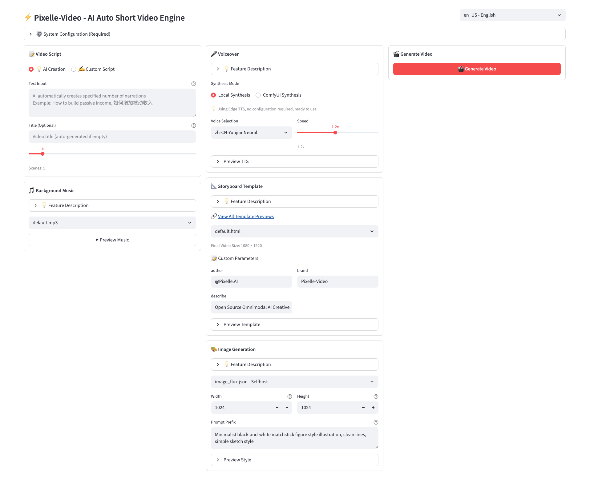
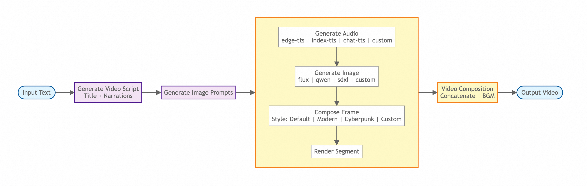

<h1 align="center">🎬 Pixelle-Video —— AI Fully Automated Short Video Engine</h1>

<p align="center"><b>English</b> | <a href="README.md">中文</a></p>

<p align="center">
  <a href="https://www.youtube.com/watch?v=uUkx-lRxLjc" target="_blank"></a>
  <a href="https://github.com/AIDC-AI/Pixelle-Video/releases" target="_blank"></a>
  <a href="https://aidc-ai.github.io/Pixelle-Video" target="_blank"></a>
  <a href="https://github.com/AIDC-AI/Pixelle-Video/stargazers"></a>
  <a href="https://github.com/AIDC-AI/Pixelle-Video/issues"></a>
  <a href="https://github.com/AIDC-AI/Pixelle-Video/network/members"></a>
  <a href="https://github.com/AIDC-AI/Pixelle-Video/blob/main/LICENSE"></a>
</p>

https://github.com/user-attachments/assets/a42e7457-fcc8-40da-83fc-784c45a8b95d

Just input a **topic**, and Pixelle-Video will automatically:
- ✍️ Write video script
- 🎨 Generate AI images/videos  
- 🗣️ Synthesize voice narration
- 🎵 Add background music
- 🎬 Create video with one click


**Zero threshold, zero editing experience** - Make video creation as simple as typing a sentence!


## 🖥️ Web Interface Preview




## 📋 Recent Updates

> 📖 [View Full Changelog](CHANGELOG.md) - Contains 738+ commits and detailed feature descriptions

### 2026-04-26 Latest Features
- ✅ **Storyboard Generation Contract** - Introduced automated storyboard planning system, supporting script generation from topic to complete video ([Details](CHANGELOG.md#2026-04-26-updates))
- ✅ **Video Render Backend Architecture** - Added ffmpeg render backend option for more flexible rendering ([Details](CHANGELOG.md#1-video-render-backend-architecture-design))
- ✅ **Template Visual Materializer** - Converts visual templates to renderable actual assets, supporting dynamic elements ([Details](CHANGELOG.md#4-template-visual-materializer))
- ✅ **Standard Speech Timing Contract** - Enforces precise synchronization between audio and video content ([Details](CHANGELOG.md#6-standard-speech-timing-contract))

### 2026-04-25 Important Updates
- ✅ **API File Stream and Download Endpoints** - Supports efficient large file transfer with enhanced security ([Details](CHANGELOG.md#2026-04-25-updates))
- ✅ **Task Pagination Listing** - Implements task pagination browsing, supporting large-scale task management ([Details](CHANGELOG.md#4-task-pagination-listing))
- ✅ **Text Rendering Safety Contracts** - Introduces text rendering safety mechanisms, supporting custom subtitle styles ([Details](CHANGELOG.md#3-text-rendering-safety-contracts))

### 2026-01 Updates
- ✅ **2026-01-26**: Added the Motion Transfer pipeline — upload a reference video and an image to transfer motion
- ✅ **2026-01-14**: Added "Digital Human" and "Image-to-Video" pipelines, multi-language TTS voices support
- ✅ **2026-01-06**: Added RunningHub 48G VRAM machine support

### 2025-12 Updates
- ✅ **2025-12-28**: Configurable RunningHub concurrency limit, improved LLM structured data response handling
- ✅ **2025-12-17**: Added ComfyUI API Key configuration, Nano Banana model support, API template custom parameters
- ✅ **2025-12-10**: Built-in FAQ in sidebar, fixed edge-tts version to resolve TTS service instability
- ✅ **2025-12-08**: Support multiple script split modes (paragraph/line/sentence), improved template selection with direct preview
- ✅ **2025-12-06**: Fixed video generation API URL path handling with cross-platform compatibility
- ✅ **2025-12-05**: Added Windows all-in-one package download, optimized image and video analysis workflows
- ✅ **2025-12-04**: New "Custom Media" feature - upload your photos/videos with AI-powered analysis and script generation

### 2025-11 Updates (Early Stage)
- ✅ **2025-11-18**: Parallel processing for RunningHub, added history page, batch video task creation support ([Details](CHANGELOG.md#2025-11-18--2025-11-19-updates))
- ✅ **2025-11-12**: Storyboard templates support video features, WebUI adapted for video functionality ([Details](CHANGELOG.md#2025-11-12--2025-11-17-updates))
- ✅ **2025-11-07**: Project initialization, core architecture setup, Capability layer refactoring ([Details](CHANGELOG.md#2025-11-07--2025-11-11-updates))


## ✨ Key Features

- ✅ **Fully Automatic Generation** - Input a topic, automatically generate complete video
- ✅ **AI Smart Copywriting** - Intelligently create narration based on topic, no need to write scripts yourself
- ✅ **AI Generated Images** - Each sentence comes with beautiful AI illustrations
- ✅ **AI Generated Videos** - Support AI video generation models (like WAN 2.1) to create dynamic video content
- ✅ **AI Generated Voice** - Support Edge-TTS, Index-TTS and many other mainstream TTS solutions
- ✅ **Background Music** - Support adding BGM to make videos more atmospheric
- ✅ **Visual Styles** - Multiple templates to choose from, create unique video styles
- ✅ **Flexible Dimensions** - Support portrait, landscape and other video dimensions
- ✅ **Multiple AI Models** - Support GPT, Qwen, DeepSeek, Ollama and more
- ✅ **Flexible Atomic Capability Combination** - Based on ComfyUI architecture, can use preset workflows or customize any capability (such as replacing image generation model with FLUX, replacing TTS with ChatTTS, etc.)


## 📊 Video Generation Pipeline

Pixelle-Video adopts a modular design, the entire video generation process is clear and concise:



From input text to final video output, the entire process is clear and simple: **Script Generation → Image Planning → Frame-by-Frame Processing → Video Composition**

Each step supports flexible customization, allowing you to choose different AI models, audio engines, visual styles, etc., to meet personalized creation needs.


## 🎬 Video Examples

Here are actual cases generated using Pixelle-Video, showcasing video effects with different themes and styles:

### 📱 Extension Module Video Showcase

<table>
<tr>
<td width="33%">
<h3>👤 AI Digital Avatar</h3>
<video src="https://github.com/user-attachments/assets/7c122563-c2e0-4dcd-a73c-25ba1d4fa2dd" controls width="100%"></video>
<p align="center"><b>Korean-speaking AI Avatar</b></p>
</td>
<td width="33%">
<h3>🖼️ Image-to-Video</h3>
<video src="https://github.com/user-attachments/assets/5b4eef17-07d0-4bde-9748-2ed68cc9888e" controls width="100%"></video>
<p align="center"><b>Animated Cartoon Video</b></p>
</td>
<td width="33%">
<h3>💃 Motion Transfer</h3>
<video src="https://github.com/user-attachments/assets/7b1240bc-e965-434c-b343-118ec4793d4f" controls width="100%"></video>
<p align="center"><b>Dancing Kitten</b></p>
</td>
</tr>
</table>

### 📱 Portrait Video Showcase

<table>
<tr>
<td width="33%">
<h3>🌄 Documentary & Lifestyle – Default Template</h3>
<video src="https://github.com/user-attachments/assets/e6716c1d-78de-453d-84c2-10873c8c595f" controls width="100%"></video>
<p align="center"><b>The Scenery Along the Journey</b></p>
</td>
<td width="33%">
<h3>🔍 Cultural Deconstruction – Default Template</h3>
<video src="https://github.com/user-attachments/assets/f5de75f6-135a-4ab4-9f5f-079f649764d5" controls width="100%"></video>
<p align="center"><b>Santa ID</b></p>
</td>
<td width="33%">
<h3>🔭 Scientific Inquiry – Default Template</h3>
<video src="https://github.com/user-attachments/assets/ceb8b0df-8331-4e1f-88e7-db5b295a1c1d" controls width="100%"></video>
<p align="center"><b>Why Haven’t We Found Alien Civilizations Yet?</b></p>
</td>
</tr>
<tr>
<td width="33%">
<h3>🌱 Personal Growth – Cloned Voice</h3>
<video src="https://github.com/user-attachments/assets/1bad9a49-df83-4905-9cc8-9a7640e9c7d8" controls width="100%"></video>
<p align="center"><b>How to Level Up Yourself</b></p>
</td>
<td width="33%">
<h3>🧠 Deep Thinking – Default Template</h3>
<video src="https://github.com/user-attachments/assets/663b705a-2aea-44bc-b266-4bb27aa255a8" controls width="100%"></video>
<p align="center"><b>Understanding Antifragility</b></p>
</td>
<td width="33%">
<h3>🏯 History & Culture – Static Frame</h3>
<video src="https://github.com/user-attachments/assets/56e0a018-fa99-47eb-a97f-fc2fa8915724" controls width="100%"></video>
<p align="center"><b>Zizhi Tongjian (Comprehensive Mirror for Aid in Governance)</b></p>
</td>
</tr>
<tr>
<td width="33%">
<h3>☀️ Emotional Storytelling – Cloned Voice</h3>
<video src="https://github.com/user-attachments/assets/4687df95-dd21-4a7b-b01e-f33a7b646644" controls width="100%"></video>
<p align="center"><b>Winter Sunlight</b></p>
</td>
<td width="33%">
<h3>📜 Novel Adaptation – Custom Script</h3>
<video src="https://github.com/user-attachments/assets/d354465e-3fa8-40b4-93e9-61ad75ef0697" controls width="100%"></video>
<p align="center"><b>Doupo Cangqiong (Battle Through the Heavens)</b></p>
</td>
<td width="33%">
<h3>🧬 Knowledge Explainer – Qwen Image Generation</h3>
<video src="https://github.com/user-attachments/assets/8ac21768-41ce-4d41-acdd-e3dd3eb9725a" controls width="100%"></video>
<p align="center"><b>Essential Wellness Tips</b></p>
</td>
</tr>
</table>

### 🖥️ Landscape Video Showcase

<table>
<tr>
<td width="50%">
<h3>💰 Side Hustle Money Making - Movie Template</h3>
<video src="https://github.com/user-attachments/assets/c9209d4e-73a6-4b82-aaad-cf102248c9e2" controls width="100%"></video>
<p align="center"><b>Side Hustle Money Making</b></p>
</td>
<td width="50%">
<h3>🏛️ Historical Commentary - Custom Template</h3>
<video src="https://github.com/user-attachments/assets/a767c452-d5f1-4cff-bb34-b80fff0d4c3e" controls width="100%"></video>
<p align="center"><b>Insights from Zizhi Tongjian</b></p>
</td>
</tr>
</table>

> 💡 **Tip**: All these videos are fully automatically generated by AI just by inputting a topic keyword, without any video editing experience required!

<div id="tutorial-start" />

## 🚀 Quick Start

### 🪟 Windows All-in-One Package (Recommended for Windows Users)

**No need to install Python, uv, or ffmpeg - ready to use out of the box!**

👉 **[Download Windows All-in-One Package](https://github.com/AIDC-AI/Pixelle-Video/releases/latest)**

1. Download the latest Windows All-in-One Package and extract it
2. Double-click `start.bat` to launch the Web interface
3. Browser will automatically open http://localhost:8501
4. Configure LLM API and image generation service in "⚙️ System Configuration"
5. Start generating videos!

> 💡 **Tip**: The package includes all dependencies, no need to manually install any environment. On first use, you only need to configure API keys.


### Install from Source (For macOS / Linux Users or Users Who Need Customization)

#### Prerequisites

Before starting, you need to install Python package manager `uv` and video processing tool `ffmpeg`:

##### Install uv

Please visit the uv official documentation to see the installation method for your system:  
👉 **[uv Installation Guide](https://docs.astral.sh/uv/getting-started/installation/)**

After installation, run `uv --version` in the terminal to verify successful installation.

##### Install ffmpeg

**macOS**
```bash
brew install ffmpeg
```

**Ubuntu / Debian**
```bash
sudo apt update
sudo apt install ffmpeg
```

**Windows**
- Download URL: https://ffmpeg.org/download.html
- After downloading, extract and add the `bin` directory to the system environment variable PATH

After installation, run `ffmpeg -version` in the terminal to verify successful installation.

##### Prepare Chrome for HyperFrames rendering

Pixelle uses Puppeteer to drive Chrome for video frame rendering. The renderer selects a browser in this order:

1. A browser explicitly set through `PRODUCER_HEADLESS_SHELL_PATH`.
2. System Chrome, Edge, or Chromium in common Windows, macOS, or Linux installation paths.
3. A dedicated browser downloaded into the Puppeteer cache.

If Chrome, Edge, or Chromium is already installed, no additional download is required. On Windows, check the common Chrome path first:

```powershell
Test-Path 'C:\Program Files\Google\Chrome\Application\chrome.exe'
```

When this returns `True`, Pixelle discovers the browser automatically and passes its path only to the render subprocess. If the browser is installed in a custom location, set it explicitly before launching Pixelle:

```powershell
$env:PRODUCER_HEADLESS_SHELL_PATH='D:\Apps\Chrome\chrome.exe'
.\start_web.bat
```

Only when no compatible system browser exists, install the version pinned by Puppeteer:

```bash
cd tools/hyperframes_bridge
npx puppeteer browsers install chrome
cd ../..
```

For `Could not find Chrome`, verify the browser path and `PRODUCER_HEADLESS_SHELL_PATH` before downloading another browser.


#### Step 1: Clone Project

```bash
git clone https://github.com/AIDC-AI/Pixelle-Video.git
cd Pixelle-Video
```

#### Step 2: Launch the API and Web Interface

The recommended path is to use the project launcher, which starts the Pixelle API first and then starts the Web UI:

```bash
# Windows
start_web.bat

# macOS / Linux
./start_web.sh
```

If you need to start them manually, open two terminals:

```bash
# Terminal 1: start the Pixelle API (FastAPI, used by the Web UI)
uv run uvicorn api.app:app --host 127.0.0.1 --port 6789
```

```bash
# Terminal 2: start the Web UI (Streamlit)
uv run streamlit run web/app.py
```

Browser will automatically open http://localhost:8501. The API health check is http://localhost:6789/health, and Swagger docs are available at http://localhost:6789/docs.

> Note: `uv run streamlit run web/app.py` only starts the Web UI. It does not start the Pixelle API automatically. Stage1/Stage2 workbench, storyboard image candidates, status queries, and related features require `http://localhost:6789/api`.

#### Local Single-Instance ComfyUI Backend: Complete Guide

##### 1. Understand the three independent services

The complete local generation path contains three services. Image and speech generation no longer use separate ComfyUI processes. Both route to the same Pixelle-managed `default` backend:

```text
Web UI (8501) -> Pixelle API (6789) -> One ComfyUI (8000)
                                           ├─ Image workflows
                                           └─ TTS workflows
```

| Service | Default address | Purpose | Started by `start_web.bat` |
| ---- | ---- | ---- | ---- |
| Web UI | `http://localhost:8501` | User interface | Yes |
| Pixelle API | `http://localhost:6789` | Task orchestration, status queries, and workflow submission | Yes |
| Shared ComfyUI | `http://127.0.0.1:8000` | Runs local image and TTS workflows | No; the first local workflow can start it on demand |

> `start_web.bat` starts only the Pixelle API and Web UI. It does not launch ComfyUI immediately. With managed mode enabled, Pixelle checks and starts ComfyUI before the first local image or TTS workflow.

##### 2. Confirm the repository root before running commands

All relative commands must run from the repository root. That directory directly contains `start_web.bat`, `config.example.yaml`, `scripts`, and `pixelle_video`.

Check from PowerShell:

```powershell
Get-Location
Test-Path .\start_web.bat
Test-Path .\scripts\comfyui\start_backend.ps1
```

Both `Test-Path` commands must return `True`. If either returns `False`, enter the actual repository directory first. For example, if the repository is at `D:\demo1\Pixelle\Pixelle`:

```powershell
Set-Location 'D:\demo1\Pixelle\Pixelle'
```

If the current directory is the outer `D:\demo1\Pixelle` folder, you can also include the nested directory in the script path:

```powershell
powershell -NoProfile -ExecutionPolicy Bypass -File .\Pixelle\scripts\comfyui\start_backend.ps1
```

An error stating that the `-File` argument does not exist means the current directory or relative path is wrong. It is not a ComfyUI startup failure.

##### 3. Configure the single backend

Keep one backend profile in the local `config.yaml` and route image, speech, and fallback workflows to it:

```yaml
comfyui:
  comfyui_url: http://127.0.0.1:8000
  backend_management_mode: auto
  backends:
    default:
      url: http://127.0.0.1:8000
      python_exe: E:/ComfyUIData/.venv/Scripts/python.exe
      comfyui_root: E:/comfyui/resources/ComfyUI
      managed: true
      restart_after_batch: true
      data_root: E:/ComfyUIData/pixelle
      runtime_dir: _runtime/comfyui
      logs_dir: logs/comfyui
      database_url: sqlite:///E:/ComfyUIData/pixelle/user/comfyui.db
  workflow_routing:
    image: default
    tts: default
    default: default
  tts:
    inference_mode: comfyui
```

If `config.yaml` does not exist on first setup, copy the example:

```powershell
Copy-Item .\config.example.yaml .\config.yaml
```

Then change these fields to match the local installation:

| Field | Meaning | Requirement |
| ---- | ---- | ---- |
| `python_exe` | Python interpreter used by ComfyUI | The file must exist and include the ComfyUI dependencies |
| `comfyui_root` | ComfyUI application root | The directory must contain `main.py` |
| `data_root` | Pixelle-specific input, output, and user data | Keep it isolated from other ComfyUI instances |
| `database_url` | Pixelle-specific ComfyUI database | Point it to `data_root/user/comfyui.db` |
| `runtime_dir` | Managed process PID files | Use a dedicated project directory |
| `logs_dir` | Backend logs | Use a dedicated project directory |

Pixelle starts, stops, and restarts the backend only when `backend_management_mode: auto`, `managed: true`, and a manageable local URL are all active. Remote ComfyUI, RunningHub, and other cloud workflows do not start the local backend.

##### 4. Recommended startup: pre-start the backend, then start Pixelle

After first installation, a ComfyUI upgrade, node changes, or model changes, manually start the backend once. This exposes path, dependency, node, and port errors before a generation task begins.

Run from the repository root:

```powershell
powershell -NoProfile -ExecutionPolicy Bypass -File .\scripts\comfyui\start_backend.ps1
```

Windows users can also double-click:

```text
scripts\comfyui\start_backend.bat
```

The command is idempotent. If the managed backend already owns port `8000`, it reports `already_running` instead of creating a second instance.

After the backend is ready, start Pixelle:

```powershell
.\start_web.bat
```

Default addresses:

- Web UI: `http://localhost:8501`
- Pixelle API health check: `http://localhost:6789/health`
- API documentation: `http://localhost:6789/docs`
- ComfyUI: `http://127.0.0.1:8000`

##### 5. Simplified startup: let the first task start the backend

For routine use, you can start only Pixelle:

```powershell
.\start_web.bat
```

Then submit a local image or TTS task from the Web UI. Before execution, Pixelle:

1. Waits for any in-progress restart of the shared backend.
2. Checks port `8000` and the managed process state.
3. Calls `scripts\comfyui\start_backend.ps1` when the backend is not running.
4. Waits for the listener, then clears stale pre-generation state.
5. Submits the image or TTS workflow to the same `default` backend.

If the backend is already running, Pixelle reuses it. If automatic startup fails, the current task fails with a specific logged reason. Pixelle does not silently move to an unknown port or create a second instance.

##### 6. Automatic restart after each batch

The example configuration uses:

```yaml
restart_after_batch: true
```

After each local workflow batch, Pixelle restarts the shared ComfyUI process to release GPU and CPU memory. New tasks wait for the backend to become ready. A changed ComfyUI PID after a task is expected behavior, not a crash.

If memory is sufficient and repeated-request latency matters more, use:

```yaml
restart_after_batch: false
```

Disabling restart keeps models in GPU memory and speeds up follow-up requests, but image and TTS model switches can accumulate GPU and system memory. Keep `true` when one GPU runs several large model families.

##### 7. When the API port is occupied

The Pixelle API uses `6789` by default. If another program owns that port, override it with `8890` before startup:

```powershell
$env:PIXELLE_API_PORT='8890'
$env:PIXELLE_API_BASE_URL='http://localhost:8890/api'
.\start_web.bat
```

The launcher never switches ports silently. It first verifies whether the service on `6789` is a healthy Pixelle API: a matching service is safely reused, a foreign service causes an explicit failure, and an unused port starts a new process. The Web UI starts only after the health check passes. The launcher cleans up only the API process it created and never terminates a reused process.

Then use:

- Web UI: `http://localhost:8501`
- Pixelle API health check: `http://localhost:8890/health`
- API documentation: `http://localhost:8890/docs`

These environment variables affect only the current PowerShell session and its child processes. Closing the window does not permanently change the system configuration.

##### 8. Check status

Check whether the shared ComfyUI listener exists and whether Pixelle manages it:

```powershell
powershell -NoProfile -ExecutionPolicy Bypass -File .\scripts\comfyui\check_backend.ps1
```

Windows users can also double-click:

```text
scripts\comfyui\check_backend.bat
```

The output should contain `127.0.0.1:8000` and `managed=True`. Direct health checks are also available:

```powershell
Invoke-RestMethod 'http://127.0.0.1:8000/system_stats'
Invoke-RestMethod 'http://localhost:6789/health'
```

If the API uses `8890`, change the second command to port `8890`.

##### 9. Stop services

Safely stop the Pixelle-managed ComfyUI process:

```powershell
powershell -NoProfile -ExecutionPolicy Bypass -File .\scripts\comfyui\stop_backend.ps1
```

Windows users can also double-click:

```text
scripts\comfyui\stop_backend.bat
```

The stop script terminates only a process whose command line, port, data directory, and PID record all match the Pixelle-managed backend. It refuses to terminate an unrelated owner of port `8000`.

To stop the Web UI and Pixelle API, close the matching terminal windows created by `start_web.bat`. When started separately, press `Ctrl+C` in each terminal.

##### 10. Logs and runtime files

Default locations:

| Content | Path |
| ---- | ---- |
| Standard output log | `logs/comfyui/comfyui-backend.stdout.log` |
| Error log | `logs/comfyui/comfyui-backend.stderr.log` |
| Backend PID | `_runtime/comfyui/comfyui-backend.pid` |
| Launcher PID | `_runtime/comfyui/comfyui-backend.launcher.pid` |
| Image and audio outputs | Configured `data_root/output` |
| ComfyUI user data and database | Configured `data_root/user` |

On each restart, old logs are archived with a timestamp instead of being overwritten. For startup failures, inspect the error log first and then the standard output log.

##### 11. Troubleshooting

| Symptom | Cause | Fix |
| ---- | ---- | ---- |
| The script passed to `-File` does not exist | The current directory is not the repository root | Run `Test-Path .\start_web.bat`, then enter the actual repository directory |
| Port `8000` is occupied | ComfyUI Desktop or another process is listening | Run the check command and close the conflicting process; do not run two ComfyUI instances |
| No listener after 90 seconds | Python path, ComfyUI path, dependencies, or custom nodes failed | Read `logs/comfyui/comfyui-backend.stderr.log` |
| Web UI opens but actions fail | Pixelle API is not running or the UI uses the wrong port | Check `/health` and make `PIXELLE_API_BASE_URL` match the actual port |
| Image or speech nodes are missing | Custom nodes were removed, disabled, or failed to import after an update | Read the ComfyUI startup logs and repair the corresponding node dependencies |
| Process PID changes after a task | `restart_after_batch: true` is releasing memory | No action is required; wait for the backend to become ready |
| A cloud workflow does not start local ComfyUI | Cloud execution does not use the local backend | This is expected; only local `selfhost` workflows use port `8000` |

Legacy dual-backend entry points have been removed. Image and speech workflows must use the shared backend.

#### Step 3: Configure in Web Interface

On first use, expand the "⚙️ System Configuration" panel and fill in:
- **LLM Configuration**: Select AI model (such as Qwen, GPT, etc.) and enter API Key
- **Image Configuration**: If you need to generate images, configure ComfyUI address or RunningHub API Key

After configuration, click "Save Configuration", and you can start generating videos!

<div id="tutorial-end" />

## 💻 Usage

After opening the Web interface, you will see a three-column layout. Here's a detailed explanation of each part:


### ⚙️ System Configuration (Required on First Use)

Configuration is required on first use. Click to expand the "⚙️ System Configuration" panel:

#### 1. LLM Configuration (Large Language Model)
Used for generating video scripts.

**Quick Select Preset**  
- Select preset model from dropdown menu (Qwen, GPT-4o, DeepSeek, etc.)
- After selection, base_url and model will be automatically filled
- Click "🔑 Get API Key" link to register and obtain key

**Manual Configuration**  
- API Key: Enter your key
- Base URL: API address
- Model: Model name

#### 2. Image Configuration
Used for generating video images.

**Local Deployment (Recommended)**  
- ComfyUI URL: Local ComfyUI service address (single-instance default http://127.0.0.1:8000)
- Click "Test Connection" to confirm service is available

**Cloud Deployment**  
- RunningHub API Key: Cloud image generation service key

After configuration, click "Save Configuration".


### 📝 Content Input (Left Column)

#### Generation Mode
- **AI Generated Content**: Input topic, AI automatically creates script
  - Suitable for: Want to quickly generate video, let AI write script
  - Example: "Why develop a reading habit"
- **Fixed Script Content**: Directly input complete script, skip AI creation
  - Suitable for: Already have ready-made script, directly generate video

#### Background Music (BGM)
- **No BGM**: Pure voice narration
- **Built-in Music**: Select preset background music (such as default.mp3)
- **Custom Music**: Put your music files (MP3/WAV, etc.) in the `bgm/` folder
- Click "Preview BGM" to preview music


### 🎤 Voice Settings (Middle Column)

#### TTS Workflow
- Select TTS workflow from dropdown menu (supports Edge-TTS, Index-TTS, etc.)
- System will automatically scan TTS workflows in the `workflows/` folder
- If you know ComfyUI, you can customize TTS workflows

#### Reference Audio (Optional)
- Upload reference audio file for voice cloning (supports MP3/WAV/FLAC and other formats)
- Suitable for TTS workflows that support voice cloning (such as Index-TTS)
- Can listen directly after upload

#### Preview Function
- Enter test text, click "Preview Voice" to listen to the effect
- Supports using reference audio for preview


### 🎨 Visual Settings (Middle Column)

#### Image Generation
Determine what style of images AI generates.

**ComfyUI Workflow**  
- Select image generation workflow from dropdown menu
- Supports local deployment (selfhost) and cloud (RunningHub) workflows
- Default uses `image_flux.json`
- If you know ComfyUI, you can put your own workflows in the `workflows/` folder

**Image Dimensions**  
- Set width and height of generated images (unit: pixels)
- Default 1024x1024, can be adjusted as needed
- Note: Different models have different dimension limitations

**Prompt Prefix**  
- Controls overall image style (language needs to be English)
- Example: Minimalist black-and-white matchstick figure style illustration, clean lines, simple sketch style
- Use the prompt prefix library to save multiple reusable presets
- Choose one active prefix for real generation, or compare multiple prefixes in preview
- You can also generate candidate prefixes from the configured LLM and add them into the library

#### Video Template
Determines video layout and design.

**Template Naming Convention**  
- `static_*.html`: Static templates (no AI-generated media, text-only styles)
- `image_*.html`: Image templates (uses AI-generated images as background)
- `video_*.html`: Video templates (uses AI-generated videos as background)

**Usage**  
- Select template from dropdown menu, displayed grouped by dimension (portrait/landscape/square)
- Click "Preview Template" to test effect with custom parameters
- If you know HTML, you can create your own templates in the `templates/` folder
- 🔗 [View All Template Previews](https://aidc-ai.github.io/Pixelle-Video/user-guide/templates/#built-in-template-preview)


### 🎬 Generate Video (Right Column)

#### Generate Button
- After configuring all parameters, click "🎬 Generate Video"
- Shows real-time progress (generating script → generating images → synthesizing voice → composing video)
- Automatically shows video preview after completion

#### Progress Display
- Shows current step in real-time
- Example: "Frame 3/5 - Generating Image"

#### Video Preview
- Automatically plays after generation
- Shows video duration, file size, number of frames, etc.
- Video files are saved in the `output/` folder


### ❓ FAQ

**Q: How long does it take to use for the first time?**  
A: Generation time depends on the number of video frames, network conditions, and AI inference speed, typically completed within a few minutes.

**Q: What if I'm not satisfied with the video?**  
A: You can try:
1. Change LLM model (different models have different script styles)
2. Adjust image dimensions and prompt prefix (change image style)
3. Change TTS workflow or upload reference audio (change voice effect)
4. Try different video templates and dimensions

**Q: What about the cost?**  
A: **This project fully supports free operation!**

- **Completely Free Solution**: LLM using Ollama (local) + ComfyUI local deployment = 0 cost
- **Recommended Solution**: LLM using Qwen (extremely low cost, highly cost-effective) + ComfyUI local deployment
- **Cloud Solution**: LLM using OpenAI + Image using RunningHub (higher cost but no need for local environment)

**Selection Suggestion**: If you have a local GPU, recommend completely free solution, otherwise recommend using Qwen (cost-effective)


## 🤝 Referenced Projects

Pixelle-Video design is inspired by the following excellent open-source projects:

- [Pixelle-MCP](https://github.com/AIDC-AI/Pixelle-MCP) - ComfyUI MCP server, allows AI assistants to directly call ComfyUI
- [MoneyPrinterTurbo](https://github.com/harry0703/MoneyPrinterTurbo) - Excellent video generation tool
- [NarratoAI](https://github.com/linyqh/NarratoAI) - Film commentary automation tool
- [MoneyPrinterPlus](https://github.com/ddean2009/MoneyPrinterPlus) - Video creation platform
- [ComfyKit](https://github.com/puke3615/ComfyKit) - ComfyUI workflow wrapper library

Thanks for the open-source spirit of these projects! 🙏


## 💬 Community

Scan the QR codes below to join our communities for latest updates and technical support:

| Discord Community | WeChat Group |
| ---- | ---- |
|  |  |


## 📢 Feedback and Support

- 🐛 **Encountered Issues**: Submit [Issue](https://github.com/AIDC-AI/Pixelle-Video/issues)
- 💡 **Feature Suggestions**: Submit [Feature Request](https://github.com/AIDC-AI/Pixelle-Video/issues)
- ⭐ **Give a Star**: If this project helps you, feel free to give a Star for support!


## 📝 License

This project is released under the Apache License 2.0. For details, please see the [LICENSE](LICENSE) file.


## ⭐ Star History

[](https://star-history.com/#AIDC-AI/Pixelle-Video&Date)
