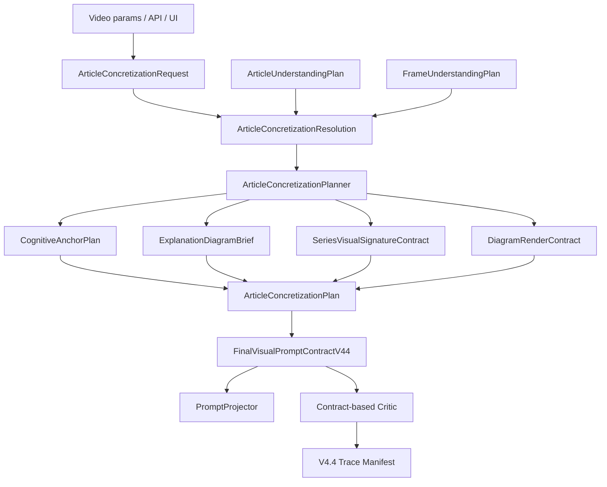

# Pixelle Article Concretization Visual System V4.4.1 执行修正版计划

> 文档状态：可执行代码修改计划 / Review Debug 修正版  
> 生成日期：2026-06-02  
> 基准文档：`2026-06-02-article-concretization-visual-system.md`  
> 目标：在不制造“小黑模式”技术债的前提下，实现可测试、可回退、可追踪的文章具象化解读系统。

---

## 0. 冷启动结论

上一版计划的产品方向正确：Pixelle 要做的是 **Article Concretization / 文章具象化解读系统**，不是一个单独的 “Xiaohei mode”。

但上一版不能直接按 Task 1 开工。原因是代码任务里存在多个会导致回归或边界打穿的风险：

1. 缺少 `ArticleConcretizationResolution`，raw request、auto fallback、strict conflict 混在 planner 里。
2. `article_concretization_enabled=False` 没有 no-op 保护，可能污染旧路径 prompt。
3. request 同时存在 flat / nested 两种形态，但 `from_mapping()` 没兼容。
4. 用户显式选择 anchor 且 grammar=auto 时，grammar 应根据 resolved anchor 重新选择。
5. 产品模型里有 causal mechanism，但 enum 里缺 `causal_mechanism`。
6. `xiaohei_handdrawn` render style 不应自动插入 signature figure。
7. `diagram_aspect_ratio` 和视频模板比例需要拆成 canvas ratio 与 diagram panel ratio。
8. `approved_labels_only` 没有 approved labels 字段，无法执行。
9. visible text policy 必须和 ArticleUnderstandingPlan / FrameUnderstandingPlan 取最严格合并。
10. strict 模式下显式 signature role 但无 `ip_profile_id` 必须报错。
11. 新 `series_visual_signature_role` 与旧 V4.4 `visual_role_strategy` 的优先级必须定义。
12. critic 不能只检查 raw prompt 字符串，必须优先检查结构化 contract。

因此本修正版新增 **Phase 0.5：Resolution / Conflict / No-op 边界冻结**，并重排任务顺序。

---

## 1. 非谈判原则

### 1.1 不做 Xiaohei mode

禁止实现：

```python
xiaohei_mode = True
```

正确实现：

```text
cognitive_anchor_kind       # 解释什么
explanation_diagram_grammar # 用什么图解语法解释
diagram_render_style        # 表面风格，可选 xiaohei_handdrawn
series_visual_signature_role# 固定视觉签名如何参与，可为 none
```

`xiaohei_handdrawn` 只能影响画面表面，例如白底、手绘线条、少量标注色。它不能自动插入固定角色，更不能替代文章主体。

### 1.2 ArticleUnderstandingPlan 是事实源

`ArticleUnderstandingPlan` / `FrameUnderstandingPlan` 继续作为事实源，至少拥有：

```text
core_claim
central_problem
main_entities
required_subjects
source_evidence
visible_text_policy
primary_lens
secondary_lenses
```

文章具象化系统只能把它们投影成解释图，不能重写文章事实。

### 1.3 FinalVisualPromptContractV44 是唯一 projector 输入

Provider projector 不允许另开第二套 metadata 事实源。

错误：

```python
contract_metadata["article_concretization"] = article_concretization
# 同时 FinalVisualPromptContractV44.article_concretization 也存在
```

正确：

```text
provider_prompt_projector 只消费 FinalVisualPromptContractV44。
metadata 只能来自 contract.to_dict() 的投影。
```

### 1.4 Disabled 必须 no-op

当：

```python
article_concretization_enabled = False
```

必须满足：

```text
1. 不调用 ArticleConcretizationPlanner。
2. 不向 FinalVisualPromptContractV44 注入 article_concretization payload。
3. 不追加 article_concretization.* projected_prompt_parts。
4. 不改变旧 V4.4 prompt 结果。
5. trace manifest 中可以记录 disabled，但不能污染 final prompt。
```

### 1.5 strict_user_mode 不允许静默 fallback

当 `strict_user_mode=True` 时，以下情况必须报错：

```text
1. anchor 和 diagram grammar 不兼容。
2. 用户请求非 none signature role，但没有 ip_profile_id。
3. 用户请求更宽松 visible_text_policy，但文章层要求更严格。
4. 用户请求 diagram ratio 与模板 canvas ratio 发生不可容忍冲突。
5. approved_labels_only 但 approved_labels 为空。
```

当 `strict_user_mode=False` 时，可以自动修正，但必须在 resolution warnings 中记录。

---

## 2. 更新后的产品模型

### 2.1 四个独立轴

| Axis | 用户问题 | Backend 字段 |
| --- | --- | --- |
| Cognitive anchor | 这篇文章最需要具象化的认知锚点是什么？ | `cognitive_anchor_kind` |
| Diagram grammar | 用什么解释图语法表达？ | `explanation_diagram_grammar` |
| Series visual signature | 固定角色 / 品牌视觉以什么身份参与？ | `series_visual_signature_role` |
| Render surface | 它长什么样、比例如何？ | `diagram_render_style`, `diagram_aspect_ratio` |

### 2.2 CognitiveAnchorKind

必须包含：

```python
class CognitiveAnchorKind(str, Enum):
    AUTO = "auto"
    JUDGMENT = "judgment"
    CAUSAL_MECHANISM = "causal_mechanism"
    PROCESS = "process"
    STRUCTURE = "structure"
    STATE = "state"
    METAPHOR = "metaphor"
    CONTRAST = "contrast"
    RELATIONSHIP = "relationship"
    EVIDENCE = "evidence"
    DECISION_PATH = "decision_path"
```

注意：`CAUSAL_MECHANISM` 不能被合并成 `PROCESS`。因果机制关注 cause / trigger / feedback / systemic effect；流程方法关注 step / sequence / operation。

### 2.3 ExplanationDiagramGrammar

```python
class ExplanationDiagramGrammar(str, Enum):
    AUTO = "auto"
    SINGLE_EXPLANATION_IMAGE = "single_explanation_image"
    MULTI_PANEL_COMIC = "multi_panel_comic"
    PROCESS_FLOW = "process_flow"
    STRUCTURE_MAP = "structure_map"
    CONTRAST_BOARD = "contrast_board"
    RELATIONSHIP_MAP = "relationship_map"
    METAPHOR_SCENE = "metaphor_scene"
    DECISION_TREE = "decision_tree"
    STATE_MACHINE = "state_machine"
    EVIDENCE_MAP = "evidence_map"
```

### 2.4 SeriesVisualSignatureRole

```python
class SeriesVisualSignatureRole(str, Enum):
    NONE = "none"
    AUTO = "auto"
    CORE_ACTOR = "core_actor"
    SILENT_WITNESS = "silent_witness"
    OPERATOR = "operator"
    GUIDE = "guide"
    OBSTACLE = "obstacle"
    CONTAINER = "container"
    BACKGROUND_MARK = "background_mark"
```

### 2.5 DiagramRenderStyle

```python
class DiagramRenderStyle(str, Enum):
    AUTO = "auto"
    XIAOHEI_HANDDRAWN = "xiaohei_handdrawn"
    EDITORIAL_DIAGRAM = "editorial_diagram"
    CLEAN_VECTOR = "clean_vector"
    CINEMATIC_METAPHOR = "cinematic_metaphor"
    BRAND_KV = "brand_kv"
    THREE_D_CONCEPT = "three_d_concept"
    INK_COLLAGE = "ink_collage"
```

`XIAOHEI_HANDDRAWN` 的 style rules 必须类似：

```python
(
    "white background",
    "hand-drawn explanatory panel style",
    "simple black linework",
    "limited red orange blue annotation marks",
)
```

禁止写：

```python
"hand-drawn black solid signature figure"
```

因为这会让 render style 偷偷创建视觉签名角色。

### 2.6 DiagramAspectRatio

```python
class DiagramAspectRatio(str, Enum):
    AUTO = "auto"
    LANDSCAPE_16_9 = "landscape_16_9"
    SQUARE_1_1 = "square_1_1"
    PORTRAIT_4_5 = "portrait_4_5"
    VERTICAL_9_16 = "vertical_9_16"
    TEMPLATE = "template"
```

实际 resolution 必须产生两层比例：

```python
canvas_aspect_ratio: DiagramAspectRatio       # 由 frame_template / render target 决定
diagram_aspect_ratio: DiagramAspectRatio      # 画布内部解释图区域比例
```

规则：

```text
1. canvas_aspect_ratio 永远由模板或 renderer target 决定。
2. diagram_aspect_ratio 控制画布内部解释图 panel。
3. 用户选 landscape_16_9，但模板是 vertical_9_16：
   - strict=True：报 conflict。
   - strict=False：竖屏画布中放 16:9 diagram panel，并记录 warning。
4. diagram_aspect_ratio=template：diagram 跟随 canvas。
```

### 2.7 VisibleTextPolicy 与 approved labels

如果保留：

```text
approved_labels_only
```

必须新增：

```python
diagram_approved_labels: tuple[str, ...] = ()
```

规则：

```text
1. diagram_visible_text_policy=approved_labels_only 时，approved_labels 不能为空。
2. approved labels 必须被 projector 作为 allowed label set 投影。
3. critic 检查最终 contract 里是否存在 allowed labels。
```

---

## 3. 目标架构



关键顺序：

```text
Raw request
-> ArticleConcretizationRequest.from_mapping(flat or nested)
-> ArticleConcretizationResolution
-> ArticleConcretizationPlanner consumes resolution only
-> FinalVisualPromptContractV44 owns final article_concretization payload
-> Projector consumes final contract only
-> Critic checks final contract first, prompt text second
```

---

## 4. 文件改动清单

### 4.1 新增文件

```text
pixelle_video/models/article_concretization.py
pixelle_video/services/article_concretization_resolution.py
pixelle_video/services/article_concretization_planner.py
pixelle_video/services/article_concretization_critic.py
web/components/article_concretization_controls.py

tests/models/test_article_concretization.py
tests/services/test_article_concretization_resolution.py
tests/services/test_article_concretization_planner.py
tests/services/test_article_concretization_critic.py
tests/web/test_article_concretization_controls.py
```

### 4.2 修改文件

```text
pixelle_video/models/final_visual_prompt_contract.py
pixelle_video/models/mode_resolution.py
pixelle_video/models/video_generation_contract.py
pixelle_video/services/visual_prompt_planning_service.py
pixelle_video/services/provider_prompt_projector.py
pixelle_video/services/v44_prompt_trace_manifest.py
api/schemas/video.py
api/routers/video.py
web/components/content_input.py
web/components/output_preview.py
web/i18n/locales/zh_CN.json
web/i18n/locales/en_US.json

tests/models/test_final_visual_prompt_contract.py
tests/models/test_mode_resolution.py
tests/test_video_api.py
tests/test_output_preview.py
tests/services/test_provider_prompt_projector.py
tests/services/test_v44_prompt_trace_manifest.py
```

---

## 5. Execution Preflight

### Step 1：确认当前仓库状态

```powershell
cd D:\demo1\Pixelle\Pixelle
git status --short --branch
```

如果主 workspace 有未提交改动，不要直接在主目录执行。

### Step 2：创建干净 worktree

```powershell
cd D:\demo1\Pixelle
git fetch origin
git worktree add D:\demo1\Pixelle-article-concretization-v441 origin/dev -b codex/article-concretization-v441
cd D:\demo1\Pixelle-article-concretization-v441
git status --short --branch
```

预期：

```text
## codex/article-concretization-v441
```

### Step 3：先读现有 V4.4 文件

```powershell
rg -n "ArticleUnderstandingMode|ArticleUnderstandingPlan|FrameUnderstandingPlan|VisualPlanningMode|FinalVisualPromptContractV44|visual_role_strategy|force_v44_planning|VisibleTextPolicy" pixelle_video api web tests -g "*.py"
```

目标：先确认现有字段、类名、构造函数和测试风格，再改代码。

---

# Phase 0.5：Resolution / Conflict / No-op 边界冻结

这是新增阶段，必须先做。不要直接从旧计划 Task 1 开始。

## Task 0.5.1：新增边界测试

新增文件：

```text
tests/services/test_article_concretization_resolution.py
```

必须先写这些测试：

```python
def test_disabled_request_has_no_prompt_side_effects():
    ...


def test_from_mapping_accepts_flat_payload():
    ...


def test_from_mapping_accepts_nested_payload():
    ...


def test_explicit_anchor_with_auto_grammar_uses_anchor_default():
    ...


def test_non_strict_incompatible_anchor_grammar_warns_and_repairs():
    ...


def test_strict_incompatible_anchor_grammar_raises():
    ...


def test_signature_role_requires_ip_profile_in_strict_mode():
    ...


def test_signature_role_without_ip_profile_warns_and_drops_in_non_strict_mode():
    ...


def test_xiaohei_render_style_does_not_insert_signature_when_role_none():
    ...


def test_landscape_diagram_inside_vertical_template_records_warning():
    ...


def test_approved_labels_only_requires_approved_labels():
    ...


def test_visible_text_policy_resolves_to_most_restrictive_policy():
    ...
```

运行：

```powershell
python -m pytest tests/services/test_article_concretization_resolution.py -q
```

预期：失败，因为实现还不存在。

## Task 0.5.2：实现 ArticleConcretizationResolution

新增：

```text
pixelle_video/services/article_concretization_resolution.py
```

核心 dataclass：

```python
@dataclass(frozen=True)
class ArticleConcretizationResolution:
    request: ArticleConcretizationRequest
    enabled: bool
    effective_anchor_kind: CognitiveAnchorKind
    effective_diagram_grammar: ExplanationDiagramGrammar
    effective_signature_role: SeriesVisualSignatureRole
    effective_render_style: DiagramRenderStyle
    effective_canvas_aspect_ratio: DiagramAspectRatio
    effective_diagram_aspect_ratio: DiagramAspectRatio
    effective_visible_text_policy: VisibleTextPolicy
    approved_labels: tuple[str, ...]
    warnings: tuple[str, ...]
    errors: tuple[str, ...]
    fallback_used: bool
    fallback_reason: str | None

    def to_dict(self) -> dict[str, Any]:
        ...
```

核心异常：

```python
class ArticleConcretizationResolutionConflict(ValueError):
    pass
```

核心解析函数：

```python
def resolve_article_concretization(
    *,
    request: ArticleConcretizationRequest,
    article_plan: ArticleUnderstandingPlan,
    frame_plan: FrameUnderstandingPlan,
    ip_profile_id: str | None,
    template_aspect_ratio: DiagramAspectRatio,
    strict_user_mode: bool,
) -> ArticleConcretizationResolution:
    ...
```

### 必须实现的解析顺序

```python
if not request.enabled:
    return disabled_resolution(request, template_aspect_ratio)

lens_default = lens_defaults[frame_plan.primary_lens or article_plan.primary_lens]

anchor = (
    lens_default.anchor_kind
    if request.cognitive_anchor_kind is CognitiveAnchorKind.AUTO
    else request.cognitive_anchor_kind
)

grammar = (
    default_grammar_for_anchor(anchor)
    if request.explanation_diagram_grammar is ExplanationDiagramGrammar.AUTO
    else request.explanation_diagram_grammar
)

if grammar not in allowed_grammars_for_anchor(anchor):
    if strict_user_mode:
        errors.append(...)
    else:
        warnings.append(...)
        grammar = default_grammar_for_anchor(anchor)
        fallback_used = True
```

### anchor 到默认 grammar 映射

```python
_DEFAULT_GRAMMAR_BY_ANCHOR = {
    CognitiveAnchorKind.JUDGMENT: ExplanationDiagramGrammar.SINGLE_EXPLANATION_IMAGE,
    CognitiveAnchorKind.CAUSAL_MECHANISM: ExplanationDiagramGrammar.PROCESS_FLOW,
    CognitiveAnchorKind.PROCESS: ExplanationDiagramGrammar.PROCESS_FLOW,
    CognitiveAnchorKind.STRUCTURE: ExplanationDiagramGrammar.STRUCTURE_MAP,
    CognitiveAnchorKind.STATE: ExplanationDiagramGrammar.METAPHOR_SCENE,
    CognitiveAnchorKind.METAPHOR: ExplanationDiagramGrammar.METAPHOR_SCENE,
    CognitiveAnchorKind.CONTRAST: ExplanationDiagramGrammar.CONTRAST_BOARD,
    CognitiveAnchorKind.RELATIONSHIP: ExplanationDiagramGrammar.RELATIONSHIP_MAP,
    CognitiveAnchorKind.EVIDENCE: ExplanationDiagramGrammar.EVIDENCE_MAP,
    CognitiveAnchorKind.DECISION_PATH: ExplanationDiagramGrammar.DECISION_TREE,
}
```

### anchor / grammar 兼容表

```python
_ANCHOR_ALLOWED_GRAMMARS = {
    CognitiveAnchorKind.JUDGMENT: {
        ExplanationDiagramGrammar.SINGLE_EXPLANATION_IMAGE,
        ExplanationDiagramGrammar.CONTRAST_BOARD,
        ExplanationDiagramGrammar.METAPHOR_SCENE,
    },
    CognitiveAnchorKind.CAUSAL_MECHANISM: {
        ExplanationDiagramGrammar.PROCESS_FLOW,
        ExplanationDiagramGrammar.STRUCTURE_MAP,
        ExplanationDiagramGrammar.METAPHOR_SCENE,
        ExplanationDiagramGrammar.STATE_MACHINE,
    },
    CognitiveAnchorKind.PROCESS: {
        ExplanationDiagramGrammar.PROCESS_FLOW,
        ExplanationDiagramGrammar.MULTI_PANEL_COMIC,
        ExplanationDiagramGrammar.STATE_MACHINE,
    },
    CognitiveAnchorKind.STRUCTURE: {
        ExplanationDiagramGrammar.STRUCTURE_MAP,
        ExplanationDiagramGrammar.RELATIONSHIP_MAP,
    },
    CognitiveAnchorKind.STATE: {
        ExplanationDiagramGrammar.METAPHOR_SCENE,
        ExplanationDiagramGrammar.STATE_MACHINE,
        ExplanationDiagramGrammar.SINGLE_EXPLANATION_IMAGE,
    },
    CognitiveAnchorKind.METAPHOR: {
        ExplanationDiagramGrammar.METAPHOR_SCENE,
        ExplanationDiagramGrammar.SINGLE_EXPLANATION_IMAGE,
    },
    CognitiveAnchorKind.CONTRAST: {
        ExplanationDiagramGrammar.CONTRAST_BOARD,
        ExplanationDiagramGrammar.SINGLE_EXPLANATION_IMAGE,
    },
    CognitiveAnchorKind.RELATIONSHIP: {
        ExplanationDiagramGrammar.RELATIONSHIP_MAP,
        ExplanationDiagramGrammar.STRUCTURE_MAP,
    },
    CognitiveAnchorKind.EVIDENCE: {
        ExplanationDiagramGrammar.EVIDENCE_MAP,
        ExplanationDiagramGrammar.STRUCTURE_MAP,
    },
    CognitiveAnchorKind.DECISION_PATH: {
        ExplanationDiagramGrammar.DECISION_TREE,
        ExplanationDiagramGrammar.PROCESS_FLOW,
    },
}
```

### visible text policy 最严格合并

实现一个纯函数：

```python
_VISIBLE_TEXT_POLICY_RANK = {
    VisibleTextPolicy.NO_VISIBLE_TEXT: 0,
    VisibleTextPolicy.SOURCE_TEXT_ONLY: 1,
    VisibleTextPolicy.SYMBOLIC_LABELS_ONLY: 2,
    VisibleTextPolicy.APPROVED_LABELS_ONLY: 3,
    VisibleTextPolicy.FREE_TEXT_ALLOWED: 4,
}
```

注意：如果现有 `VisibleTextPolicy` 没有 `APPROVED_LABELS_ONLY`，先在对应 enum 中补；如果当前系统不允许新增，就把 `approved_labels_only` 暂时映射到 `SYMBOLIC_LABELS_ONLY`，并在 warnings 里记录。

规则：

```text
取三者中最严格者：
1. article_plan.visible_text_policy
2. frame_plan.visible_text_policy
3. request.diagram_visible_text_policy

strict=True 且用户请求比文章层更宽松：报错。
strict=False：自动降级为更严格 policy，并 warning。
```

### signature role 解析

```python
if request.series_visual_signature_role not in {NONE, AUTO} and not ip_profile_id:
    if strict_user_mode:
        errors.append("series signature role requires ip_profile_id")
    else:
        warnings.append("signature_role_dropped_no_ip_profile")
        signature_role = NONE
```

### aspect ratio 解析

```python
canvas_ratio = template_aspect_ratio

if request.diagram_aspect_ratio in {AUTO, TEMPLATE}:
    diagram_ratio = canvas_ratio
else:
    diagram_ratio = request.diagram_aspect_ratio

if diagram_ratio != canvas_ratio:
    if strict_user_mode:
        errors.append("diagram_aspect_ratio conflicts with canvas_aspect_ratio")
    else:
        warnings.append("diagram panel ratio differs from canvas; render as internal panel")
```

### approved labels 解析

```python
if effective_visible_text_policy is VisibleTextPolicy.APPROVED_LABELS_ONLY:
    if not request.diagram_approved_labels:
        if strict_user_mode:
            errors.append("approved_labels_only requires diagram_approved_labels")
        else:
            warnings.append("approved_labels_only downgraded because approved labels are empty")
            effective_visible_text_policy = VisibleTextPolicy.SYMBOLIC_LABELS_ONLY
```

### 运行测试

```powershell
python -m pytest tests/services/test_article_concretization_resolution.py -q
```

预期：通过。

### Commit

```powershell
git add pixelle_video/services/article_concretization_resolution.py tests/services/test_article_concretization_resolution.py
git commit -m "feat: resolve article concretization request boundaries"
```

---

# Phase 1：核心模型契约

## Task 1.1：实现 article_concretization.py

创建：

```text
pixelle_video/models/article_concretization.py
tests/models/test_article_concretization.py
```

必须包含：

```text
ArticleConcretizationRequest
CognitiveAnchorKind
ExplanationDiagramGrammar
SeriesVisualSignatureRole
DiagramRenderStyle
DiagramAspectRatio
CognitiveAnchorPlan
ExplanationDiagramBrief
SeriesVisualSignatureContract
DiagramRenderContract
ArticleConcretizationPlan
```

## Task 1.2：ArticleConcretizationRequest 要求

字段：

```python
@dataclass(frozen=True)
class ArticleConcretizationRequest:
    enabled: bool = False
    cognitive_anchor_kind: CognitiveAnchorKind | str = CognitiveAnchorKind.AUTO
    explanation_diagram_grammar: ExplanationDiagramGrammar | str = ExplanationDiagramGrammar.AUTO
    series_visual_signature_role: SeriesVisualSignatureRole | str = SeriesVisualSignatureRole.NONE
    diagram_render_style: DiagramRenderStyle | str = DiagramRenderStyle.AUTO
    diagram_aspect_ratio: DiagramAspectRatio | str = DiagramAspectRatio.AUTO
    diagram_visible_text_policy: VisibleTextPolicy | str = VisibleTextPolicy.NO_VISIBLE_TEXT
    diagram_approved_labels: Sequence[str] = ()
    diagram_user_intent_hint: str | None = None
```

`from_mapping()` 必须支持 flat 和 nested：

```python
@classmethod
def from_mapping(cls, source: Mapping[str, Any] | None) -> "ArticleConcretizationRequest":
    data = dict(source or {})
    nested = data.get("article_concretization")
    if isinstance(nested, Mapping):
        merged = {**data, **nested}
    else:
        merged = data

    return cls(
        enabled=merged.get("article_concretization_enabled", merged.get("enabled", False)),
        cognitive_anchor_kind=merged.get("cognitive_anchor_kind", CognitiveAnchorKind.AUTO),
        explanation_diagram_grammar=merged.get("explanation_diagram_grammar", ExplanationDiagramGrammar.AUTO),
        series_visual_signature_role=merged.get("series_visual_signature_role", SeriesVisualSignatureRole.NONE),
        diagram_render_style=merged.get("diagram_render_style", DiagramRenderStyle.AUTO),
        diagram_aspect_ratio=merged.get("diagram_aspect_ratio", DiagramAspectRatio.AUTO),
        diagram_visible_text_policy=merged.get("diagram_visible_text_policy", VisibleTextPolicy.NO_VISIBLE_TEXT),
        diagram_approved_labels=merged.get("diagram_approved_labels", ()),
        diagram_user_intent_hint=merged.get("diagram_user_intent_hint"),
    )
```

`diagram_user_intent_hint` 必须限制长度：

```python
MAX_INTENT_HINT_CHARS = 500
```

如果超长：

```text
strict contract 层可以直接 ValueError；UI 层也要截断或限制输入长度。
```

## Task 1.3：DiagramRenderContract 要拆比例

```python
@dataclass(frozen=True)
class DiagramRenderContract:
    render_style: DiagramRenderStyle | str
    canvas_aspect_ratio: DiagramAspectRatio | str
    diagram_aspect_ratio: DiagramAspectRatio | str
    style_rules: Sequence[str]
    negative_style_rules: Sequence[str]
```

`to_dict()` 输出：

```python
{
    "render_style": "xiaohei_handdrawn",
    "canvas_aspect_ratio": "vertical_9_16",
    "diagram_aspect_ratio": "landscape_16_9",
    "style_rules": [...],
    "negative_style_rules": [...],
}
```

## Task 1.4：SeriesVisualSignatureContract 要表达 replacement policy

```python
@dataclass(frozen=True)
class SeriesVisualSignatureContract:
    enabled: bool
    role: SeriesVisualSignatureRole | str
    identity_profile_id: str | None
    participation_rule: str
    replacement_policy: Literal["no_subject_replacement", "may_lead_but_preserve_subjects", "background_only"]
    visual_weight: float
    forbidden_behaviors: Sequence[str]
```

默认 replacement policy 必须是：

```text
no_subject_replacement
```

## Task 1.5：模型测试必须覆盖

```text
1. known values normalize。
2. invalid enum raises。
3. causal_mechanism 可用。
4. flat from_mapping 可用。
5. nested from_mapping 可用。
6. approved labels 序列化。
7. hint 长度限制。
8. DiagramRenderContract 同时序列化 canvas_aspect_ratio 和 diagram_aspect_ratio。
9. ArticleConcretizationPlan nested to_dict 正确。
```

运行：

```powershell
python -m pytest tests/models/test_article_concretization.py -q
```

Commit：

```powershell
git add pixelle_video/models/article_concretization.py tests/models/test_article_concretization.py
git commit -m "feat: add article concretization contracts"
```

---

# Phase 2：Planner 只消费 Resolution

## Task 2.1：禁止 planner 直接消费 raw request

旧计划里的 planner 逻辑：

```python
request = ArticleConcretizationRequest.from_mapping(request_mapping)
anchor_kind = defaults.anchor_kind if request.cognitive_anchor_kind is AUTO else request.cognitive_anchor_kind
grammar = defaults.grammar if request.explanation_diagram_grammar is AUTO else request.explanation_diagram_grammar
```

必须改掉。

新的 planner 签名：

```python
class ArticleConcretizationPlanner:
    def plan(
        self,
        *,
        resolution: ArticleConcretizationResolution,
        article_plan: ArticleUnderstandingPlan,
        frame_plan: FrameUnderstandingPlan,
        source_text: str,
    ) -> ArticleConcretizationPlan:
        ...
```

如果为了兼容调用侧，可以提供 wrapper：

```python
    def plan_from_request(
        self,
        *,
        request_mapping: Mapping[str, Any],
        article_plan: ArticleUnderstandingPlan,
        frame_plan: FrameUnderstandingPlan,
        source_text: str,
        ip_profile_id: str | None,
        template_aspect_ratio: DiagramAspectRatio,
        strict_user_mode: bool,
    ) -> ArticleConcretizationPlan:
        request = ArticleConcretizationRequest.from_mapping(request_mapping)
        resolution = resolve_article_concretization(...)
        return self.plan(resolution=resolution, ...)
```

但内部事实源必须是 `resolution`。

## Task 2.2：Planner 主体提取逻辑

禁止：

```python
main_entities = tuple(frame_plan.frame_claim.split("，")[:1])
```

改为：

```python
def _main_entities(article_plan, frame_plan) -> tuple[str, ...]:
    return (
        _subject_labels(getattr(frame_plan, "required_subjects", ()))
        or _subject_labels(getattr(article_plan, "required_subjects", ()))
        or tuple(str(entity).strip() for entity in getattr(article_plan, "main_entities", ()) if str(entity).strip())
        or ("article_claim",)
    )
```

`_subject_labels()` 要兼容字符串和 `SubjectAnchor`：

```python
def _subject_labels(subjects: Sequence[Any]) -> tuple[str, ...]:
    labels = []
    for subject in subjects or ():
        if isinstance(subject, str):
            label = subject.strip()
        else:
            label = str(getattr(subject, "label", "")).strip()
        if label:
            labels.append(label)
    return tuple(labels)
```

## Task 2.3：style rules 修正

```python
def _style_rules(style: DiagramRenderStyle) -> tuple[str, ...]:
    rules = {
        DiagramRenderStyle.AUTO: (
            "style follows selected renderer and template",
        ),
        DiagramRenderStyle.XIAOHEI_HANDDRAWN: (
            "white background",
            "hand-drawn explanatory panel style",
            "simple black linework",
            "limited red orange blue annotation marks",
        ),
        DiagramRenderStyle.EDITORIAL_DIAGRAM: (...),
        ...
    }
    return rules[style]
```

禁止在这里写任何：

```text
signature figure
Xiaohei appears
black solid character
mascot
```

这些只能出现在 `SeriesVisualSignatureContract`。

## Task 2.4：Planner 测试必须覆盖

```text
1. PROCESS_METHOD -> PROCESS + PROCESS_FLOW。
2. CAUSAL_MECHANISM -> CAUSAL_MECHANISM + PROCESS_FLOW。
3. explicit decision_path + grammar auto -> decision_tree。
4. non-strict incompatible combination 已在 resolution 修复，planner 不再二次修。
5. xiaohei_handdrawn + signature none 不插入 signature figure。
6. operator signature 使用 no_subject_replacement。
7. main_entities 从 required_subjects 获取。
8. render contract 有 canvas_aspect_ratio 和 diagram_aspect_ratio。
```

运行：

```powershell
python -m pytest tests/services/test_article_concretization_planner.py tests/services/test_article_concretization_resolution.py -q
```

Commit：

```powershell
git add pixelle_video/services/article_concretization_planner.py tests/services/test_article_concretization_planner.py
git commit -m "feat: plan article concretization from resolved request"
```

---

# Phase 3：API / Generation Contract 透传

## Task 3.1：API schema 字段

修改：

```text
api/schemas/video.py
```

新增 Literal：

```python
CognitiveAnchorKindRequest = Literal[
    "auto",
    "judgment",
    "causal_mechanism",
    "process",
    "structure",
    "state",
    "metaphor",
    "contrast",
    "relationship",
    "evidence",
    "decision_path",
]
```

其他 Literal 继续包括：

```text
ExplanationDiagramGrammarRequest
SeriesVisualSignatureRoleRequest
DiagramRenderStyleRequest
DiagramAspectRatioRequest
```

`VideoGenerateRequest` 新增：

```python
article_concretization_enabled: bool = Field(False, description="Enable V4.4 article concretization planning.")
cognitive_anchor_kind: CognitiveAnchorKindRequest = Field("auto")
explanation_diagram_grammar: ExplanationDiagramGrammarRequest = Field("auto")
series_visual_signature_role: SeriesVisualSignatureRoleRequest = Field("none")
diagram_render_style: DiagramRenderStyleRequest = Field("auto")
diagram_aspect_ratio: DiagramAspectRatioRequest = Field("auto")
diagram_visible_text_policy: VisibleTextPolicyRequest = Field("no_visible_text")
diagram_approved_labels: list[str] = Field(default_factory=list, max_length=24)
diagram_user_intent_hint: Optional[str] = Field(None, max_length=500)
```

## Task 3.2：Router pass-through

修改：

```text
api/routers/video.py
```

加入：

```python
"article_concretization_enabled": request_body.article_concretization_enabled,
"cognitive_anchor_kind": request_body.cognitive_anchor_kind,
"explanation_diagram_grammar": request_body.explanation_diagram_grammar,
"series_visual_signature_role": request_body.series_visual_signature_role,
"diagram_render_style": request_body.diagram_render_style,
"diagram_aspect_ratio": request_body.diagram_aspect_ratio,
"diagram_visible_text_policy": request_body.diagram_visible_text_policy,
"diagram_approved_labels": request_body.diagram_approved_labels,
"diagram_user_intent_hint": request_body.diagram_user_intent_hint,
```

## Task 3.3：mode_resolution.py

`ArticleVisualPlanningRequest` 新增：

```python
article_concretization: ArticleConcretizationRequest = field(default_factory=ArticleConcretizationRequest)
```

`from_mapping()`：

```python
article_concretization=ArticleConcretizationRequest.from_mapping(source)
```

`to_dict()`：

```python
"article_concretization": self.article_concretization.to_dict()
```

`__post_init__()` 兼容 mapping / None。

## Task 3.4：video_generation_contract.py

确保 generation contract 序列化 nested 版本：

```python
"article_concretization": ArticleConcretizationRequest.from_mapping(source).to_dict()
```

同时保留 flat fields 给旧调用链使用，直到服务层全部迁移完成。

## Task 3.5：测试

覆盖：

```text
1. API 接受所有新字段。
2. API 拒绝无效 enum。
3. diagram_user_intent_hint 超长被 schema 拒绝。
4. diagram_approved_labels 可透传。
5. ArticleVisualPlanningRequest.to_dict() 包含 nested article_concretization。
6. from_mapping flat / nested 都可用。
```

运行：

```powershell
python -m pytest tests/test_video_api.py tests/models/test_mode_resolution.py tests/models/test_article_concretization.py -q
```

Commit：

```powershell
git add api/schemas/video.py api/routers/video.py pixelle_video/models/video_generation_contract.py pixelle_video/models/mode_resolution.py tests/test_video_api.py tests/models/test_mode_resolution.py
git commit -m "feat: expose article concretization request fields"
```

---

# Phase 4：Web Controls / Frontend 透传

## Task 4.1：新增控件文件

创建：

```text
web/components/article_concretization_controls.py
tests/web/test_article_concretization_controls.py
```

控件：

```text
启用文章具象化解读
认知锚点
解释图类型
系列视觉签名角色
渲染风格
画面比例
画面文字策略
批准标签
额外意图
```

## Task 4.2：不要禁用 static template 的整个控件

旧计划：

```python
disabled=selected_template_type_for_storyboard == "static"
```

修正：

```python
disabled=False
aspect_ratio_disabled=selected_template_type_for_storyboard == "static"
```

原因：文章具象化解读非常适合静态解释图。即使 static template 不允许改变画布比例，也不应该禁用 anchor / diagram / style。

## Task 4.3：payload helper

```python
def build_article_concretization_payload(
    *,
    enabled: bool,
    cognitive_anchor_kind: str = "auto",
    explanation_diagram_grammar: str = "auto",
    series_visual_signature_role: str = "none",
    diagram_render_style: str = "auto",
    diagram_aspect_ratio: str = "auto",
    diagram_visible_text_policy: str = "no_visible_text",
    diagram_approved_labels: Sequence[str] = (),
    diagram_user_intent_hint: str | None = None,
) -> dict[str, Any]:
    return {
        "article_concretization_enabled": bool(enabled),
        "cognitive_anchor_kind": cognitive_anchor_kind,
        "explanation_diagram_grammar": explanation_diagram_grammar,
        "series_visual_signature_role": series_visual_signature_role,
        "diagram_render_style": diagram_render_style,
        "diagram_aspect_ratio": diagram_aspect_ratio,
        "diagram_visible_text_policy": diagram_visible_text_policy,
        "diagram_approved_labels": tuple(_clean_label(label) for label in diagram_approved_labels if _clean_label(label)),
        "diagram_user_intent_hint": _clean_optional_text(diagram_user_intent_hint, max_chars=500),
    }
```

## Task 4.4：approved labels UI

当：

```text
diagram_visible_text_policy == approved_labels_only
```

显示一个 text input 或 text area：

```text
批准标签，用逗号分隔
```

helper 转成 list：

```python
"速度, 成本, 风险" -> ["速度", "成本", "风险"]
```

## Task 4.5：output_preview 复制字段

新增：

```python
ARTICLE_CONCRETIZATION_OPTION_KEYS = (
    "article_concretization_enabled",
    "cognitive_anchor_kind",
    "explanation_diagram_grammar",
    "series_visual_signature_role",
    "diagram_render_style",
    "diagram_aspect_ratio",
    "diagram_visible_text_policy",
    "diagram_approved_labels",
    "diagram_user_intent_hint",
)
```

single request 和 batch shared config 都调用：

```python
copy_article_concretization_options(video_params, request)
copy_article_concretization_options(video_params, shared_config)
```

## Task 4.6：测试

覆盖：

```text
1. disabled payload 只返回 defaults。
2. enabled payload 保留显式值。
3. approved labels 从字符串或列表 normalize。
4. hint 被 trim，超长被截断或拒绝。
5. single generation request 复制所有字段。
6. batch shared config 复制所有字段。
```

运行：

```powershell
python -m pytest tests/web/test_article_concretization_controls.py tests/test_output_preview.py -q
```

Commit：

```powershell
git add web/components/article_concretization_controls.py web/components/content_input.py web/components/output_preview.py web/i18n/locales/zh_CN.json web/i18n/locales/en_US.json tests/web/test_article_concretization_controls.py tests/test_output_preview.py
git commit -m "feat: add article concretization web controls"
```

---

# Phase 5：FinalVisualPromptContractV44 集成

## Task 5.1：Final contract 新增字段

修改：

```text
pixelle_video/models/final_visual_prompt_contract.py
```

新增：

```python
article_concretization: Any = field(default_factory=dict)
```

`__post_init__()`：

```python
object.__setattr__(
    self,
    "article_concretization",
    _freeze_json_value("article_concretization", self.article_concretization or {}),
)
```

`to_dict()`：

```python
"article_concretization": _thaw_json_value(self.article_concretization)
```

## Task 5.2：projected prompt parts 必须覆盖全部轴

新增 helper：

```python
def concretization_projected_prompt_parts(plan: Any) -> tuple[ProjectedPromptPart, ...]:
    payload = plan.to_dict()
    return (
        ProjectedPromptPart(
            part_id="article_concretization.anchor",
            priority=10,
            source_plan_type="CognitiveAnchorPlan",
            source_field="anchor_claim",
            content=payload["anchor"]["anchor_claim"],
            locked=True,
            critic_check_required=True,
        ),
        ProjectedPromptPart(
            part_id="article_concretization.required_subjects",
            priority=15,
            source_plan_type="CognitiveAnchorPlan",
            source_field="main_entities",
            content=", ".join(payload["anchor"].get("main_entities") or []),
            locked=True,
            critic_check_required=True,
        ),
        ProjectedPromptPart(
            part_id="article_concretization.diagram",
            priority=20,
            source_plan_type="ExplanationDiagramBrief",
            source_field="visual_metaphor",
            content=payload["diagram"]["visual_metaphor"],
            locked=True,
            critic_check_required=True,
        ),
        ProjectedPromptPart(
            part_id="article_concretization.visible_text_policy",
            priority=25,
            source_plan_type="ExplanationDiagramBrief",
            source_field="visible_text_policy",
            content=payload["diagram"]["visible_text_policy"],
            locked=True,
            critic_check_required=True,
        ),
        ProjectedPromptPart(
            part_id="article_concretization.series_signature",
            priority=30,
            source_plan_type="SeriesVisualSignatureContract",
            source_field="participation_rule",
            content=payload["series_signature"]["participation_rule"],
            locked=True,
            critic_check_required=True,
        ),
        ProjectedPromptPart(
            part_id="article_concretization.render_style",
            priority=40,
            source_plan_type="DiagramRenderContract",
            source_field="style_rules",
            content="; ".join(payload["render"].get("style_rules") or []),
            locked=True,
            critic_check_required=True,
        ),
        ProjectedPromptPart(
            part_id="article_concretization.aspect_ratio",
            priority=45,
            source_plan_type="DiagramRenderContract",
            source_field="diagram_aspect_ratio",
            content=f"canvas={payload['render'].get('canvas_aspect_ratio')}; diagram={payload['render'].get('diagram_aspect_ratio')}",
            locked=True,
            critic_check_required=True,
        ),
    )
```

上一版只投影 anchor / diagram / signature，不够。必须补 render style、aspect ratio、visible text policy、required subjects。

## Task 5.3：测试

覆盖：

```text
1. contract.to_dict() 包含 article_concretization。
2. projected_prompt_parts 包含 7 类 article_concretization.*。
3. 旧 V4.4 字段不丢。
```

运行：

```powershell
python -m pytest tests/models/test_final_visual_prompt_contract.py tests/models/test_article_concretization.py -q
```

Commit：

```powershell
git add pixelle_video/models/final_visual_prompt_contract.py tests/models/test_final_visual_prompt_contract.py
git commit -m "feat: attach article concretization to v44 prompt contract"
```

---

# Phase 6：V4.4 Planning Service Wiring + Disabled No-op

## Task 6.1：服务层必须 no-op

在构建 V4.4 final prompt contract 的服务里，逻辑必须是：

```python
request = ArticleConcretizationRequest.from_mapping(video_params)

if not request.enabled:
    concretization_plan = None
    article_concretization_payload = {}
    concretization_parts = ()
    concretization_critic_result = None
else:
    resolution = resolve_article_concretization(
        request=request,
        article_plan=article_understanding_plan,
        frame_plan=frame_understanding_plan,
        ip_profile_id=video_params.get("ip_profile_id"),
        template_aspect_ratio=resolve_template_aspect_ratio(video_params.get("frame_template")),
        strict_user_mode=bool(video_params.get("strict_user_mode")),
    )
    concretization_plan = ArticleConcretizationPlanner().plan(
        resolution=resolution,
        article_plan=article_understanding_plan,
        frame_plan=frame_understanding_plan,
        source_text=frame_understanding_plan.source_text,
    )
    article_concretization_payload = concretization_plan.to_dict()
    concretization_parts = concretization_projected_prompt_parts(concretization_plan)
```

禁止无条件：

```python
concretization_plan = ArticleConcretizationPlanner().plan(...)
```

## Task 6.2：FinalVisualPromptContractV44 注入

```python
FinalVisualPromptContractV44(
    ...,
    article_concretization=article_concretization_payload,
    projected_prompt_parts=(
        *existing_projected_parts,
        *concretization_parts,
    ),
)
```

## Task 6.3：disabled 测试

必须新增：

```python
def test_disabled_article_concretization_has_no_prompt_side_effects():
    ...
    assert contract.article_concretization == {}
    assert not any(part.part_id.startswith("article_concretization.") for part in contract.projected_prompt_parts)
```

## Task 6.4：enabled 测试

必须验证：

```python
assert contract.article_concretization["anchor"]["anchor_kind"] == "process"
assert contract.article_concretization["diagram"]["grammar"] == "process_flow"
assert any(part.part_id == "article_concretization.diagram" for part in contract.projected_prompt_parts)
assert any(part.part_id == "article_concretization.visible_text_policy" for part in contract.projected_prompt_parts)
```

运行：

```powershell
python -m pytest tests/services/test_visual_role_projector_and_service_v4.py tests/test_video_api.py -q
```

Commit：

```powershell
git add pixelle_video/services/visual_prompt_planning_service.py tests/services/test_visual_role_projector_and_service_v4.py tests/test_video_api.py
git commit -m "feat: wire article concretization through v44 planning"
```

---

# Phase 7：Series Signature 与旧 visual_role_strategy 优先级

## Task 7.1：定义 precedence

必须写进代码注释和测试。

规则：

```text
1. article_concretization_enabled=False：完全走旧 V4.4 visual_role_strategy / IP 逻辑。
2. article_concretization_enabled=True 且 series_visual_signature_role=none：
   - 文章具象化系统不插入 signature。
   - 如果旧 IP 控件显式要求 signature_presence，记录 conflict warning。
   - 不允许双重插入 IP。
3. article_concretization_enabled=True 且 series_visual_signature_role 非 none：
   - SeriesVisualSignatureContract 接管解释图中的身份参与。
   - 旧 visual_role_strategy 只能提供 identity source / profile source。
   - 旧链路不能再决定 subject replacement。
4. strict_user_mode=True 且新旧设置冲突：报错。
5. strict_user_mode=False：新系统优先，旧策略降级为 identity support，并 warning。
```

## Task 7.2：context helper

在服务层创建纯函数：

```python
def resolve_visual_signature_precedence(
    *,
    article_concretization_enabled: bool,
    series_visual_signature_role: SeriesVisualSignatureRole,
    visual_role_strategy: VisualRoleStrategy | None,
    ip_profile_id: str | None,
    strict_user_mode: bool,
) -> VisualSignaturePrecedenceDecision:
    ...
```

返回：

```python
@dataclass(frozen=True)
class VisualSignaturePrecedenceDecision:
    use_article_concretization_signature: bool
    use_legacy_visual_role_strategy: bool
    identity_profile_id: str | None
    warnings: tuple[str, ...]
    errors: tuple[str, ...]
```

## Task 7.3：测试矩阵

```text
1. disabled + legacy signature_presence：旧路径照常。
2. enabled + new role none + no legacy：无 signature。
3. enabled + new role none + legacy signature_presence + strict=False：warning，不双插入。
4. enabled + new role none + legacy signature_presence + strict=True：error。
5. enabled + new role operator + legacy signature_presence：新系统接管。
6. enabled + new role operator + no ip_profile_id + strict=True：error。
```

运行：

```powershell
python -m pytest tests/services/test_visual_role_projector_and_service_v4.py tests/services/test_article_concretization_resolution.py -q
```

Commit：

```powershell
git add pixelle_video/services/visual_prompt_planning_service.py tests/services/test_visual_role_projector_and_service_v4.py
git commit -m "feat: define signature precedence for article concretization"
```

---

# Phase 8：Provider Projector 单事实源

## Task 8.1：projector 只能消费 FinalVisualPromptContractV44

修改：

```text
pixelle_video/services/provider_prompt_projector.py
```

错误做法：

```python
def project(..., article_concretization: dict | None = None):
    contract_metadata["article_concretization"] = article_concretization
```

正确做法：

```python
def project(contract: FinalVisualPromptContractV44, ...):
    payload = contract.to_dict()
    article_concretization = payload.get("article_concretization") or {}
```

metadata 只能来自：

```python
contract.to_dict()
```

## Task 8.2：prompt guidance 来源

Projector 可以根据 `projected_prompt_parts` 组装 prompt guidance：

```python
for part in contract.projected_prompt_parts:
    if part.locked:
        append_locked_guidance(part.content)
```

不要直接读散落的外部 dict。

## Task 8.3：测试

```text
1. provider projector 读取 contract.article_concretization。
2. provider projector 不接受第二个 article_concretization 参数。
3. metadata.article_concretization 等于 contract.to_dict()["article_concretization"]。
4. locked projected_prompt_parts 进入 prompt guidance。
```

运行：

```powershell
python -m pytest tests/services/test_provider_prompt_projector.py tests/models/test_final_visual_prompt_contract.py -q
```

Commit：

```powershell
git add pixelle_video/services/provider_prompt_projector.py tests/services/test_provider_prompt_projector.py
git commit -m "feat: project article concretization from final contract"
```

---

# Phase 9：Contract-based Critic

## Task 9.1：critic 不再只看 prompt_text

上一版 critic 的问题：

```python
if "replace" in lower_text:
    issues.append("signature_replacement_policy_violation")
```

这会误判：

```text
"do not replace article subjects"
```

新 critic 必须优先检查结构化 contract。

接口：

```python
class ArticleConcretizationCritic:
    def review(
        self,
        *,
        final_contract: Mapping[str, Any],
        prompt_text: str,
    ) -> ArticleConcretizationCriticResult:
        ...
```

结果：

```python
@dataclass(frozen=True)
class ArticleConcretizationCriticIssue:
    code: str
    severity: Literal["error", "warning", "info"]
    target: Literal[
        "article_concretization.anchor",
        "article_concretization.diagram",
        "article_concretization.series_signature",
        "article_concretization.render",
        "projected_prompt_parts",
        "final_prompt_text",
    ]
    message: str
    evidence: tuple[str, ...]
```

```python
@dataclass(frozen=True)
class ArticleConcretizationCriticResult:
    passed: bool
    issues: tuple[ArticleConcretizationCriticIssue, ...]
```

## Task 9.2：critic 检查项

结构化检查：

```text
1. article_concretization disabled 时，不应存在 article_concretization.* projected parts。
2. enabled 时，anchor / diagram / render / series_signature 必须存在。
3. required subjects 必须存在于 anchor.main_entities 或 contract.required_subjects。
4. diagram.grammar 必须与 anchor.anchor_kind 兼容。
5. series_signature.replacement_policy 必须存在。
6. render.canvas_aspect_ratio 与 render.diagram_aspect_ratio 必须存在。
7. visible_text_policy 必须存在。
8. approved_labels_only 时 approved_labels 必须非空。
9. xiaohei_handdrawn style rules 不能包含 signature figure / mascot / character insertion。
10. projected_prompt_parts 必须包含 anchor、diagram、required_subjects、visible_text_policy、render_style、aspect_ratio。
```

prompt text 检查只做补充：

```text
1. 不泄漏内部字段名。
2. 不出现明显 subject replacement 指令。
3. 不出现违反 visible_text_policy 的大段文字要求。
```

## Task 9.3：测试

覆盖：

```text
1. 合格 final contract 通过。
2. disabled 但存在 projected parts -> fail。
3. enabled 但缺 diagram -> fail。
4. xiaohei_handdrawn style rules 插入 signature figure -> fail。
5. approved_labels_only 缺 labels -> fail。
6. prompt 里出现 "replace all article subjects" -> fail。
7. prompt 里出现 "do not replace article subjects" 不应误判。
```

运行：

```powershell
python -m pytest tests/services/test_article_concretization_critic.py -q
```

Commit：

```powershell
git add pixelle_video/services/article_concretization_critic.py tests/services/test_article_concretization_critic.py
git commit -m "feat: add contract-based article concretization critic"
```

---

# Phase 10：Trace Manifest

## Task 10.1：统一 trace manifest 接口

修改：

```text
pixelle_video/services/v44_prompt_trace_manifest.py
```

`build_v44_prompt_trace_manifest()` 新增可选参数：

```python
def build_v44_prompt_trace_manifest(
    *,
    ...,
    final_prompt_contract: Mapping[str, Any] | None = None,
    article_concretization_contract: Mapping[str, Any] | None = None,
    article_concretization_critic: Mapping[str, Any] | None = None,
) -> dict[str, Any]:
    ...
```

兼容旧调用：

```python
concretization = (
    article_concretization_contract
    or dict(final_prompt_contract or {}).get("article_concretization")
    or {}
)
```

critic：

```python
critic = dict(article_concretization_critic or {})
```

## Task 10.2：manifest 字段

```python
"article_concretization": {
    "enabled": bool(concretization),
    "requested": requested_modes.get("article_concretization") or {},
    "resolved_anchor_kind": anchor.get("anchor_kind"),
    "resolved_diagram_grammar": diagram.get("grammar"),
    "series_visual_signature_role": signature.get("role"),
    "diagram_render_style": render.get("render_style"),
    "canvas_aspect_ratio": render.get("canvas_aspect_ratio"),
    "diagram_aspect_ratio": render.get("diagram_aspect_ratio"),
    "visible_text_policy": diagram.get("visible_text_policy"),
    "approved_labels": diagram.get("approved_labels") or [],
    "critic_passed": critic.get("passed"),
    "critic_issues": critic.get("issues") or [],
}
```

## Task 10.3：测试

```text
1. final_prompt_contract 内含 article_concretization 时 manifest 能读取。
2. 显式 article_concretization_contract 参数优先。
3. critic result 进入 manifest。
4. disabled 时 enabled=false，且不报错。
```

运行：

```powershell
python -m pytest tests/services/test_v44_prompt_trace_manifest.py -q
```

Commit：

```powershell
git add pixelle_video/services/v44_prompt_trace_manifest.py tests/services/test_v44_prompt_trace_manifest.py
git commit -m "feat: trace article concretization resolution"
```

---

# Phase 11：End-to-End Wiring

## Task 11.1：API 到 video core 测试

在 `tests/test_video_api.py` 增加 E2E pass-through 测试，必须包括：

```python
VideoGenerateInternalRequest(
    text="先理解流程瓶颈，再重排执行顺序。",
    frame_template="1080x1920/image_default.html",
    force_v44_planning=True,
    article_concretization_enabled=True,
    cognitive_anchor_kind="process",
    explanation_diagram_grammar="process_flow",
    series_visual_signature_role="operator",
    diagram_render_style="xiaohei_handdrawn",
    diagram_aspect_ratio="landscape_16_9",
    diagram_visible_text_policy="symbolic_labels_only",
    diagram_approved_labels=["瓶颈", "重排"],
)
```

断言 video core 收到所有字段。

## Task 11.2：服务层 contract 测试

必须不是只测 pass-through，还要测 final contract：

```python
assert contract.article_concretization["anchor"]["anchor_kind"] == "process"
assert contract.article_concretization["diagram"]["grammar"] == "process_flow"
assert contract.article_concretization["series_signature"]["role"] == "operator"
assert contract.article_concretization["render"]["diagram_aspect_ratio"] == "landscape_16_9"
assert any(part.part_id == "article_concretization.diagram" for part in contract.projected_prompt_parts)
```

## Task 11.3：strict critic gate

```python
critic_result = ArticleConcretizationCritic().review(
    final_contract=final_contract.to_dict(),
    prompt_text=rendered_prompt.prompt,
)

if not critic_result.passed and video_params.get("strict_user_mode"):
    raise ValueError(f"article concretization critic failed: {critic_result.to_dict()}")
```

非 strict 模式下不阻断，但 trace manifest 必须记录 issues。

运行：

```powershell
python -m pytest tests/test_video_api.py tests/services/test_visual_role_projector_and_service_v4.py tests/services/test_v44_prompt_trace_manifest.py -q
```

Commit：

```powershell
git add pixelle_video/services/visual_prompt_planning_service.py pixelle_video/services/v44_prompt_trace_manifest.py tests/test_video_api.py tests/services/test_visual_role_projector_and_service_v4.py
git commit -m "feat: complete article concretization e2e wiring"
```

---

# Phase 12：Verification Matrix

## Task 12.1：模型测试

```powershell
python -m pytest tests/models/test_article_concretization.py tests/models/test_mode_resolution.py tests/models/test_final_visual_prompt_contract.py -q
```

## Task 12.2：Resolution / Planner / Critic 测试

```powershell
python -m pytest tests/services/test_article_concretization_resolution.py tests/services/test_article_concretization_planner.py tests/services/test_article_concretization_critic.py -q
```

## Task 12.3：V4.4 服务测试

```powershell
python -m pytest tests/services/test_visual_role_projector_and_service_v4.py tests/services/test_provider_prompt_projector.py tests/services/test_v44_prompt_trace_manifest.py -q
```

## Task 12.4：API / Web 测试

```powershell
python -m pytest tests/test_video_api.py tests/test_output_preview.py tests/web/test_article_concretization_controls.py -q
```

## Task 12.5：既有 V4.4 回归

```powershell
python -m pytest tests/models/test_article_understanding.py tests/models/test_visual_planning_mode.py tests/models/test_mode_resolution.py tests/models/test_final_visual_prompt_contract.py tests/services/test_v44_prompt_trace_manifest.py -q
```

## Task 12.6：Scoped ruff

```powershell
python -m ruff check pixelle_video/models/article_concretization.py pixelle_video/services/article_concretization_resolution.py pixelle_video/services/article_concretization_planner.py pixelle_video/services/article_concretization_critic.py web/components/article_concretization_controls.py tests/models/test_article_concretization.py tests/services/test_article_concretization_resolution.py tests/services/test_article_concretization_planner.py tests/services/test_article_concretization_critic.py tests/web/test_article_concretization_controls.py
```

## Task 12.7：Diff hygiene

```powershell
git diff --check
git status --short --branch
```

如果 verification 需要修复源码：

```powershell
git add .
git commit -m "test: verify article concretization v441"
```

---

# Phase 13：Two-pass Review

## Pass 1：实现正确性 review

检查：

```text
1. ArticleConcretizationResolution 是否早于 planner。
2. disabled request 是否真正 no-op。
3. flat / nested request 是否都支持。
4. API、Web、generation contract、planner、final contract、trace manifest 字段名是否一致。
5. explicit anchor + auto grammar 是否使用 anchor default。
6. strict_user_mode 是否阻断所有不兼容情况。
7. xiaohei_handdrawn 是否没有偷偷插入 signature。
8. visible_text_policy 是否取最严格。
9. V4.4 默认路径是否无回归。
```

修复方式：每个 finding 先补测试，再改代码。

Commit：

```powershell
git add .
git commit -m "fix: address article concretization implementation review"
```

## Pass 2：产品边界 / 技术债 review

检查：

```text
1. 实现没有变成 Xiaohei mode。
2. anchor、diagram grammar、signature role、render style、aspect ratio 是独立轴。
3. Series signature 不能静默替代 required subjects。
4. style/aspect 不能改变文章语义或 diagram grammar。
5. Provider projector 是否只有 FinalVisualPromptContractV44 一个事实源。
6. Critic 是否优先检查 contract，而不是 raw prompt 字符串。
7. Trace manifest 能解释 requested -> resolved -> projected -> criticized。
8. 没有大范围无关重构。
```

Commit：

```powershell
git add .
git commit -m "fix: harden article concretization product boundaries"
```

---

# Phase 14：安全完成分支

## Step 1：最终验证

```powershell
python -m pytest tests/models/test_article_concretization.py tests/services/test_article_concretization_resolution.py tests/services/test_article_concretization_planner.py tests/services/test_article_concretization_critic.py tests/test_video_api.py tests/test_output_preview.py tests/web/test_article_concretization_controls.py tests/services/test_v44_prompt_trace_manifest.py -q
python -m ruff check pixelle_video/models/article_concretization.py pixelle_video/services/article_concretization_resolution.py pixelle_video/services/article_concretization_planner.py pixelle_video/services/article_concretization_critic.py web/components/article_concretization_controls.py tests/models/test_article_concretization.py tests/services/test_article_concretization_resolution.py tests/services/test_article_concretization_planner.py tests/services/test_article_concretization_critic.py tests/web/test_article_concretization_controls.py
git diff --check
git status --short --branch
```

## Step 2：rebase + push

```powershell
git fetch origin
git rebase origin/dev
python -m pytest tests/models/test_article_concretization.py tests/services/test_article_concretization_resolution.py tests/services/test_article_concretization_planner.py tests/services/test_article_concretization_critic.py tests/test_video_api.py tests/test_output_preview.py tests/web/test_article_concretization_controls.py tests/services/test_v44_prompt_trace_manifest.py -q
git push -u origin codex/article-concretization-v441
```

## Step 3：merge dev

```powershell
git checkout dev
git pull --ff-only origin dev
git merge --no-ff codex/article-concretization-v441 -m "merge: add article concretization visual system v441"
python -m pytest tests/models/test_article_concretization.py tests/services/test_article_concretization_resolution.py tests/services/test_article_concretization_planner.py tests/services/test_article_concretization_critic.py tests/test_video_api.py tests/test_output_preview.py tests/web/test_article_concretization_controls.py tests/services/test_v44_prompt_trace_manifest.py -q
git push origin dev
```

---

## 15. Acceptance Criteria

完成后必须满足：

```text
1. 前端可以启用“文章具象化解读”。
2. 用户可以独立选择 cognitive anchor、diagram grammar、series signature role、render style、diagram aspect ratio、visible text policy、approved labels 和 intent hint。
3. API 支持同字段 typed validation。
4. ArticleConcretizationRequest 支持 flat / nested 输入。
5. ArticleConcretizationResolution 负责所有 auto、fallback、strict conflict、warnings。
6. Planner 只消费 resolution，不直接消费 raw request。
7. disabled request 对 final prompt 无副作用。
8. causal_mechanism 是正式 anchor，不被强行压成 process。
9. xiaohei_handdrawn 只是 render style，不自动插入视觉签名角色。
10. canvas_aspect_ratio 和 diagram_aspect_ratio 被拆分。
11. approved_labels_only 有 approved labels 支撑。
12. visible_text_policy 与文章层、帧层、用户请求取最严格合并。
13. series_visual_signature_role 和旧 visual_role_strategy 有明确优先级。
14. FinalVisualPromptContractV44 包含 article_concretization payload 和完整 locked projected_prompt_parts。
15. Provider projector 只消费 FinalVisualPromptContractV44。
16. Critic 优先检查结构化 contract。
17. Trace manifest 记录 requested、resolved、projected、critic result。
18. V4.4 默认路径无回归。
19. Focused tests、V4.4 regression tests、scoped ruff 全部通过。
20. 完成两轮 review：实现正确性 + 产品边界 / 技术债。
```

---

## 16. 不允许的实现

```text
1. 不允许新增 xiaohei_mode。
2. 不允许把 xiaohei_handdrawn style 当作 signature role。
3. 不允许 disabled 时仍调用 planner。
4. 不允许 planner 直接把 raw request 拼进 prompt。
5. 不允许 Provider projector 同时读 contract 和外部 metadata。
6. 不允许 strict_user_mode 下静默 fallback。
7. 不允许只靠 raw prompt 字符串 critic 当 production gate。
8. 不允许把 approved_labels_only 做成空字段。
9. 不允许用 frame_claim.split("，") 猜主体。
10. 不允许改一大片无关 V4.4 逻辑。
```

---

## 17. 推荐提交顺序

```text
1. feat: resolve article concretization request boundaries
2. feat: add article concretization contracts
3. feat: plan article concretization from resolved request
4. feat: expose article concretization request fields
5. feat: add article concretization web controls
6. feat: attach article concretization to v44 prompt contract
7. feat: wire article concretization through v44 planning
8. feat: define signature precedence for article concretization
9. feat: project article concretization from final contract
10. feat: add contract-based article concretization critic
11. feat: trace article concretization resolution
12. feat: complete article concretization e2e wiring
13. test: verify article concretization v441
14. fix: address article concretization implementation review
15. fix: harden article concretization product boundaries
```

---

## 18. 执行提醒

这份修正版的核心不是增加字段数量，而是把边界固定下来：

```text
Request 是用户输入。
Resolution 是系统承诺。
Plan 是结构化解释图方案。
FinalVisualPromptContractV44 是唯一 projector 输入。
Critic 检查 contract，而不是猜 prompt。
Trace manifest 解释整个链路。
```

只要坚持这个边界，文章具象化解读就不会退化成 prompt 拼接，也不会变成单个 IP 的“小黑模式”。
