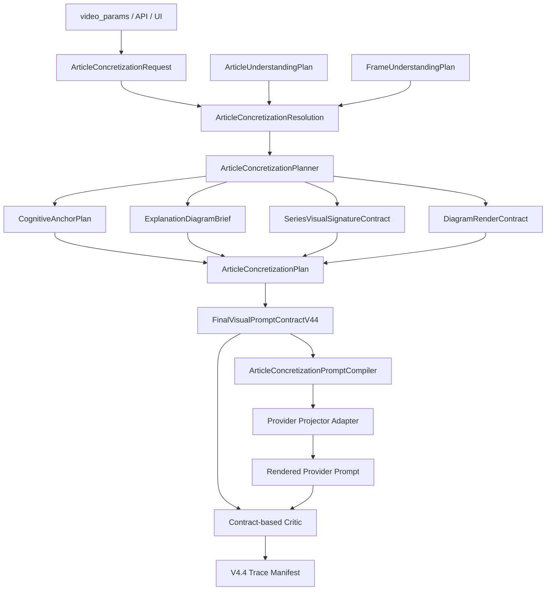

# Pixelle Article Concretization Visual System V4.4.2 可直接执行实现计划

> 文档状态：V4.4.1 执行计划修正版 / 可开工版本
> 日期：2026-06-02
> 目标分支建议：`codex/article-concretization-v442`
> 执行原则：TDD、显式边界、单事实源、禁止隐式 fallback、禁止破坏旧 V4.4 路径、禁止使用 `git add` 加当前目录。

---

## 0. 一句话结论

本版本不是继续做“小黑模式”，而是落地 **Article Concretization / 文章具象化解读系统**。

系统目标是：

```text
文章理解结果
-> 认知锚点选择
-> 图解语法选择
-> 系列视觉签名参与策略
-> 渲染表面与图解面板比例
-> FinalVisualPromptContractV44
-> ArticleConcretizationPromptCompiler
-> Provider projector adapter
-> Contract-based critic
-> Trace manifest
```

用户看到的是“文章具象化解读”，工程上落地为一组结构化 contract。最终 prompt 只是 contract 的投影结果，不再作为事实源。

---

## 1. 本版相对 V4.4.1 的关键修正

这版必须吸收以下冷水 review 结论：

| 问题 | 修正 |
| --- | --- |
| Phase 0.5 依赖 Phase 1 模型 | 新增 **Phase 0：极小模型骨架**，先创建 enums、request、基础 helper，再做 Resolution。 |
| VisibleTextPolicy 不能简单线性排序 | 改成 **allowed visible text intersection**，新增 `VisibleTextResolution`，不再用简单 strictness rank。 |
| 竖屏 canvas + 横版 diagram panel 不应 strict 报错 | 拆分 `canvas_aspect_ratio` 与 `diagram_panel_aspect_ratio`。strict 只禁止非法 canvas override，不禁止内部横版图解面板。 |
| Provider projector 直接改签名风险大 | 不改旧 projector 主签名，新增 `ArticleConcretizationPromptCompiler` 和 V4.4 adapter 入口。 |
| 前端控制项过多 | 默认只展示：启用、认知锚点、图解类型、渲染风格；签名角色、文字策略、面板比例、批准标签、意图放高级设置。 |
| 提交命令不安全 | 所有提交均使用显式路径；计划中不提供 `git add` 当前目录命令。 |
| 缺少 prompt compiler | 新增 `ArticleConcretizationPromptCompiler`，负责 contract -> prompt guidance，防止 provider projector 重新变成拼字段层。 |
| Resolution dataclass 放在 service 会造成 models 反向依赖 | `VisibleTextResolution`、`DiagramLayoutResolution`、`ArticleConcretizationResolution` 全部定义在 `models/article_concretization.py`；`services/article_concretization_resolution.py` 只放 resolver 函数和异常。 |
| `free_text_allowed` 是否新增不明确 | 本版本正式扩展现有 `VisibleTextPolicy`，新增 `FREE_TEXT_ALLOWED = "free_text_allowed"`；不走 adapter 分支。 |
| positive-only workflow 可能把 negative blocks 塞进正向 prompt | Compiler 必须区分 provider capability；negative blocks 只进入 negative prompt，positive-only workflow 必须转写成正向约束。 |

---

## 2. 产品边界

### 2.1 要做

```text
1. Article Concretization / 文章具象化解读。
2. 从 ArticleUnderstandingPlan 中选择本帧认知锚点。
3. 用 ExplanationDiagramGrammar 决定图解结构。
4. 用 SeriesVisualSignatureContract 决定固定视觉签名如何参与。
5. 用 DiagramRenderContract 决定表面风格和图解面板比例。
6. 通过 FinalVisualPromptContractV44 形成唯一事实源。
7. 通过 ArticleConcretizationPromptCompiler 生成 provider 可读 prompt guidance。
8. 通过 contract-based critic 验证输出是否保留文章主体、锚点、图解语法和签名边界。
```

### 2.2 不做

```text
1. 不做“小黑模式”产品名。
2. 不把 xiaohei_handdrawn style 等同于固定黑色角色出场。
3. 不让 render style 改变文章主体或语义任务。
4. 不让 series visual signature 替代 required subjects。
5. 不把用户选择直接拼进 prompt。
6. 不让 provider projector 重新做 mode resolution。
7. 不通过 raw prompt string critic 作为主要 gate。
8. 不破坏旧 V4.4 projector 调用链。
```

---

## 3. 核心产品模型

文章具象化系统有 4 条独立轴：

| 轴 | 用户问题 | Backend contract |
| --- | --- | --- |
| Cognitive anchor | 这篇文章最该被具象化的认知点是什么？ | `CognitiveAnchorPlan` |
| Explanation diagram grammar | 这张图用什么解释图结构呈现？ | `ExplanationDiagramBrief` |
| Series visual signature | 固定视觉签名以什么身份进入图？ | `SeriesVisualSignatureContract` |
| Render surface / layout | 它长什么样，图解面板比例是什么？ | `DiagramRenderContract` |

支持的 cognitive anchor：

```text
auto
judgment
causal_mechanism
process
structure
state
metaphor
contrast
relationship
evidence
decision_path
state_machine
```

支持的 diagram grammar：

```text
auto
single_explanation_image
multi_panel_comic
process_flow
structure_map
contrast_board
relationship_map
metaphor_scene
decision_tree
state_machine
evidence_map
```

支持的 series visual signature role：

```text
none
auto
core_actor
silent_witness
operator
guide
obstacle
container
background_mark
```

支持的 render style：

```text
auto
xiaohei_handdrawn
editorial_diagram
clean_vector
cinematic_metaphor
brand_kv
three_d_concept
ink_collage
```

支持的 diagram panel aspect ratio：

```text
auto
landscape_16_9
square_1_1
portrait_4_5
vertical_9_16
template
```

---

## 4. 目标架构



硬规则：

```text
1. ArticleUnderstandingPlan 是 claims、evidence、required subjects、article visible text policy 的事实源。
2. ArticleConcretizationResolution 是用户请求和系统可执行配置之间的唯一解析层。
3. ArticleConcretizationPlanner 只消费 Resolution，不直接消费 raw request 做 fallback。
4. FinalVisualPromptContractV44 是 provider projector、compiler、critic、trace 的唯一事实源。
5. ArticleConcretizationPromptCompiler 只读 FinalVisualPromptContractV44，不读 raw video_params。
6. Provider projector adapter 只负责 provider-specific 格式化，不做语义解析。
7. strict_user_mode=True 时，不能静默修改用户显式选择。
8. article_concretization_enabled=False 时，不产生 plan、不产生 projected prompt parts、不污染旧 V4.4 路径。
```

---

## 5. 文件结构

### 5.1 新增文件

```text
pixelle_video/models/article_concretization.py
pixelle_video/services/article_concretization_resolution.py
pixelle_video/services/article_concretization_planner.py
pixelle_video/services/article_concretization_prompt_compiler.py
pixelle_video/services/article_concretization_provider_adapter.py
pixelle_video/services/article_concretization_critic.py
web/components/article_concretization_controls.py

tests/models/test_article_concretization.py
tests/services/test_article_concretization_resolution.py
tests/services/test_article_concretization_planner.py
tests/services/test_article_concretization_prompt_compiler.py
tests/services/test_article_concretization_provider_adapter.py
tests/services/test_article_concretization_critic.py
tests/web/test_article_concretization_controls.py
```

### 5.2 修改文件

```text
pixelle_video/models/visual_planning_mode.py
pixelle_video/models/final_visual_prompt_contract.py
pixelle_video/models/mode_resolution.py
pixelle_video/models/video_generation_contract.py
pixelle_video/services/visual_prompt_planning_service.py
pixelle_video/services/provider_prompt_projector.py
pixelle_video/services/v44_prompt_trace_manifest.py
api/schemas/video.py
api/routers/video.py
web/components/content_input.py
web/components/output_preview.py
web/i18n/locales/zh_CN.json
web/i18n/locales/en_US.json

tests/models/test_mode_resolution.py
tests/models/test_final_visual_prompt_contract.py
tests/test_video_api.py
tests/test_output_preview.py
tests/services/test_provider_prompt_projector.py
tests/services/test_visual_role_projector_and_service_v4.py
tests/services/test_v44_prompt_trace_manifest.py
```

---

## 6. 执行前置检查

### Step 6.1 确认当前仓库状态

```powershell
cd D:\demo1\Pixelle\Pixelle
git status --short --branch
```

如果当前工作区有用户未提交改动，不要在该目录直接开工。

### Step 6.2 创建干净 worktree

```powershell
cd D:\demo1\Pixelle
git fetch origin
git worktree add D:\demo1\Pixelle-article-concretization-v442 origin/dev -b codex/article-concretization-v442
cd D:\demo1\Pixelle-article-concretization-v442
git status --short --branch
```

### Step 6.3 读当前 V4.4 入口

```powershell
rg -n "ArticleUnderstandingMode|VisualPlanningMode|FinalVisualPromptContractV44|visual_role_strategy|provider_prompt_projector|v44_prompt_trace_manifest" pixelle_video api web tests -g "*.py"
```

验收：确认当前 V4.4 model、service、projector、trace、API、UI、tests 的真实文件名和调用链。后续执行时以实际代码为准，不能盲目替换旧接口。

---

# Phase 0：极小模型骨架

> 目的：先让 Resolution 可编译，避免 Phase 0.5 为了写解析逻辑“顺手实现完整模型”。

## 0.1 新增最小 enums 与 request

文件：

```text
pixelle_video/models/article_concretization.py
tests/models/test_article_concretization.py
```

新增最小类型：

```python
class CognitiveAnchorKind(str, Enum):
    AUTO = "auto"
    JUDGMENT = "judgment"
    CAUSAL_MECHANISM = "causal_mechanism"
    PROCESS = "process"
    STRUCTURE = "structure"
    STATE = "state"
    METAPHOR = "metaphor"
    CONTRAST = "contrast"
    RELATIONSHIP = "relationship"
    EVIDENCE = "evidence"
    DECISION_PATH = "decision_path"
    STATE_MACHINE = "state_machine"
```

```python
class ExplanationDiagramGrammar(str, Enum):
    AUTO = "auto"
    SINGLE_EXPLANATION_IMAGE = "single_explanation_image"
    MULTI_PANEL_COMIC = "multi_panel_comic"
    PROCESS_FLOW = "process_flow"
    STRUCTURE_MAP = "structure_map"
    CONTRAST_BOARD = "contrast_board"
    RELATIONSHIP_MAP = "relationship_map"
    METAPHOR_SCENE = "metaphor_scene"
    DECISION_TREE = "decision_tree"
    STATE_MACHINE = "state_machine"
    EVIDENCE_MAP = "evidence_map"
```

```python
class SeriesVisualSignatureRole(str, Enum):
    NONE = "none"
    AUTO = "auto"
    CORE_ACTOR = "core_actor"
    SILENT_WITNESS = "silent_witness"
    OPERATOR = "operator"
    GUIDE = "guide"
    OBSTACLE = "obstacle"
    CONTAINER = "container"
    BACKGROUND_MARK = "background_mark"
```

```python
class DiagramRenderStyle(str, Enum):
    AUTO = "auto"
    XIAOHEI_HANDDRAWN = "xiaohei_handdrawn"
    EDITORIAL_DIAGRAM = "editorial_diagram"
    CLEAN_VECTOR = "clean_vector"
    CINEMATIC_METAPHOR = "cinematic_metaphor"
    BRAND_KV = "brand_kv"
    THREE_D_CONCEPT = "three_d_concept"
    INK_COLLAGE = "ink_collage"
```

```python
class DiagramAspectRatio(str, Enum):
    AUTO = "auto"
    LANDSCAPE_16_9 = "landscape_16_9"
    SQUARE_1_1 = "square_1_1"
    PORTRAIT_4_5 = "portrait_4_5"
    VERTICAL_9_16 = "vertical_9_16"
    TEMPLATE = "template"
```

`ArticleConcretizationRequest` 最小字段：

```python
@dataclass(frozen=True)
class ArticleConcretizationRequest:
    enabled: bool = False
    cognitive_anchor_kind: CognitiveAnchorKind = CognitiveAnchorKind.AUTO
    explanation_diagram_grammar: ExplanationDiagramGrammar = ExplanationDiagramGrammar.AUTO
    series_visual_signature_role: SeriesVisualSignatureRole = SeriesVisualSignatureRole.NONE
    diagram_render_style: DiagramRenderStyle = DiagramRenderStyle.AUTO
    diagram_aspect_ratio: DiagramAspectRatio = DiagramAspectRatio.AUTO
    diagram_visible_text_policy: VisibleTextPolicy = VisibleTextPolicy.NO_VISIBLE_TEXT
    diagram_approved_labels: tuple[str, ...] = ()
    diagram_user_intent_hint: str | None = None
```

规则：

```text
1. from_mapping 必须支持 flat payload 和 nested payload。
2. nested key 为 article_concretization。
3. nested 值覆盖 flat 值。
4. article_concretization_enabled 与 enabled 都可识别。
5. diagram_user_intent_hint 最大 500 字符，超长 ValueError。
6. diagram_approved_labels 支持 tuple/list，也支持逗号分隔字符串。
7. unknown enum value 必须 ValueError，不做自动降级。
```

flat / nested merge 示例：

```python
@classmethod
def from_mapping(cls, source: Mapping[str, Any] | None) -> "ArticleConcretizationRequest":
    data = dict(source or {})
    nested = data.get("article_concretization")
    if isinstance(nested, Mapping):
        merged = {**data, **nested}
    else:
        merged = data
    return cls(...)
```


## 0.2 VisibleTextPolicy 最小扩展

现有 `VisibleTextPolicy` 必须正式扩展为以下值：

```text
no_visible_text
source_text_only
symbolic_labels_only
approved_labels_only
free_text_allowed
```

执行要求：

```text
1. 在 `pixelle_video/models/visual_planning_mode.py` 中新增 `VisibleTextPolicy.FREE_TEXT_ALLOWED = "free_text_allowed"`。
2. `VisibleTextPolicy.from_value("free_text_allowed")` 必须返回新枚举值。
3. API / request / resolution / trace 都使用同一个字符串值 `free_text_allowed`。
4. 不允许为 `free_text_allowed` 做临时 adapter 或映射到别的 policy；否则测试和 API 会分叉。
```

注意：本系统不使用简单严格度排序。`approved_labels_only` 与 `symbolic_labels_only` 不是天然线性强弱关系。

## 0.3 Phase 0 测试

新增测试：

```text
test_request_accepts_flat_payload
test_request_accepts_nested_payload
test_nested_payload_overrides_flat_payload
test_request_rejects_unknown_enum_values
test_request_rejects_too_long_user_intent_hint
test_request_parses_approved_labels_from_list_and_csv
test_disabled_request_serializes_noop_defaults
test_visible_text_policy_accepts_free_text_allowed
```

运行：

```powershell
python -m pytest tests/models/test_article_concretization.py -q
```

提交：

```powershell
git add pixelle_video/models/visual_planning_mode.py pixelle_video/models/article_concretization.py tests/models/test_visual_planning_mode.py tests/models/test_article_concretization.py
git commit -m "feat: add article concretization model skeleton"
```

---

# Phase 0.5：Resolution / Conflict / No-op 边界冻结

> 目的：先把用户请求解析成可执行决定，再让 planner 消费。Planner 不再承担 auto、fallback、strict conflict、text policy intersection、aspect ratio layout 等职责。

文件：

```text
pixelle_video/models/article_concretization.py
pixelle_video/services/article_concretization_resolution.py
tests/services/test_article_concretization_resolution.py
```

归属规则：

```text
1. `VisibleTextResolution`、`DiagramLayoutResolution`、`ArticleConcretizationResolution` 定义在 `pixelle_video/models/article_concretization.py`。
2. `pixelle_video/services/article_concretization_resolution.py` 只定义 `ArticleConcretizationResolutionConflict`、mapping 常量、纯解析函数。
3. `models/article_concretization.py` 不允许 import services，避免 models -> services 反向依赖。
4. Planner、Final contract、Compiler 都从 models 导入 Resolution dataclass。
```

## 0.5.1 新增 Resolution 合同

```python
@dataclass(frozen=True)
class VisibleTextResolution:
    effective_policy: VisibleTextPolicy
    allowed_visible_text: tuple[str, ...]
    text_origin: Literal["none", "source", "approved", "intersection", "symbolic_controlled", "free"]
    warnings: tuple[str, ...] = ()
```

```python
@dataclass(frozen=True)
class DiagramLayoutResolution:
    canvas_aspect_ratio: DiagramAspectRatio
    diagram_panel_aspect_ratio: DiagramAspectRatio
    panel_inside_canvas: bool
    layout_intent: Literal["match_canvas", "panel_inside_canvas", "template_default"]
    warnings: tuple[str, ...] = ()
```

```python
@dataclass(frozen=True)
class ArticleConcretizationResolution:
    request: ArticleConcretizationRequest
    enabled: bool
    effective_anchor_kind: CognitiveAnchorKind
    effective_diagram_grammar: ExplanationDiagramGrammar
    effective_signature_role: SeriesVisualSignatureRole
    effective_render_style: DiagramRenderStyle
    layout: DiagramLayoutResolution
    visible_text: VisibleTextResolution
    approved_labels: tuple[str, ...]
    warnings: tuple[str, ...]
    errors: tuple[str, ...]
    fallback_used: bool
    fallback_reason: str | None
```

Disabled no-op：

```python
if not request.enabled:
    return ArticleConcretizationResolution(
        request=request,
        enabled=False,
        effective_anchor_kind=CognitiveAnchorKind.AUTO,
        effective_diagram_grammar=ExplanationDiagramGrammar.AUTO,
        effective_signature_role=SeriesVisualSignatureRole.NONE,
        effective_render_style=DiagramRenderStyle.AUTO,
        layout=template_default_layout,
        visible_text=no_visible_text_resolution,
        approved_labels=(),
        warnings=(),
        errors=(),
        fallback_used=False,
        fallback_reason=None,
    )
```

## 0.5.2 Anchor / Grammar 解析规则

解析顺序：

```text
1. 读取 ArticleUnderstandingPlan / FrameUnderstandingPlan 的 primary_lens。
2. 根据 lens 得到默认 anchor。
3. 如果用户显式选择 anchor，用用户 anchor。
4. 如果 grammar 是 auto，必须根据 resolved anchor 选择默认 grammar。
5. 如果用户显式选择 grammar，检查它是否与 resolved anchor 兼容。
6. strict_user_mode=True：不兼容则 errors 并 raise。
7. strict_user_mode=False：不兼容则 warning，并将 grammar 修正为 anchor default。
```

默认映射：

| Anchor | Default grammar |
| --- | --- |
| judgment | single_explanation_image |
| causal_mechanism | process_flow |
| process | process_flow |
| structure | structure_map |
| state | metaphor_scene |
| metaphor | metaphor_scene |
| contrast | contrast_board |
| relationship | relationship_map |
| evidence | evidence_map |
| decision_path | decision_tree |
| state_machine | state_machine |

兼容矩阵：

```python
ANCHOR_ALLOWED_GRAMMARS = {
    JUDGMENT: {SINGLE_EXPLANATION_IMAGE, CONTRAST_BOARD, METAPHOR_SCENE},
    CAUSAL_MECHANISM: {PROCESS_FLOW, STRUCTURE_MAP, METAPHOR_SCENE},
    PROCESS: {PROCESS_FLOW, MULTI_PANEL_COMIC, STATE_MACHINE},
    STRUCTURE: {STRUCTURE_MAP, RELATIONSHIP_MAP},
    STATE: {METAPHOR_SCENE, STATE_MACHINE, SINGLE_EXPLANATION_IMAGE},
    METAPHOR: {METAPHOR_SCENE, SINGLE_EXPLANATION_IMAGE},
    CONTRAST: {CONTRAST_BOARD, SINGLE_EXPLANATION_IMAGE},
    RELATIONSHIP: {RELATIONSHIP_MAP, STRUCTURE_MAP},
    EVIDENCE: {EVIDENCE_MAP, STRUCTURE_MAP},
    DECISION_PATH: {DECISION_TREE, PROCESS_FLOW},
    STATE_MACHINE: {STATE_MACHINE, PROCESS_FLOW},
}
```

## 0.5.3 Visible text policy intersection

禁止简单 rank：

```text
不要写：NO_VISIBLE_TEXT < SOURCE_TEXT_ONLY < SYMBOLIC_LABELS_ONLY < APPROVED_LABELS_ONLY < FREE_TEXT_ALLOWED
```

必须用 allowed set / intersection：

```text
1. NO_VISIBLE_TEXT 与任何 policy 合并，结果都是 NO_VISIBLE_TEXT。
2. FREE_TEXT_ALLOWED 不扩大 article/frame 的限制，只表示用户不额外限制。
3. SOURCE_TEXT_ONLY 允许 source evidence 中的短词、实体、原文短句。
4. APPROVED_LABELS_ONLY 必须有 diagram_approved_labels。
5. APPROVED_LABELS_ONLY + SOURCE_TEXT_ONLY = approved_labels ∩ source_allowed_terms。
6. APPROVED_LABELS_ONLY + SYMBOLIC_LABELS_ONLY = approved_labels 中可作为受控短标签的项。
7. 交集为空：strict_user_mode=True 报错；strict_user_mode=False 降级 NO_VISIBLE_TEXT 并 warning。
```

输入来源优先级：

```text
article_plan.visible_text_policy
frame_plan.visible_text_policy
request.diagram_visible_text_policy
```

输出为 `VisibleTextResolution`，而不是单个 enum。

## 0.5.4 Aspect ratio 解析规则

概念拆分：

```text
canvas_aspect_ratio：视频画布比例，由 frame_template / render target 决定。
diagram_panel_aspect_ratio：解释图面板比例，由 diagram_aspect_ratio 控制。
```

规则：

```text
1. 用户的 diagram_aspect_ratio 默认只控制内部 diagram panel，不覆盖 canvas。
2. vertical_9_16 canvas 内部放 landscape_16_9 diagram panel 是合法需求。
3. strict_user_mode=True 不应因为 panel 与 canvas 不同就报错。
4. 只有用户明确请求 canvas override，且模板或 renderer 不允许 override 时，strict 才报错。
5. 当 panel 与 canvas 不同时，记录 warning/layout_intent="panel_inside_canvas"。
6. diagram_aspect_ratio=template 时，panel 跟随 canvas。
```

本版本 UI 不暴露 canvas override。API 如果未来要支持 canvas override，必须新增独立字段，不能复用 `diagram_aspect_ratio`。

## 0.5.5 Series signature strict 规则

```text
1. series_visual_signature_role=none：文章具象化系统不插入固定视觉签名。
2. role 非 none/auto 且没有 ip_profile_id：strict=True 报错。
3. role 非 none/auto 且没有 ip_profile_id：strict=False 降级 none 并 warning。
4. role=auto 且没有 ip_profile_id：解析为 none。
5. role=auto 且有 ip_profile_id：根据 anchor/grammar 解析 operator/guide/silent_witness。
```

## 0.5.6 与旧 visual_role_strategy 的优先级

```text
1. article_concretization_enabled=False：完全走旧 V4.4 visual role / IP 路径。
2. enabled=True 且 series_visual_signature_role=none：文章具象化系统不插入 signature；如果旧 visual_role_strategy 显式要求 signature_presence，记录 conflict warning，由旧路径承担身份一致性，但不得替代文章主体。
3. enabled=True 且 series_visual_signature_role 非 none：SeriesVisualSignatureContract 接管解释图中的身份参与；旧 visual_role_strategy 只能提供 identity source，不再决定主体替换。
4. 两条路径都不能双重插入同一个 IP。
```

## 0.5.7 Phase 0.5 测试

新增测试：

```text
test_disabled_request_returns_noop_resolution
test_explicit_anchor_with_auto_grammar_uses_anchor_default
test_non_strict_incompatible_anchor_grammar_warns_and_repairs
test_strict_incompatible_anchor_grammar_raises
test_causal_mechanism_anchor_defaults_to_process_flow
test_approved_labels_only_requires_labels
test_visible_text_intersection_source_and_approved
test_empty_visible_text_intersection_non_strict_downgrades_to_no_visible_text
test_empty_visible_text_intersection_strict_raises
test_landscape_panel_inside_vertical_canvas_is_allowed_in_strict_mode
test_canvas_override_conflict_raises_only_when_canvas_override_is_explicit
test_signature_role_requires_ip_profile_in_strict_mode
test_signature_role_without_ip_non_strict_drops_to_none_with_warning
test_old_visual_role_strategy_conflict_records_warning
```

运行：

```powershell
python -m pytest tests/services/test_article_concretization_resolution.py -q
```

提交：

```powershell
git add pixelle_video/models/article_concretization.py pixelle_video/services/article_concretization_resolution.py tests/models/test_article_concretization.py tests/services/test_article_concretization_resolution.py
git commit -m "feat: resolve article concretization requests"
```

---

# Phase 1：完整模型契约

文件：

```text
pixelle_video/models/article_concretization.py
tests/models/test_article_concretization.py
```

## 1.1 新增完整 dataclass

```python
@dataclass(frozen=True)
class CognitiveAnchorPlan:
    anchor_id: str
    anchor_kind: CognitiveAnchorKind
    anchor_claim: str
    anchor_question: str
    source_evidence_ids: tuple[str, ...]
    main_entities: tuple[str, ...]
    required_subjects: tuple[str, ...]
    source_text_excerpt: str
    confidence: float
```

```python
@dataclass(frozen=True)
class ExplanationDiagramBrief:
    brief_id: str
    grammar: ExplanationDiagramGrammar
    primary_visual_task: PrimaryVisualTask
    diagram_title: str
    visual_metaphor: str
    composition_rules: tuple[str, ...]
    panel_plan: tuple[str, ...]
    forbidden_losses: tuple[str, ...]
    visible_text: VisibleTextResolution
```

```python
@dataclass(frozen=True)
class SeriesVisualSignatureContract:
    enabled: bool
    role: SeriesVisualSignatureRole
    identity_profile_id: str | None
    participation_rule: str
    replacement_policy: Literal["no_subject_replacement", "background_only", "may_lead_without_replacement"]
    visual_weight: float
    forbidden_behaviors: tuple[str, ...]
```

```python
@dataclass(frozen=True)
class DiagramRenderContract:
    render_style: DiagramRenderStyle
    canvas_aspect_ratio: DiagramAspectRatio
    diagram_panel_aspect_ratio: DiagramAspectRatio
    panel_inside_canvas: bool
    style_rules: tuple[str, ...]
    negative_style_rules: tuple[str, ...]
```

```python
@dataclass(frozen=True)
class ArticleConcretizationPlan:
    plan_id: str
    request: ArticleConcretizationRequest
    resolution: ArticleConcretizationResolution
    anchor: CognitiveAnchorPlan
    diagram: ExplanationDiagramBrief
    series_signature: SeriesVisualSignatureContract
    render: DiagramRenderContract
```

所有 contract 必须有：

```text
1. __post_init__ validation
2. to_dict()
3. from_mapping() 仅在必要对象中实现
4. tuple 化，禁止裸 list 留在 frozen dataclass 内部
5. 0 <= confidence/visual_weight <= 1
```

## 1.2 Xiaohei style 与 signature 解耦

`DiagramRenderStyle.XIAOHEI_HANDDRAWN` 的 style rules 只能描述表面风格：

```text
white background
hand-drawn explanatory panel style
simple black linework
limited red orange blue annotation marks
```

禁止 style rules 自动包含：

```text
black solid signature figure
Xiaohei character appears
mascot in every frame
```

固定角色是否出现，只能由 `SeriesVisualSignatureContract` 决定。

## 1.3 Phase 1 测试

新增 / 扩展：

```text
test_full_plan_serializes_request_resolution_anchor_diagram_signature_render
test_xiaohei_render_style_does_not_insert_signature_when_role_none
test_signature_enabled_requires_non_none_role
test_signature_visual_weight_range_validation
test_diagram_render_contract_serializes_canvas_and_panel_ratio
test_cognitive_anchor_plan_requires_source_evidence_or_source_text_fallback
```

运行：

```powershell
python -m pytest tests/models/test_article_concretization.py -q
```

提交：

```powershell
git add pixelle_video/models/article_concretization.py tests/models/test_article_concretization.py
git commit -m "feat: add article concretization plan contracts"
```

---

# Phase 2：Deterministic Planner

文件：

```text
pixelle_video/services/article_concretization_planner.py
tests/services/test_article_concretization_planner.py
```

## 2.1 Planner 职责

Planner 只做：

```text
1. 根据 Resolution + ArticleUnderstandingPlan + FrameUnderstandingPlan 构建 plan。
2. 选择 anchor claim、question、main entities、required subjects。
3. 构建 diagram brief。
4. 构建 signature contract。
5. 构建 render contract。
```

Planner 不做：

```text
1. 不从 raw request 做 enum fallback。
2. 不重新做 strict conflict。
3. 不重新解析 visible text policy。
4. 不重新解析 aspect ratio。
5. 不直接输出最终 prompt。
```

## 2.2 main_entities / required_subjects 来源

禁止：

```python
frame_plan.frame_claim.split("，")
```

正确优先级：

```text
1. frame_plan.required_subjects
2. article_plan.required_subjects
3. article_plan.main_entities
4. frame_plan.frame_claim 中经过明确 extractor 得到的 entities
5. fallback: ("article_claim",)
```

如果现有 `required_subjects` 仍是字符串 tuple，就先支持字符串；如果已经是 `SubjectAnchor`，要保留 label、importance、visual_presence、loss_policy。

## 2.3 Planner 测试

新增：

```text
test_planner_consumes_resolution_not_raw_request
test_planner_maps_causal_mechanism_to_mechanism_diagram
test_planner_uses_required_subjects_before_claim_split
test_planner_keeps_source_evidence_ids
test_planner_builds_signature_contract_from_resolved_role
test_planner_builds_render_contract_from_layout_resolution
test_planner_disabled_resolution_returns_none_or_noop_without_prompt_parts
```

推荐 service API：

```python
class ArticleConcretizationPlanner:
    def plan(
        self,
        *,
        resolution: ArticleConcretizationResolution,
        article_plan: ArticleUnderstandingPlan,
        frame_plan: FrameUnderstandingPlan,
        source_text: str,
    ) -> ArticleConcretizationPlan | None:
        ...
```

Disabled 行为：

```text
resolution.enabled=False 时，planner 返回 None，调用方不得构建 article_concretization prompt parts。
```

运行：

```powershell
python -m pytest tests/services/test_article_concretization_planner.py -q
```

提交：

```powershell
git add pixelle_video/services/article_concretization_planner.py tests/services/test_article_concretization_planner.py
git commit -m "feat: plan article concretization from resolved contracts"
```

---

# Phase 3：API / Generation Contract Pass-through

文件：

```text
api/schemas/video.py
api/routers/video.py
pixelle_video/models/video_generation_contract.py
pixelle_video/models/mode_resolution.py
tests/test_video_api.py
tests/models/test_mode_resolution.py
```

## 3.1 API 字段

在 `VideoGenerateRequest` / internal request 中加入：

```python
article_concretization_enabled: bool = False
cognitive_anchor_kind: CognitiveAnchorKindRequest = "auto"
explanation_diagram_grammar: ExplanationDiagramGrammarRequest = "auto"
series_visual_signature_role: SeriesVisualSignatureRoleRequest = "none"
diagram_render_style: DiagramRenderStyleRequest = "auto"
diagram_aspect_ratio: DiagramAspectRatioRequest = "auto"
diagram_visible_text_policy: VisibleTextPolicyRequest = "no_visible_text"
diagram_approved_labels: list[str] = Field(default_factory=list)
diagram_user_intent_hint: str | None = Field(None, max_length=500)
```

`VisibleTextPolicyRequest` 必须包含：

```text
no_visible_text
source_text_only
symbolic_labels_only
approved_labels_only
free_text_allowed
```

API 可以暴露高级字段；UI 默认不一定展示全部。

## 3.2 mode_resolution 集成

`ArticleVisualPlanningRequest` 增加：

```python
article_concretization: ArticleConcretizationRequest
```

规则：

```text
1. from_mapping(source) 调 ArticleConcretizationRequest.from_mapping(source)。
2. to_dict() 输出 nested article_concretization。
3. 不在 mode_resolution 里构建完整 plan。
4. strict_user_mode 只透传，具体冲突由 ArticleConcretizationResolution 处理。
```

## 3.3 no-op 传递规则

```text
article_concretization_enabled=False 时：
- request 可以序列化默认值；
- generation contract 可以带 request；
- 但 visual planning service 不生成 plan；
- final contract 中 article_concretization 为 {} 或完全缺省；
- projected_prompt_parts 中不能有 article_concretization.*。
```

## 3.4 测试

新增：

```text
test_video_generate_request_accepts_article_concretization_fields
test_video_generate_request_rejects_invalid_article_concretization_values
test_video_generate_request_rejects_too_long_diagram_hint
test_router_passes_article_concretization_fields_to_video_params
test_article_visual_planning_request_carries_nested_concretization_request
test_disabled_article_concretization_has_no_prompt_side_effects_in_generation_contract
```

运行：

```powershell
python -m pytest tests/test_video_api.py tests/models/test_mode_resolution.py tests/models/test_article_concretization.py -q
```

提交：

```powershell
git add api/schemas/video.py api/routers/video.py pixelle_video/models/video_generation_contract.py pixelle_video/models/mode_resolution.py tests/test_video_api.py tests/models/test_mode_resolution.py tests/models/test_article_concretization.py
git commit -m "feat: expose article concretization request fields"
```

---

# Phase 4：Web UI 控件与请求传播

文件：

```text
web/components/article_concretization_controls.py
web/components/content_input.py
web/components/output_preview.py
web/i18n/locales/zh_CN.json
web/i18n/locales/en_US.json
tests/web/test_article_concretization_controls.py
tests/test_output_preview.py
```

## 4.1 UI 信息架构

新增 expander：

```text
文章具象化解读
```

默认区只展示：

```text
1. 启用文章具象化解读
2. 认知锚点
3. 解释图类型
4. 渲染风格
```

高级设置展示：

```text
1. 系列视觉签名角色
2. 画面文字策略
3. 图解面板比例
4. 批准标签
5. 额外意图
```

文案要求：

```text
1. 不叫“小黑模式”。
2. xiaohei_handdrawn 说明为“小黑参考手绘风格”，不是“强制小黑角色出场”。
3. diagram_aspect_ratio UI 文案叫“图解面板比例”，不要叫“视频画面比例”。
4. strict_user_mode 不暴露给普通 UI。
```

## 4.2 static template 行为

不要因为 `selected_template_type_for_storyboard == "static"` 禁用整个文章具象化控件。

建议：

```text
1. 文章具象化控件始终可用。
2. 如果 static template 不允许布局变化，只禁用图解面板比例或提示“跟随模板”。
3. 其他 anchor / diagram / style 仍可用。
```

## 4.3 Helper API

```python
def build_article_concretization_payload(
    *,
    enabled: bool,
    cognitive_anchor_kind: str = "auto",
    explanation_diagram_grammar: str = "auto",
    diagram_render_style: str = "auto",
    series_visual_signature_role: str = "none",
    diagram_aspect_ratio: str = "auto",
    diagram_visible_text_policy: str = "no_visible_text",
    diagram_approved_labels: Sequence[str] | str | None = None,
    diagram_user_intent_hint: str | None = None,
) -> dict[str, Any]:
    ...
```

Disabled payload 返回默认值，但后端 no-op 决定以 `article_concretization_enabled=False` 为准。

## 4.4 output_preview 传播

新增固定 key 列表：

```python
ARTICLE_CONCRETIZATION_OPTION_KEYS = (
    "article_concretization_enabled",
    "cognitive_anchor_kind",
    "explanation_diagram_grammar",
    "series_visual_signature_role",
    "diagram_render_style",
    "diagram_aspect_ratio",
    "diagram_visible_text_policy",
    "diagram_approved_labels",
    "diagram_user_intent_hint",
)
```

单图生成和 batch shared config 都要复制这些字段。

## 4.5 测试

新增：

```text
test_build_payload_default_controls_only
test_build_payload_advanced_controls
test_build_payload_trims_hint_and_labels
test_controls_do_not_disable_entire_expander_for_static_template
test_single_generation_request_copies_article_concretization_options
test_batch_shared_config_copies_article_concretization_options
```

运行：

```powershell
python -m pytest tests/web/test_article_concretization_controls.py tests/test_output_preview.py -q
```

提交：

```powershell
git add web/components/article_concretization_controls.py web/components/content_input.py web/components/output_preview.py web/i18n/locales/zh_CN.json web/i18n/locales/en_US.json tests/web/test_article_concretization_controls.py tests/test_output_preview.py
git commit -m "feat: add article concretization web controls"
```

---

# Phase 5：FinalVisualPromptContractV44 集成

文件：

```text
pixelle_video/models/final_visual_prompt_contract.py
tests/models/test_final_visual_prompt_contract.py
```

## 5.1 Contract 字段

`FinalVisualPromptContractV44` 增加：

```python
article_concretization: Mapping[str, Any] = field(default_factory=dict)
```

规则：

```text
1. 这是 final contract 中唯一的 article_concretization metadata 事实源。
2. provider metadata 不允许另塞一份不同版本。
3. to_dict() 必须稳定序列化。
4. disabled no-op 时 article_concretization 为空 dict。
```

## 5.2 Projected prompt parts

新增 helper：

```python
def concretization_projected_prompt_parts(plan: ArticleConcretizationPlan) -> tuple[ProjectedPromptPart, ...]:
    ...
```

必须投影：

```text
article_concretization.anchor
article_concretization.required_subjects
article_concretization.diagram
article_concretization.visible_text_policy
article_concretization.series_signature
article_concretization.render_style
article_concretization.aspect_ratio
```

每个 part 必须有：

```text
part_id
priority
source_plan_type
source_field
content
locked
critic_check_required
```

## 5.3 测试

新增：

```text
test_v44_contract_serializes_article_concretization_metadata
test_concretization_projected_prompt_parts_include_all_axes
test_disabled_concretization_has_no_projected_parts
test_projected_parts_are_locked_and_critic_check_required
```

运行：

```powershell
python -m pytest tests/models/test_final_visual_prompt_contract.py tests/models/test_article_concretization.py -q
```

提交：

```powershell
git add pixelle_video/models/final_visual_prompt_contract.py tests/models/test_final_visual_prompt_contract.py
git commit -m "feat: attach article concretization to v44 prompt contract"
```

---

# Phase 6：ArticleConcretization Prompt Compiler

文件：

```text
pixelle_video/services/article_concretization_prompt_compiler.py
tests/services/test_article_concretization_prompt_compiler.py
```

## 6.1 新增 Guidance 合同

```python
@dataclass(frozen=True)
class PromptGuidanceBlock:
    block_id: str
    priority: int
    content: str
    locked: bool
    source_part_ids: tuple[str, ...]
```

```python
@dataclass(frozen=True)
class ArticleConcretizationPromptGuidance:
    locked_blocks: tuple[PromptGuidanceBlock, ...]
    soft_blocks: tuple[PromptGuidanceBlock, ...]
    negative_blocks: tuple[PromptGuidanceBlock, ...]
    metadata: Mapping[str, Any]
    critic_expectations: tuple[str, ...]
```

## 6.2 Compiler 规则

```python
class ArticleConcretizationPromptCompiler:
    def compile(
        self,
        *,
        contract: FinalVisualPromptContractV44,
        supports_negative_prompt: bool = True,
        positive_only_workflow: bool = False,
    ) -> ArticleConcretizationPromptGuidance:
        ...
```

硬规则：

```text
1. 只能读取 FinalVisualPromptContractV44。
2. 不读取 raw request。
3. 不读取 video_params。
4. 不重新做 mode resolution。
5. 不改变 contract。
6. 不制造第二事实源。
7. 优先使用 projected_prompt_parts。
8. required_subjects、visible_text_policy、signature replacement_policy 必须进入 locked_blocks。
9. render style 只能进入 style guidance，不能插入 signature character。
10. aspect ratio 输出为 diagram panel layout guidance，不覆盖 canvas。
11. negative_blocks 保持结构化，不得默认拼进正向 prompt。
12. 当 `supports_negative_prompt=True` 且 `positive_only_workflow=False`，negative_blocks 进入 provider negative prompt / negative_rules。
13. 当 provider 是 positive-only，例如 z_image，negative intent 必须转写成正向约束，正向 prompt 不允许出现 `do not`、`no `、`avoid`、`禁止`、`不要` 等否定句式。
```

positive-only 转写示例：

```text
negative block: do not replace article subjects
positive guidance: keep required article subjects as primary visible subjects

negative block: no unrelated mascot sticker
positive guidance: keep the series visual signature as an in-scene participant only when the contract enables it

negative block: no dense paragraph text inside image
positive guidance: use only compact approved labels or symbolic markers according to visible_text_policy
```

## 6.3 Compiler 输出示例

```text
Locked:
- Preserve required article subjects: 流程瓶颈, 执行顺序.
- Explain the cognitive anchor: 流程瓶颈需要先被看见.
- Use process_flow diagram grammar.
- Series visual signature role: operator; no_subject_replacement.
- Visible text policy: symbolic_labels_only; allowed labels: ...

Soft:
- Render as hand-drawn explanatory panel style.
- Place a landscape_16_9 diagram panel inside the template canvas if canvas differs.

Negative:
- no unrelated mascot sticker
- no dense paragraph text inside image
- do not replace article subjects
```

## 6.4 测试

新增：

```text
test_compiler_reads_only_final_contract
test_compiler_outputs_required_subjects_as_locked_block
test_compiler_outputs_signature_replacement_policy_as_locked_block
test_compiler_treats_xiaohei_style_as_surface_not_character
test_compiler_outputs_panel_ratio_without_canvas_override
test_compiler_keeps_negative_blocks_out_of_positive_prompt_for_z_image
test_compiler_converts_negative_intent_to_positive_requirements_for_positive_only_workflow
test_compiler_noops_when_article_concretization_empty
```

运行：

```powershell
python -m pytest tests/services/test_article_concretization_prompt_compiler.py -q
```

提交：

```powershell
git add pixelle_video/services/article_concretization_prompt_compiler.py tests/services/test_article_concretization_prompt_compiler.py
git commit -m "feat: compile article concretization prompt guidance"
```

---

# Phase 7：Provider Projector Adapter 渐进迁移

文件：

```text
pixelle_video/services/article_concretization_provider_adapter.py
pixelle_video/services/provider_prompt_projector.py
tests/services/test_article_concretization_provider_adapter.py
tests/services/test_provider_prompt_projector.py
```

## 7.1 不改旧主签名

不要把旧 projector 直接改成只接受 `FinalVisualPromptContractV44`。

新增 adapter 入口，例如：

```python
@dataclass(frozen=True)
class ArticleConcretizationProviderAdapter:
    provider_projector: ProviderPromptProjector = field(default_factory=ProviderPromptProjector)

    def project_v44_contract(
        self,
        *,
        contract: FinalVisualPromptContractV44,
        base_visual_brief: BaseVisualBrief,
        visual_anchor_plan: VisualAnchorPlacementPlan | None = None,
        negative_rules: Sequence[str] = (),
        capabilities: Any = None,
        workflow: str | None = None,
    ) -> RenderedMediaPrompt:
        positive_only = _is_positive_only(workflow, capabilities)
        guidance = ArticleConcretizationPromptCompiler().compile(
            contract=contract,
            supports_negative_prompt=not positive_only,
            positive_only_workflow=positive_only,
        )
        enriched_brief = merge_concretization_guidance_into_base_brief(
            base_visual_brief=base_visual_brief,
            guidance=guidance,
            positive_only=positive_only,
        )
        rendered = self.provider_projector.project(
            base_visual_brief=enriched_brief,
            visual_anchor_plan=visual_anchor_plan,
            negative_rules=(
                (*negative_rules, *negative_block_contents(guidance))
                if not positive_only
                else negative_rules
            ),
            capabilities=capabilities,
            workflow=workflow,
        )
        return attach_article_concretization_metadata(rendered, guidance.metadata)
```

说明：

```text
1. 当前 `ProviderPromptProjector.project()` 的真实主签名是 `base_visual_brief`、`visual_anchor_plan`、`negative_rules`、`capabilities`、`workflow` 等参数；adapter 必须围绕这个真实签名工作。
2. 不引入文档虚构的 `ProviderPromptContext`、`locked_guidance_blocks`、`ProviderPrompt` 作为旧 projector 参数。
3. `merge_concretization_guidance_into_base_brief()` 只能把 locked / soft guidance 合并到 BaseVisualBrief 的 image-facing 字段，不能把 raw contract 字段直接拼进去。
4. positive-only workflow 下，adapter 不得把 negative_blocks 追加进正向 prompt；只能使用 compiler 已转写的正向要求。
5. `attach_article_concretization_metadata()` 只把 compiler metadata 投影到 rendered metadata，不另造一份 article_concretization 事实源。
```

## 7.2 Provider metadata 规则

```text
1. metadata_projection 只能来自 compiler guidance。
2. guidance.metadata 必须来自 FinalVisualPromptContractV44.article_concretization。
3. provider projector 不单独读取 video_params["article_concretization"]。
4. provider projector 不重新拼接 raw contract 字段。
```

## 7.3 测试

新增：

```text
test_legacy_projector_signature_still_works
test_project_v44_contract_uses_compiler_guidance
test_provider_metadata_comes_from_final_contract_only
test_provider_prompt_contains_locked_concretization_guidance
test_positive_only_adapter_does_not_put_negative_blocks_in_prompt
test_disabled_concretization_does_not_add_guidance
```

运行：

```powershell
python -m pytest tests/services/test_article_concretization_provider_adapter.py tests/services/test_provider_prompt_projector.py tests/services/test_article_concretization_prompt_compiler.py -q
```

提交：

```powershell
git add pixelle_video/services/article_concretization_provider_adapter.py pixelle_video/services/provider_prompt_projector.py tests/services/test_article_concretization_provider_adapter.py tests/services/test_provider_prompt_projector.py
git commit -m "feat: project v44 article concretization via adapter"
```

---

# Phase 8：Series Visual Signature 与旧 Visual Role 链路整合

文件：

```text
pixelle_video/services/visual_prompt_planning_service.py
pixelle_video/services/visual_anchor_integration_planner.py
tests/services/test_visual_role_projector_and_service_v4.py
```

## 8.1 整合规则

```text
1. ArticleConcretizationResolution 决定 series_visual_signature_role。
2. SeriesVisualSignatureContract 决定解释图中的视觉签名参与方式。
3. 旧 visual_role_strategy 可以提供 identity profile，但不能覆盖 SeriesVisualSignatureContract 的 replacement_policy。
4. 当 enabled=True 且 series role 非 none 时，禁止旧路径再次插入第二个同类 IP。
5. 当 enabled=True 且 series role=none 时，新系统不插入 signature；旧路径如显式要求 IP，必须附加 no_subject_replacement 规则。
```

## 8.2 测试

新增：

```text
test_article_concretization_signature_role_does_not_replace_required_subjects
test_series_signature_role_takes_precedence_over_old_signature_presence
test_role_none_does_not_insert_signature_from_concretization_path
test_old_visual_role_strategy_gets_conflict_warning_when_it_disagrees_with_series_role
test_no_double_ip_insertion_when_both_paths_enabled
```

运行：

```powershell
python -m pytest tests/services/test_visual_role_projector_and_service_v4.py -q
```

提交：

```powershell
git add pixelle_video/services/visual_prompt_planning_service.py pixelle_video/services/visual_anchor_integration_planner.py tests/services/test_visual_role_projector_and_service_v4.py
git commit -m "feat: align article concretization with visual role strategy"
```

---

# Phase 9：Contract-based Critic

文件：

```text
pixelle_video/services/article_concretization_critic.py
tests/services/test_article_concretization_critic.py
```

## 9.1 Critic 输入

```python
class ArticleConcretizationCritic:
    def review(
        self,
        *,
        contract: FinalVisualPromptContractV44,
        provider_prompt: str | None = None,
        rendered_config: Mapping[str, Any] | None = None,
    ) -> ArticleConcretizationCriticResult:
        ...
```

## 9.2 Critic 原则

```text
1. 先检查 structured contract。
2. 再检查 projected_prompt_parts。
3. 再检查 compiler guidance。
4. 最后才检查 raw provider prompt 是否泄漏或明显违约。
```

禁止只做：

```python
if "replace" in prompt_text:
    fail
```

因为：

```text
"do not replace article subjects" 包含 replace，但不是违规。
```

## 9.3 Issue 合同

```python
@dataclass(frozen=True)
class ArticleConcretizationCriticIssue:
    code: str
    severity: Literal["error", "warning", "info"]
    target: Literal[
        "article_concretization_resolution",
        "article_concretization_plan",
        "final_visual_prompt_contract",
        "prompt_guidance",
        "provider_prompt",
    ]
    message: str
    evidence: tuple[str, ...] = ()
```

```python
@dataclass(frozen=True)
class ArticleConcretizationCriticResult:
    passed: bool
    issues: tuple[ArticleConcretizationCriticIssue, ...]
```

## 9.4 Critic checks

```text
required_subject_missing_in_contract
required_subject_missing_in_projected_parts
anchor_claim_missing
anchor_grammar_mismatch
signature_replacement_policy_missing
signature_overdominance
style_signature_leakage
visible_text_policy_missing
approved_labels_missing
aspect_ratio_layout_missing
mode_prompt_leakage
provider_prompt_conflicts_with_locked_guidance
```

## 9.5 测试

新增：

```text
test_critic_passes_valid_contract_and_guidance
test_critic_fails_missing_required_subject_projected_part
test_critic_fails_style_signature_leakage_for_xiaohei_role_none
test_critic_does_not_fail_on_do_not_replace_phrase
test_critic_fails_missing_approved_labels_for_approved_policy
test_critic_checks_panel_ratio_from_render_contract_not_prompt_text_only
test_strict_user_mode_raises_when_critic_has_error
```

运行：

```powershell
python -m pytest tests/services/test_article_concretization_critic.py -q
```

提交：

```powershell
git add pixelle_video/services/article_concretization_critic.py tests/services/test_article_concretization_critic.py
git commit -m "feat: critique article concretization contracts"
```

---

# Phase 10：Trace Manifest

文件：

```text
pixelle_video/services/v44_prompt_trace_manifest.py
tests/services/test_v44_prompt_trace_manifest.py
```

## 10.1 Manifest 字段

新增：

```json
{
  "article_concretization": {
    "enabled": true,
    "requested": {},
    "resolution": {
      "anchor_kind": "process",
      "diagram_grammar": "process_flow",
      "signature_role": "operator",
      "render_style": "xiaohei_handdrawn",
      "canvas_aspect_ratio": "vertical_9_16",
      "diagram_panel_aspect_ratio": "landscape_16_9",
      "layout_intent": "panel_inside_canvas",
      "visible_text_policy": "symbolic_labels_only",
      "allowed_visible_text": [],
      "warnings": []
    },
    "plan": {
      "anchor_id": "...",
      "brief_id": "..."
    },
    "compiled_guidance": {
      "locked_blocks": 5,
      "soft_blocks": 2,
      "negative_blocks": 3
    },
    "critic": {
      "passed": true,
      "issues": []
    }
  }
}
```

## 10.2 函数签名兼容

不要破坏现有 `build_v44_prompt_trace_manifest()` 调用者。新增 keyword-only optional 参数：

```python
def build_v44_prompt_trace_manifest(
    *,
    ...,
    final_prompt_contract: Mapping[str, Any] | None = None,
    article_concretization_resolution: Mapping[str, Any] | None = None,
    article_concretization_plan: Mapping[str, Any] | None = None,
    article_concretization_guidance: Mapping[str, Any] | None = None,
    article_concretization_critic: Mapping[str, Any] | None = None,
) -> dict[str, Any]:
    ...
```

如果参数都缺失，但 `final_prompt_contract` 有 `article_concretization`，则从 final contract 提取摘要。

## 10.3 测试

新增：

```text
test_trace_manifest_includes_requested_resolved_planned_compiled_critic_summary
test_trace_manifest_accepts_final_contract_only_fallback
test_trace_manifest_disabled_concretization_is_empty_or_disabled
test_trace_manifest_keeps_existing_v44_fields
```

运行：

```powershell
python -m pytest tests/services/test_v44_prompt_trace_manifest.py -q
```

提交：

```powershell
git add pixelle_video/services/v44_prompt_trace_manifest.py tests/services/test_v44_prompt_trace_manifest.py
git commit -m "feat: trace article concretization resolution and critic"
```

---

# Phase 11：End-to-End Wiring

文件：

```text
pixelle_video/services/visual_prompt_planning_service.py
pixelle_video/models/video_generation_contract.py
tests/test_video_api.py
tests/services/test_visual_role_projector_and_service_v4.py
tests/services/test_v44_prompt_trace_manifest.py
```

## 11.1 服务层接线顺序

伪代码：

```python
request = ArticleConcretizationRequest.from_mapping(video_params)

resolution = resolve_article_concretization(
    request=request,
    article_plan=article_understanding_plan,
    frame_plan=frame_understanding_plan,
    ip_profile_id=video_params.get("ip_profile_id"),
    visual_role_strategy=video_params.get("visual_role_strategy"),
    template_aspect_ratio=template_aspect_ratio,
    strict_user_mode=bool(video_params.get("strict_user_mode")),
)

if not resolution.enabled:
    concretization_plan = None
    concretization_payload = {}
    concretization_parts = ()
else:
    concretization_plan = ArticleConcretizationPlanner().plan(
        resolution=resolution,
        article_plan=article_understanding_plan,
        frame_plan=frame_understanding_plan,
        source_text=frame_understanding_plan.source_text,
    )
    concretization_payload = concretization_plan.to_dict()
    concretization_parts = concretization_projected_prompt_parts(concretization_plan)
```

再构建：

```python
FinalVisualPromptContractV44(
    ...,
    article_concretization=concretization_payload,
    projected_prompt_parts=(
        *existing_parts,
        *concretization_parts,
    ),
)
```

然后：

```python
provider_prompt = ArticleConcretizationProviderAdapter().project_v44_contract(
    contract=final_contract,
    base_visual_brief=base_visual_brief,
    visual_anchor_plan=visual_anchor_plan,
    negative_rules=negative_rules,
    capabilities=capabilities,
    workflow=workflow,
)
critic_result = ArticleConcretizationCritic().review(contract=final_contract, provider_prompt=provider_prompt.text)
```

strict 行为：

```text
1. Resolution errors：strict=True 直接 raise。
2. Critic error：strict=True 直接 raise。
3. strict=False：记录 issues 到 trace manifest，不中断生成。
```

## 11.2 E2E 测试

新增：

```text
test_generate_video_disabled_concretization_has_no_prompt_side_effects
test_generate_video_enabled_concretization_reaches_final_contract
test_generate_video_explicit_anchor_auto_grammar_uses_anchor_default
test_generate_video_landscape_panel_inside_vertical_template
test_generate_video_strict_signature_role_without_ip_raises
test_generate_video_provider_prompt_uses_compiler_guidance
test_generate_video_trace_manifest_has_concretization_summary
```

运行：

```powershell
python -m pytest tests/test_video_api.py tests/services/test_visual_role_projector_and_service_v4.py tests/services/test_v44_prompt_trace_manifest.py -q
```

提交：

```powershell
git add pixelle_video/services/visual_prompt_planning_service.py pixelle_video/models/video_generation_contract.py tests/test_video_api.py tests/services/test_visual_role_projector_and_service_v4.py tests/services/test_v44_prompt_trace_manifest.py
git commit -m "feat: wire article concretization through v44 planning"
```

---

# Phase 12：Verification Matrix

## 12.1 Model tests

```powershell
python -m pytest tests/models/test_visual_planning_mode.py tests/models/test_article_concretization.py tests/models/test_mode_resolution.py tests/models/test_final_visual_prompt_contract.py -q
```

## 12.2 Resolution / planner / compiler / critic tests

```powershell
python -m pytest tests/services/test_article_concretization_resolution.py tests/services/test_article_concretization_planner.py tests/services/test_article_concretization_prompt_compiler.py tests/services/test_article_concretization_critic.py -q
```

## 12.3 Provider / visual role / trace tests

```powershell
python -m pytest tests/services/test_article_concretization_provider_adapter.py tests/services/test_provider_prompt_projector.py tests/services/test_visual_role_projector_and_service_v4.py tests/services/test_v44_prompt_trace_manifest.py -q
```

## 12.4 API / Web tests

```powershell
python -m pytest tests/test_video_api.py tests/test_output_preview.py tests/web/test_article_concretization_controls.py -q
```

## 12.5 Existing V4.4 regression

```powershell
python -m pytest tests/models/test_article_understanding.py tests/models/test_visual_planning_mode.py tests/models/test_mode_resolution.py tests/models/test_final_visual_prompt_contract.py tests/services/test_v44_prompt_trace_manifest.py -q
```

## 12.6 Scoped ruff

```powershell
python -m ruff check pixelle_video/models/visual_planning_mode.py pixelle_video/models/article_concretization.py pixelle_video/services/article_concretization_resolution.py pixelle_video/services/article_concretization_planner.py pixelle_video/services/article_concretization_prompt_compiler.py pixelle_video/services/article_concretization_provider_adapter.py pixelle_video/services/article_concretization_critic.py web/components/article_concretization_controls.py tests/models/test_visual_planning_mode.py tests/models/test_article_concretization.py tests/services/test_article_concretization_resolution.py tests/services/test_article_concretization_planner.py tests/services/test_article_concretization_prompt_compiler.py tests/services/test_article_concretization_provider_adapter.py tests/services/test_article_concretization_critic.py tests/web/test_article_concretization_controls.py
```

## 12.7 Diff hygiene

```powershell
git diff --check
git status --short --branch
git diff --name-only
```

如果需要提交验证修正，只能显式添加本次修改过的文件，例如：

```powershell
git add pixelle_video/models/visual_planning_mode.py pixelle_video/models/article_concretization.py pixelle_video/services/article_concretization_resolution.py pixelle_video/services/article_concretization_planner.py pixelle_video/services/article_concretization_prompt_compiler.py pixelle_video/services/article_concretization_provider_adapter.py pixelle_video/services/article_concretization_critic.py web/components/article_concretization_controls.py tests/models/test_visual_planning_mode.py tests/models/test_article_concretization.py tests/services/test_article_concretization_resolution.py tests/services/test_article_concretization_planner.py tests/services/test_article_concretization_prompt_compiler.py tests/services/test_article_concretization_provider_adapter.py tests/services/test_article_concretization_critic.py tests/web/test_article_concretization_controls.py
git commit -m "test: verify article concretization v442"
```

如果没有源码修正，不创建空提交。

---

# Phase 13：两轮 Review

## 13.1 Review pass 1：实现正确性

检查：

```text
1. ArticleConcretizationResolution 早于 Planner，Planner 不直接处理 raw request fallback。
2. disabled request 完全 no-op，不产生 prompt side effects。
3. flat / nested request 兼容。
4. explicit anchor + auto grammar 根据 resolved anchor 决定 grammar。
5. causal_mechanism anchor 没有被降级成 process。
6. visible text policy 用 intersection，不用简单 rank。
7. landscape panel inside vertical canvas 不被 strict 误杀。
8. provider projector 旧入口不破坏。
9. compiler 是 contract -> guidance 的唯一语义桥。
10. 所有新增字段 API / UI / contract / trace 命名一致。
```

每个 finding：先补测试，再修代码，再跑 focused tests。

提交示例：

```powershell
git add <explicit-file-1> <explicit-file-2> <explicit-test-file>
git commit -m "fix: address article concretization implementation review"
```

## 13.2 Review pass 2：产品边界与技术债

检查：

```text
1. 没有把产品做成 Xiaohei mode。
2. xiaohei_handdrawn 不自动插入 signature character。
3. series signature 不能替代 required article subjects。
4. UI 默认没有把所有系统轴平铺给用户。
5. strict_user_mode 没有隐藏 fallback。
6. trace manifest 能解释 requested -> resolved -> planned -> compiled -> criticized。
7. critic 不是 raw prompt string 检查为主。
8. provider projector 没有重新做拼字段事实源。
9. 没有 broad unrelated refactor。
10. 没有使用不安全的批量 add 命令。
```

每个 finding：先补测试，再修代码，再跑 focused tests。

提交示例：

```powershell
git add <explicit-file-1> <explicit-file-2> <explicit-test-file>
git commit -m "fix: harden article concretization product boundaries"
```

---

# Phase 14：Finish Branch

## 14.1 Final focused verification

```powershell
python -m pytest tests/models/test_visual_planning_mode.py tests/models/test_article_concretization.py tests/services/test_article_concretization_resolution.py tests/services/test_article_concretization_planner.py tests/services/test_article_concretization_prompt_compiler.py tests/services/test_article_concretization_provider_adapter.py tests/services/test_article_concretization_critic.py tests/test_video_api.py tests/test_output_preview.py tests/web/test_article_concretization_controls.py tests/services/test_v44_prompt_trace_manifest.py -q
python -m ruff check pixelle_video/models/visual_planning_mode.py pixelle_video/models/article_concretization.py pixelle_video/services/article_concretization_resolution.py pixelle_video/services/article_concretization_planner.py pixelle_video/services/article_concretization_prompt_compiler.py pixelle_video/services/article_concretization_provider_adapter.py pixelle_video/services/article_concretization_critic.py web/components/article_concretization_controls.py tests/models/test_visual_planning_mode.py tests/models/test_article_concretization.py tests/services/test_article_concretization_resolution.py tests/services/test_article_concretization_planner.py tests/services/test_article_concretization_prompt_compiler.py tests/services/test_article_concretization_provider_adapter.py tests/services/test_article_concretization_critic.py tests/web/test_article_concretization_controls.py
git diff --check
git status --short --branch
```

## 14.2 Rebase 与 push

```powershell
git fetch origin
git rebase origin/dev
python -m pytest tests/models/test_visual_planning_mode.py tests/models/test_article_concretization.py tests/services/test_article_concretization_resolution.py tests/services/test_article_concretization_planner.py tests/services/test_article_concretization_prompt_compiler.py tests/services/test_article_concretization_provider_adapter.py tests/services/test_article_concretization_critic.py tests/test_video_api.py tests/test_output_preview.py tests/web/test_article_concretization_controls.py tests/services/test_v44_prompt_trace_manifest.py -q
git push -u origin codex/article-concretization-v442
```

## 14.3 Merge 后验证

```powershell
git checkout dev
git pull --ff-only origin dev
git merge --no-ff codex/article-concretization-v442 -m "merge: add article concretization visual system"
python -m pytest tests/models/test_visual_planning_mode.py tests/models/test_article_concretization.py tests/services/test_article_concretization_resolution.py tests/services/test_article_concretization_planner.py tests/services/test_article_concretization_prompt_compiler.py tests/services/test_article_concretization_provider_adapter.py tests/services/test_article_concretization_critic.py tests/test_video_api.py tests/test_output_preview.py tests/web/test_article_concretization_controls.py tests/services/test_v44_prompt_trace_manifest.py -q
git push origin dev
```

---

## 15. Acceptance Criteria

完成后必须满足：

```text
1. 用户可以从前端启用“文章具象化解读”。
2. 默认 UI 只展示 4 个核心控件，高级控件折叠。
3. API 支持同一组 typed fields。
4. disabled 时无 prompt side effects。
5. Resolution 明确记录 requested、effective、warnings、errors。
6. visible text policy 使用 intersection 解析。
7. diagram panel ratio 与 canvas ratio 解耦。
8. causal_mechanism 是独立 anchor。
9. xiaohei_handdrawn 是 render style，不自动插入固定角色。
10. SeriesVisualSignatureContract 防止 IP 替代 required subjects。
11. FinalVisualPromptContractV44 是唯一事实源。
12. ArticleConcretizationPromptCompiler 是 contract -> prompt guidance 的唯一语义桥。
13. Provider projector 旧入口不破坏，新 adapter 支持 V4.4 contract。
14. positive-only workflow 不把 negative blocks 或 `do not` 类句式塞进正向 prompt。
15. Critic 以 contract-based checks 为主。
16. Trace manifest 覆盖 requested -> resolved -> planned -> compiled -> criticized。
17. 所有 focused tests、V4.4 regression、scoped ruff 通过。
18. 两轮 review 完成。
19. 所有提交均使用显式路径添加文件。
```

---

## 16. Blocker Checklist

开工前确认以下项已在文档和测试中覆盖：

```text
[ ] Phase 0 极小模型骨架先于 Phase 0.5 Resolution。
[ ] ArticleConcretizationRequest 支持 flat + nested payload。
[ ] ArticleConcretizationResolution 存在并被 Planner 消费。
[ ] Resolution dataclass 定义在 models，resolver 函数定义在 services，没有 models -> services 反向依赖。
[ ] Disabled no-op 有测试。
[ ] VisibleTextPolicy 没有简单 rank 实现。
[ ] VisibleTextPolicy 正式新增 free_text_allowed，不做临时 adapter。
[ ] Approved labels policy 有 approved labels 字段。
[ ] Aspect ratio 明确是 diagram panel，不是 canvas override。
[ ] Provider projector 采用 adapter，不直接破坏旧签名。
[ ] 新增 ArticleConcretizationPromptCompiler。
[ ] positive-only workflow 有测试，negative blocks 不进入正向 prompt。
[ ] UI 默认控件与高级控件分层。
[ ] 所有 git add 命令均为显式路径。
```

如果任意一项未满足，不进入 Phase 2 Planner。

---

## 17. 推荐提交顺序

```text
1. feat: add article concretization model skeleton
2. feat: resolve article concretization requests
3. feat: add article concretization plan contracts
4. feat: plan article concretization from resolved contracts
5. feat: expose article concretization request fields
6. feat: add article concretization web controls
7. feat: attach article concretization to v44 prompt contract
8. feat: compile article concretization prompt guidance
9. feat: project v44 article concretization via adapter
10. feat: align article concretization with visual role strategy
11. feat: critique article concretization contracts
12. feat: trace article concretization resolution and critic
13. feat: wire article concretization through v44 planning
14. test: verify article concretization v442
15. fix: address article concretization implementation review
16. fix: harden article concretization product boundaries
```

每一步都必须：

```text
1. 先测试，后实现。
2. focused test 通过再提交。
3. 不混入无关 refactor。
4. 不使用批量添加当前目录。
5. 保持旧 V4.4 regression 绿色。
```

---

## 18. 执行交接说明

推荐执行方式：

```text
1. Subagent-driven：每个 Phase 一个干净上下文，完成后人工 review。
2. Inline TDD：严格按 Phase 0 -> 0.5 -> 1 -> ... 顺序执行，每个 Phase 一个 commit。
```

最重要的执行约束：

```text
Resolution 必须早于 Planner。
Compiler 必须早于 Provider adapter。
Contract-based critic 必须早于 E2E 放量。
```

否则系统会再次退化成 prompt 拼接和模式互相覆盖。
