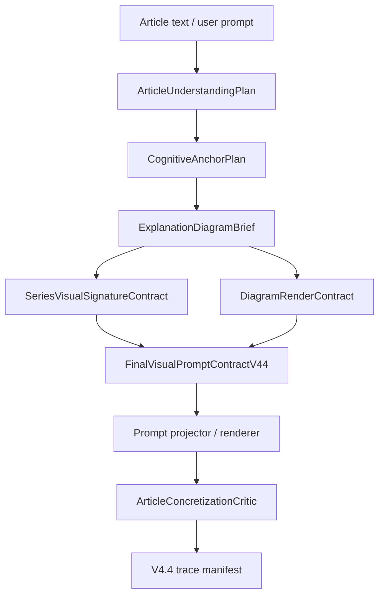

# Pixelle Article Concretization Visual System Implementation Plan

> **For agentic workers:** REQUIRED SUB-SKILL: Use superpowers:subagent-driven-development (recommended) or superpowers:executing-plans to implement this plan task-by-task. Steps use checkbox (`- [ ]`) syntax for tracking.

**Goal:** Build a production-grade article concretization system that turns an article's cognitive anchor into a memorable explanation visual while independently supporting diagram grammar, series visual signature, render style, and aspect ratio.

**Architecture:** Extend the existing V4.4 article understanding and visual routing foundation with a new contract layer: `ArticleUnderstandingPlan -> CognitiveAnchorPlan -> ExplanationDiagramBrief -> SeriesVisualSignatureContract -> DiagramRenderContract -> FinalVisualPromptContractV44`. The UI and API expose the same formal fields, the planner resolves auto values deterministically, the final prompt projector consumes one normalized source of truth, and a critic verifies that article meaning, diagram grammar, visual signature role, style, and aspect ratio do not conflict.

**Tech Stack:** Python 3.12, dataclasses, enums, Pydantic/FastAPI request schemas, Streamlit UI, pytest, ruff, existing Pixelle V4.4 prompt trace and visual role planning services.

---

## Cold-Water Verdict

Current Pixelle V4.4 already has useful foundations, but it does not yet cover the requested capability as a product workflow.

The reference repository `helloianneo/ian-xiaohei-illustrations` is valuable because it makes the agent first find a cognitive anchor in the article, then render one judgment, process, structure, state, or metaphor into a memorable image. Its visible surface is "Xiaohei, 16:9, white hand-drawn panels", but that surface must not become Pixelle's architecture. If Pixelle copies only the style, we get prompt decoration. If Pixelle extracts the workflow, we get a reusable article interpretation system.

The correct product decision is:

- Build "Article Concretization / 文章具象化解读", not "Xiaohei mode".
- Treat Xiaohei-style hand drawing as one render style and one possible series visual signature.
- Let the user choose the explanation logic separately from visual identity and visual surface.
- Preserve the article as the fact source; the visual signature can participate, but it cannot silently replace required article subjects.
- Reject silent fallback when a strict user selection conflicts with the resolved route.

Reference links:

- [helloianneo/ian-xiaohei-illustrations](https://github.com/helloianneo/ian-xiaohei-illustrations)
- [Reference skill file](https://raw.githubusercontent.com/helloianneo/ian-xiaohei-illustrations/main/ian-xiaohei-illustrations/SKILL.md)
- [Reference composition patterns](https://raw.githubusercontent.com/helloianneo/ian-xiaohei-illustrations/main/ian-xiaohei-illustrations/references/composition-patterns.md)

## Current Flow Coverage

| Area | Current coverage | Gap | Required action |
| --- | --- | --- | --- |
| Article understanding | `pixelle_video/models/article_understanding.py` has `ArticleUnderstandingMode`, `ArticleUnderstandingPlan`, `FrameUnderstandingPlan`, evidence spans, required subjects, and visible text policy. | It identifies article lenses, but it does not produce a formal "cognitive anchor" chosen for one explanation visual. | Add `CognitiveAnchorPlan` and deterministic mapping from article lens to anchor kind. |
| Visual routing | `pixelle_video/models/visual_planning_mode.py` has `VisualPlanningMode` and `PrimaryVisualTask`; `mode_resolution.py` resolves V4.4 planning choices. | It can route to cognitive illustration or structural explainer, but it does not define the diagram grammar: panel comic, process flow, relationship map, metaphor scene, decision tree, etc. | Add `ExplanationDiagramBrief` with grammar, composition rules, panel plan, and prompt projection fields. |
| Visual role / IP | `visual_role_strategy.py`, `visual_role_request.py`, `visual_anchor_integration_planner.py`, and IP controls can keep a visual identity across generations. | It does not formalize series visual signature roles for explanation diagrams: core actor, silent witness, operator, guide, obstacle, container, background mark. | Add `SeriesVisualSignatureContract` and prevent accidental subject replacement. |
| Final prompt contract | `FinalVisualPromptContractV44` already carries article anchor, visual concretization summary, visual role strategy, required subjects, projected parts, and negative semantics. | It has no typed diagram/concretization subcontracts, so downstream prompt text can become mixed and unverifiable. | Extend V4.4 contract metadata and projected prompt parts with diagram fields. |
| API | `api/schemas/video.py` and `api/routers/video.py` accept V4.4 article and visual routing fields. | API cannot request anchor kind, diagram grammar, series signature role, render style, or aspect ratio. | Add typed request fields and pass them into `video_params`. |
| Web UI | Existing storyboard and IP controls are useful, but there is no "文章具象化解读" control. | Users cannot choose the cognitive interpretation logic or diagram type from the frontend. | Add a focused Streamlit expander and propagate fields into single and batch requests. |
| QA / trace | `v44_prompt_trace_manifest.py` tracks V4.4 route decisions. | It does not verify anchor preservation, diagram grammar match, signature role discipline, or style/aspect independence. | Add critic and trace manifest fields. |

## Product Model

The product capability has four independent axes:

| Axis | User-facing question | Backend field family |
| --- | --- | --- |
| Cognitive anchor | "这篇文章要被具象化的是判断、流程、结构、状态、隐喻、关系、证据，还是决策路径？" | `cognitive_anchor_kind` |
| Explanation diagram grammar | "这张图应该是单图、分格、流程、结构图、对照板、关系图、隐喻场景、决策树、状态机，还是证据地图？" | `explanation_diagram_grammar` |
| Series visual signature | "固定角色/品牌视觉要以什么身份进入图里？" | `series_visual_signature_role` |
| Render surface | "它长什么样、用什么比例？" | `diagram_render_style`, `diagram_aspect_ratio` |

Supported article concretization types:

| Type | Best for | Visual outcome |
| --- | --- | --- |
| Judgment embodiment | One strong claim, thesis, or counterintuitive judgment | A single image that turns the claim into a physical scene |
| Causal mechanism | Cause, trigger, feedback loop, systemic effect | Mechanism diagram or metaphor machine |
| Process walkthrough | Method, workflow, operation sequence | Step flow, lane flow, or multi-panel progression |
| Structure map | Hierarchy, nested model, architecture, taxonomy | Layered structure, matrix, or container map |
| State / cognitive space | Emotion, mental model, ambiguity, stuckness | Spatial state diagram or symbolic room |
| Contrast / tradeoff | Before/after, two camps, tension, conflict | Split board, balance, collision, or comparison grid |
| Relationship map | Stakeholders, dependencies, role positions | Network, orbit map, influence map |
| Evidence map | Claims backed by sources or examples | Claim-evidence trail with controlled labels |
| Decision path | Conditions, branching choices, strategy | Decision tree or route map |
| State machine | Repeated lifecycle or status transitions | Nodes and transitions with visual states |
| Metaphor scene | Abstract concept that needs memory | Object scene, absurd tool, physical metaphor |
| Series-signature panel | Recurring IP needs to participate consistently | Same visual signature enters the diagram with a declared role |

## Frontend Control Decision

Add one expander in the left-column content controls:

`文章具象化解读`

Controls:

| Control | Widget | Options | Request field |
| --- | --- | --- | --- |
| Enable | Toggle / checkbox | on, off | `article_concretization_enabled` |
| Anchor | Segmented control or radio | `auto`, `judgment`, `process`, `structure`, `state`, `metaphor`, `contrast`, `relationship`, `evidence`, `decision_path` | `cognitive_anchor_kind` |
| Diagram | Selectbox | `auto`, `single_explanation_image`, `multi_panel_comic`, `process_flow`, `structure_map`, `contrast_board`, `relationship_map`, `metaphor_scene`, `decision_tree`, `state_machine`, `evidence_map` | `explanation_diagram_grammar` |
| Series signature role | Selectbox | `none`, `auto`, `core_actor`, `silent_witness`, `operator`, `guide`, `obstacle`, `container`, `background_mark` | `series_visual_signature_role` |
| Render style | Selectbox | `auto`, `xiaohei_handdrawn`, `editorial_diagram`, `clean_vector`, `cinematic_metaphor`, `brand_kv`, `three_d_concept`, `ink_collage` | `diagram_render_style` |
| Aspect ratio | Selectbox | `auto`, `landscape_16_9`, `square_1_1`, `portrait_4_5`, `vertical_9_16`, `template` | `diagram_aspect_ratio` |
| User hint | Text area | Free text | `diagram_user_intent_hint` |
| Visible text | Selectbox | `no_visible_text`, `source_text_only`, `symbolic_labels_only`, `approved_labels_only` | `diagram_visible_text_policy` |

Default button behavior:

- If disabled, no new concretization fields are sent except defaults in server-side contracts.
- If enabled and all selectors are `auto`, backend uses article lens and current storyboard/IP controls to resolve the route.
- If enabled with `series_visual_signature_role=none`, article subjects remain the only visible semantic actors unless other IP controls explicitly request visual identity consistency.
- If enabled with a non-`none` signature role, the system applies that role through `SeriesVisualSignatureContract`; it does not rewrite required article subjects.

## Target Architecture



Hard rules:

- `ArticleUnderstandingPlan` remains the source of truth for article claims, evidence, required subjects, and visible text policy.
- `ExplanationDiagramBrief` owns composition. Render style changes surface, not meaning.
- `SeriesVisualSignatureContract` owns visual identity participation. It must state replacement policy, role, and visual weight.
- `FinalVisualPromptContractV44` is the single contract passed to projectors and critic.
- `strict_user_mode=True` blocks incompatible planner fallback.
- No route should hide a mismatch by changing user-selected fields after validation.

## File Structure

Create:

- `pixelle_video/models/article_concretization.py`  
  Typed enums and dataclasses for article concretization request, cognitive anchor, diagram brief, signature contract, render contract, and normalized plan.

- `pixelle_video/services/article_concretization_planner.py`  
  Deterministic planner that converts article understanding and user selections into a normalized concretization plan.

- `pixelle_video/services/article_concretization_critic.py`  
  Contract critic that returns pass/fail issues for article anchor, diagram grammar, visual signature role, style, aspect ratio, visible text, and source trace.

- `web/components/article_concretization_controls.py`  
  Streamlit controls plus pure helper functions for building the UI payload.

- `tests/models/test_article_concretization.py`  
  Model and enum normalization tests.

- `tests/services/test_article_concretization_planner.py`  
  Planner mapping, strict conflict, and signature role tests.

- `tests/services/test_article_concretization_critic.py`  
  Critic pass/fail tests.

- `tests/web/test_article_concretization_controls.py`  
  Pure UI payload helper tests.

Modify:

- `pixelle_video/models/final_visual_prompt_contract.py`  
  Add diagram/concretization metadata fields or adapter methods while preserving current V4.4 serialization.

- `pixelle_video/models/mode_resolution.py`  
  Accept and normalize `ArticleConcretizationRequest` from video params when V4.4 planning is enabled.

- `pixelle_video/models/video_generation_contract.py`  
  Normalize new API/UI fields and attach `ArticleConcretizationRequest` to generation params.

- `pixelle_video/services/v44_prompt_trace_manifest.py`  
  Add concretization request, resolved anchor, diagram grammar, signature role, render style, aspect ratio, and critic result.

- `api/schemas/video.py`  
  Add typed fields for the new request controls.

- `api/routers/video.py`  
  Pass new fields into `video_params`.

- `web/components/content_input.py`  
  Render the new controls and merge their payload into `video_params`.

- `web/components/output_preview.py`  
  Copy new options into single-generation request and batch shared config.

- `web/i18n/locales/zh_CN.json`  
  Add Chinese labels for controls and option names.

- `web/i18n/locales/en_US.json`  
  Add English labels for controls and option names.

- `tests/models/test_final_visual_prompt_contract.py`  
  Verify V4.4 contract serialization includes concretization metadata without losing existing fields.

- `tests/models/test_mode_resolution.py`  
  Verify preflight and route decisions include concretization request and strict conflict behavior.

- `tests/test_video_api.py`  
  Verify API schema validation and router pass-through.

- `tests/test_output_preview.py`  
  Verify frontend single and batch payload propagation.

- `tests/services/test_v44_prompt_trace_manifest.py`  
  Verify trace manifest fields.

## Execution Preflight

- [ ] **Step 1: Confirm current repository state**

Run:

```powershell
cd D:\demo1\Pixelle\Pixelle
git status --short --branch
```

Expected: If the main workspace is dirty, keep those changes untouched and execute in a clean worktree.

- [ ] **Step 2: Create a clean implementation worktree from remote dev**

Run:

```powershell
cd D:\demo1\Pixelle
git fetch origin
git worktree add D:\demo1\Pixelle-article-concretization origin/dev -b codex/article-concretization-visual-system
cd D:\demo1\Pixelle-article-concretization
git status --short --branch
```

Expected:

```text
## codex/article-concretization-visual-system
```

- [ ] **Step 3: Read existing V4.4 files before coding**

Run:

```powershell
rg -n "ArticleUnderstandingMode|VisualPlanningMode|FinalVisualPromptContractV44|article_understanding_mode|visual_planning_mode|visual_role_strategy|force_v44_planning" pixelle_video api web tests -g "*.py"
```

Expected: Output includes the V4.4 model, API, router, trace, and tests listed in this plan.

---

### Task 1: Core Article Concretization Contracts

**Files:**

- Create: `pixelle_video/models/article_concretization.py`
- Create: `tests/models/test_article_concretization.py`

- [ ] **Step 1: Write model tests first**

Add these tests to `tests/models/test_article_concretization.py`:

```python
from __future__ import annotations

import pytest

from pixelle_video.models.article_concretization import (
    ArticleConcretizationPlan,
    ArticleConcretizationRequest,
    CognitiveAnchorKind,
    CognitiveAnchorPlan,
    DiagramAspectRatio,
    DiagramRenderContract,
    DiagramRenderStyle,
    ExplanationDiagramBrief,
    ExplanationDiagramGrammar,
    SeriesVisualSignatureContract,
    SeriesVisualSignatureRole,
)
from pixelle_video.models.visual_planning_mode import PrimaryVisualTask, VisibleTextPolicy


def test_article_concretization_request_normalizes_known_values() -> None:
    request = ArticleConcretizationRequest.from_mapping(
        {
            "article_concretization_enabled": "true",
            "cognitive_anchor_kind": "judgment",
            "explanation_diagram_grammar": "single_explanation_image",
            "series_visual_signature_role": "silent_witness",
            "diagram_render_style": "editorial_diagram",
            "diagram_aspect_ratio": "portrait_4_5",
            "diagram_visible_text_policy": "symbolic_labels_only",
            "diagram_user_intent_hint": "突出一个反直觉判断",
        }
    )

    assert request.enabled is True
    assert request.cognitive_anchor_kind is CognitiveAnchorKind.JUDGMENT
    assert request.explanation_diagram_grammar is ExplanationDiagramGrammar.SINGLE_EXPLANATION_IMAGE
    assert request.series_visual_signature_role is SeriesVisualSignatureRole.SILENT_WITNESS
    assert request.diagram_render_style is DiagramRenderStyle.EDITORIAL_DIAGRAM
    assert request.diagram_aspect_ratio is DiagramAspectRatio.PORTRAIT_4_5
    assert request.diagram_visible_text_policy is VisibleTextPolicy.SYMBOLIC_LABELS_ONLY
    assert request.diagram_user_intent_hint == "突出一个反直觉判断"
    assert request.to_dict()["article_concretization_enabled"] is True


@pytest.mark.parametrize(
    ("field_name", "bad_value"),
    [
        ("cognitive_anchor_kind", "cute_character"),
        ("explanation_diagram_grammar", "poster_only"),
        ("series_visual_signature_role", "mascot_corner"),
        ("diagram_render_style", "random_style"),
        ("diagram_aspect_ratio", "21:9"),
        ("diagram_visible_text_policy", "long_copy"),
    ],
)
def test_article_concretization_request_rejects_unknown_values(field_name: str, bad_value: str) -> None:
    with pytest.raises(ValueError, match=field_name):
        ArticleConcretizationRequest.from_mapping({field_name: bad_value})


def test_article_concretization_plan_serializes_nested_contracts() -> None:
    request = ArticleConcretizationRequest.from_mapping(
        {
            "article_concretization_enabled": True,
            "cognitive_anchor_kind": "process",
            "explanation_diagram_grammar": "process_flow",
            "series_visual_signature_role": "operator",
            "diagram_render_style": "clean_vector",
            "diagram_aspect_ratio": "landscape_16_9",
        }
    )
    anchor = CognitiveAnchorPlan(
        anchor_id="anchor_001",
        anchor_kind=CognitiveAnchorKind.PROCESS,
        anchor_claim="文章主张先理解流程瓶颈，再重排执行顺序。",
        anchor_question="流程在哪里卡住？",
        source_evidence_ids=("ev_001",),
        main_entities=("流程瓶颈", "执行顺序"),
        source_text_excerpt="先理解流程瓶颈，再重排执行顺序。",
        confidence=0.84,
    )
    diagram = ExplanationDiagramBrief(
        brief_id="diagram_001",
        grammar=ExplanationDiagramGrammar.PROCESS_FLOW,
        primary_visual_task=PrimaryVisualTask.PROCESS_WALKTHROUGH,
        diagram_title="流程瓶颈重排",
        visual_metaphor="一条被堵住的传送带被重新分流",
        composition_rules=("left_to_right_flow", "show_bottleneck_before_solution"),
        panel_plan=("入口拥堵", "瓶颈识别", "重排后流动"),
        forbidden_losses=("不能把流程瓶颈画成普通装饰",),
        visible_text_policy=VisibleTextPolicy.SYMBOLIC_LABELS_ONLY,
    )
    signature = SeriesVisualSignatureContract(
        enabled=True,
        role=SeriesVisualSignatureRole.OPERATOR,
        identity_profile_id="ip_profile_xiaohei",
        participation_rule="视觉签名作为操作员推动流程变化，但不替代文章主体。",
        replacement_policy="no_subject_replacement",
        visual_weight=0.35,
        forbidden_behaviors=("不能站在角落当装饰",),
    )
    render = DiagramRenderContract(
        render_style=DiagramRenderStyle.CLEAN_VECTOR,
        aspect_ratio=DiagramAspectRatio.LANDSCAPE_16_9,
        style_rules=("clean vector shapes", "limited labels"),
        negative_style_rules=("no dense poster text",),
    )

    plan = ArticleConcretizationPlan(
        plan_id="article_concretization_001",
        request=request,
        anchor=anchor,
        diagram=diagram,
        series_signature=signature,
        render=render,
    )

    payload = plan.to_dict()

    assert payload["request"]["cognitive_anchor_kind"] == "process"
    assert payload["anchor"]["anchor_kind"] == "process"
    assert payload["diagram"]["grammar"] == "process_flow"
    assert payload["series_signature"]["role"] == "operator"
    assert payload["render"]["render_style"] == "clean_vector"
```

- [ ] **Step 2: Run the new tests and verify they fail**

Run:

```powershell
python -m pytest tests/models/test_article_concretization.py -q
```

Expected: FAIL with `ModuleNotFoundError: No module named 'pixelle_video.models.article_concretization'`.

- [ ] **Step 3: Implement `article_concretization.py`**

Create `pixelle_video/models/article_concretization.py` with these public types:

```python
from __future__ import annotations

from collections.abc import Mapping, Sequence
from dataclasses import dataclass
from enum import Enum
from typing import Any

from pixelle_video.models.visual_planning_mode import PrimaryVisualTask, VisibleTextPolicy


class CognitiveAnchorKind(str, Enum):
    AUTO = "auto"
    JUDGMENT = "judgment"
    PROCESS = "process"
    STRUCTURE = "structure"
    STATE = "state"
    METAPHOR = "metaphor"
    CONTRAST = "contrast"
    RELATIONSHIP = "relationship"
    EVIDENCE = "evidence"
    DECISION_PATH = "decision_path"


class ExplanationDiagramGrammar(str, Enum):
    AUTO = "auto"
    SINGLE_EXPLANATION_IMAGE = "single_explanation_image"
    MULTI_PANEL_COMIC = "multi_panel_comic"
    PROCESS_FLOW = "process_flow"
    STRUCTURE_MAP = "structure_map"
    CONTRAST_BOARD = "contrast_board"
    RELATIONSHIP_MAP = "relationship_map"
    METAPHOR_SCENE = "metaphor_scene"
    DECISION_TREE = "decision_tree"
    STATE_MACHINE = "state_machine"
    EVIDENCE_MAP = "evidence_map"


class SeriesVisualSignatureRole(str, Enum):
    NONE = "none"
    AUTO = "auto"
    CORE_ACTOR = "core_actor"
    SILENT_WITNESS = "silent_witness"
    OPERATOR = "operator"
    GUIDE = "guide"
    OBSTACLE = "obstacle"
    CONTAINER = "container"
    BACKGROUND_MARK = "background_mark"


class DiagramRenderStyle(str, Enum):
    AUTO = "auto"
    XIAOHEI_HANDDRAWN = "xiaohei_handdrawn"
    EDITORIAL_DIAGRAM = "editorial_diagram"
    CLEAN_VECTOR = "clean_vector"
    CINEMATIC_METAPHOR = "cinematic_metaphor"
    BRAND_KV = "brand_kv"
    THREE_D_CONCEPT = "three_d_concept"
    INK_COLLAGE = "ink_collage"


class DiagramAspectRatio(str, Enum):
    AUTO = "auto"
    LANDSCAPE_16_9 = "landscape_16_9"
    SQUARE_1_1 = "square_1_1"
    PORTRAIT_4_5 = "portrait_4_5"
    VERTICAL_9_16 = "vertical_9_16"
    TEMPLATE = "template"


@dataclass(frozen=True)
class ArticleConcretizationRequest:
    enabled: bool = False
    cognitive_anchor_kind: CognitiveAnchorKind | str = CognitiveAnchorKind.AUTO
    explanation_diagram_grammar: ExplanationDiagramGrammar | str = ExplanationDiagramGrammar.AUTO
    series_visual_signature_role: SeriesVisualSignatureRole | str = SeriesVisualSignatureRole.NONE
    diagram_render_style: DiagramRenderStyle | str = DiagramRenderStyle.AUTO
    diagram_aspect_ratio: DiagramAspectRatio | str = DiagramAspectRatio.AUTO
    diagram_user_intent_hint: str | None = None
    diagram_visible_text_policy: VisibleTextPolicy | str = VisibleTextPolicy.NO_VISIBLE_TEXT

    def __post_init__(self) -> None:
        object.__setattr__(self, "enabled", _bool_value(self.enabled, "article_concretization_enabled"))
        object.__setattr__(self, "cognitive_anchor_kind", _strict_enum_value("cognitive_anchor_kind", self.cognitive_anchor_kind, CognitiveAnchorKind, CognitiveAnchorKind.AUTO))
        object.__setattr__(self, "explanation_diagram_grammar", _strict_enum_value("explanation_diagram_grammar", self.explanation_diagram_grammar, ExplanationDiagramGrammar, ExplanationDiagramGrammar.AUTO))
        object.__setattr__(self, "series_visual_signature_role", _strict_enum_value("series_visual_signature_role", self.series_visual_signature_role, SeriesVisualSignatureRole, SeriesVisualSignatureRole.NONE))
        object.__setattr__(self, "diagram_render_style", _strict_enum_value("diagram_render_style", self.diagram_render_style, DiagramRenderStyle, DiagramRenderStyle.AUTO))
        object.__setattr__(self, "diagram_aspect_ratio", _strict_enum_value("diagram_aspect_ratio", self.diagram_aspect_ratio, DiagramAspectRatio, DiagramAspectRatio.AUTO))
        object.__setattr__(self, "diagram_visible_text_policy", _strict_enum_value("diagram_visible_text_policy", self.diagram_visible_text_policy, VisibleTextPolicy, VisibleTextPolicy.NO_VISIBLE_TEXT))
        object.__setattr__(self, "diagram_user_intent_hint", _optional_text(self.diagram_user_intent_hint))

    @classmethod
    def from_mapping(cls, source: Mapping[str, Any] | None) -> "ArticleConcretizationRequest":
        data = dict(source or {})
        return cls(
            enabled=data.get("article_concretization_enabled", data.get("enabled", False)),
            cognitive_anchor_kind=data.get("cognitive_anchor_kind", CognitiveAnchorKind.AUTO),
            explanation_diagram_grammar=data.get("explanation_diagram_grammar", ExplanationDiagramGrammar.AUTO),
            series_visual_signature_role=data.get("series_visual_signature_role", SeriesVisualSignatureRole.NONE),
            diagram_render_style=data.get("diagram_render_style", DiagramRenderStyle.AUTO),
            diagram_aspect_ratio=data.get("diagram_aspect_ratio", DiagramAspectRatio.AUTO),
            diagram_user_intent_hint=data.get("diagram_user_intent_hint"),
            diagram_visible_text_policy=data.get("diagram_visible_text_policy", VisibleTextPolicy.NO_VISIBLE_TEXT),
        )

    def to_dict(self) -> dict[str, Any]:
        return {
            "article_concretization_enabled": self.enabled,
            "cognitive_anchor_kind": self.cognitive_anchor_kind.value,
            "explanation_diagram_grammar": self.explanation_diagram_grammar.value,
            "series_visual_signature_role": self.series_visual_signature_role.value,
            "diagram_render_style": self.diagram_render_style.value,
            "diagram_aspect_ratio": self.diagram_aspect_ratio.value,
            "diagram_user_intent_hint": self.diagram_user_intent_hint,
            "diagram_visible_text_policy": self.diagram_visible_text_policy.value,
        }


@dataclass(frozen=True)
class CognitiveAnchorPlan:
    anchor_id: str
    anchor_kind: CognitiveAnchorKind | str
    anchor_claim: str
    anchor_question: str
    source_evidence_ids: Sequence[str]
    main_entities: Sequence[str]
    source_text_excerpt: str
    confidence: float

    def __post_init__(self) -> None:
        object.__setattr__(self, "anchor_id", _require_text("anchor_id", self.anchor_id))
        object.__setattr__(self, "anchor_kind", _strict_enum_value("anchor_kind", self.anchor_kind, CognitiveAnchorKind, CognitiveAnchorKind.JUDGMENT))
        object.__setattr__(self, "anchor_claim", _require_text("anchor_claim", self.anchor_claim))
        object.__setattr__(self, "anchor_question", _require_text("anchor_question", self.anchor_question))
        object.__setattr__(self, "source_evidence_ids", _text_tuple("source_evidence_ids", self.source_evidence_ids))
        object.__setattr__(self, "main_entities", _text_tuple("main_entities", self.main_entities))
        object.__setattr__(self, "source_text_excerpt", _require_text("source_text_excerpt", self.source_text_excerpt))
        object.__setattr__(self, "confidence", _confidence_value(self.confidence))

    def to_dict(self) -> dict[str, Any]:
        return {
            "anchor_id": self.anchor_id,
            "anchor_kind": self.anchor_kind.value,
            "anchor_claim": self.anchor_claim,
            "anchor_question": self.anchor_question,
            "source_evidence_ids": list(self.source_evidence_ids),
            "main_entities": list(self.main_entities),
            "source_text_excerpt": self.source_text_excerpt,
            "confidence": self.confidence,
        }


@dataclass(frozen=True)
class ExplanationDiagramBrief:
    brief_id: str
    grammar: ExplanationDiagramGrammar | str
    primary_visual_task: PrimaryVisualTask | str
    diagram_title: str
    visual_metaphor: str
    composition_rules: Sequence[str]
    panel_plan: Sequence[str]
    forbidden_losses: Sequence[str]
    visible_text_policy: VisibleTextPolicy | str

    def __post_init__(self) -> None:
        object.__setattr__(self, "brief_id", _require_text("brief_id", self.brief_id))
        object.__setattr__(self, "grammar", _strict_enum_value("grammar", self.grammar, ExplanationDiagramGrammar, ExplanationDiagramGrammar.SINGLE_EXPLANATION_IMAGE))
        object.__setattr__(self, "primary_visual_task", _strict_enum_value("primary_visual_task", self.primary_visual_task, PrimaryVisualTask, PrimaryVisualTask.COGNITIVE_EXPLANATION))
        object.__setattr__(self, "diagram_title", _require_text("diagram_title", self.diagram_title))
        object.__setattr__(self, "visual_metaphor", _require_text("visual_metaphor", self.visual_metaphor))
        object.__setattr__(self, "composition_rules", _text_tuple("composition_rules", self.composition_rules))
        object.__setattr__(self, "panel_plan", _text_tuple("panel_plan", self.panel_plan))
        object.__setattr__(self, "forbidden_losses", _text_tuple("forbidden_losses", self.forbidden_losses))
        object.__setattr__(self, "visible_text_policy", _strict_enum_value("visible_text_policy", self.visible_text_policy, VisibleTextPolicy, VisibleTextPolicy.NO_VISIBLE_TEXT))

    def to_dict(self) -> dict[str, Any]:
        return {
            "brief_id": self.brief_id,
            "grammar": self.grammar.value,
            "primary_visual_task": self.primary_visual_task.value,
            "diagram_title": self.diagram_title,
            "visual_metaphor": self.visual_metaphor,
            "composition_rules": list(self.composition_rules),
            "panel_plan": list(self.panel_plan),
            "forbidden_losses": list(self.forbidden_losses),
            "visible_text_policy": self.visible_text_policy.value,
        }


@dataclass(frozen=True)
class SeriesVisualSignatureContract:
    enabled: bool
    role: SeriesVisualSignatureRole | str
    identity_profile_id: str | None
    participation_rule: str
    replacement_policy: str
    visual_weight: float
    forbidden_behaviors: Sequence[str]

    def __post_init__(self) -> None:
        object.__setattr__(self, "enabled", _bool_value(self.enabled, "enabled"))
        object.__setattr__(self, "role", _strict_enum_value("role", self.role, SeriesVisualSignatureRole, SeriesVisualSignatureRole.NONE))
        object.__setattr__(self, "identity_profile_id", _optional_text(self.identity_profile_id))
        object.__setattr__(self, "participation_rule", _require_text("participation_rule", self.participation_rule))
        object.__setattr__(self, "replacement_policy", _require_text("replacement_policy", self.replacement_policy))
        object.__setattr__(self, "visual_weight", _confidence_value(self.visual_weight))
        object.__setattr__(self, "forbidden_behaviors", _text_tuple("forbidden_behaviors", self.forbidden_behaviors))
        if self.enabled and self.role is SeriesVisualSignatureRole.NONE:
            raise ValueError("role must not be none when series visual signature is enabled")

    def to_dict(self) -> dict[str, Any]:
        return {
            "enabled": self.enabled,
            "role": self.role.value,
            "identity_profile_id": self.identity_profile_id,
            "participation_rule": self.participation_rule,
            "replacement_policy": self.replacement_policy,
            "visual_weight": self.visual_weight,
            "forbidden_behaviors": list(self.forbidden_behaviors),
        }


@dataclass(frozen=True)
class DiagramRenderContract:
    render_style: DiagramRenderStyle | str
    aspect_ratio: DiagramAspectRatio | str
    style_rules: Sequence[str]
    negative_style_rules: Sequence[str]

    def __post_init__(self) -> None:
        object.__setattr__(self, "render_style", _strict_enum_value("render_style", self.render_style, DiagramRenderStyle, DiagramRenderStyle.AUTO))
        object.__setattr__(self, "aspect_ratio", _strict_enum_value("aspect_ratio", self.aspect_ratio, DiagramAspectRatio, DiagramAspectRatio.AUTO))
        object.__setattr__(self, "style_rules", _text_tuple("style_rules", self.style_rules))
        object.__setattr__(self, "negative_style_rules", _text_tuple("negative_style_rules", self.negative_style_rules))

    def to_dict(self) -> dict[str, Any]:
        return {
            "render_style": self.render_style.value,
            "aspect_ratio": self.aspect_ratio.value,
            "style_rules": list(self.style_rules),
            "negative_style_rules": list(self.negative_style_rules),
        }


@dataclass(frozen=True)
class ArticleConcretizationPlan:
    plan_id: str
    request: ArticleConcretizationRequest
    anchor: CognitiveAnchorPlan
    diagram: ExplanationDiagramBrief
    series_signature: SeriesVisualSignatureContract
    render: DiagramRenderContract

    def __post_init__(self) -> None:
        object.__setattr__(self, "plan_id", _require_text("plan_id", self.plan_id))

    def to_dict(self) -> dict[str, Any]:
        return {
            "plan_id": self.plan_id,
            "request": self.request.to_dict(),
            "anchor": self.anchor.to_dict(),
            "diagram": self.diagram.to_dict(),
            "series_signature": self.series_signature.to_dict(),
            "render": self.render.to_dict(),
        }


def _strict_enum_value(field_name: str, value: Any, enum_cls: type[Enum], default: Any) -> Any:
    if isinstance(value, enum_cls):
        return value
    if value is None:
        return default
    if isinstance(value, Enum) or not isinstance(value, str):
        raise ValueError(f"{field_name} must be a valid {enum_cls.__name__}")
    text = value.strip()
    if not text:
        return default
    for item in enum_cls:
        if text == item.value or text.lower() == item.name.lower():
            return item
    raise ValueError(f"{field_name} must be a valid {enum_cls.__name__}")


def _bool_value(value: Any, field_name: str) -> bool:
    if isinstance(value, bool):
        return value
    if isinstance(value, str):
        text = value.strip().lower()
        if text in {"1", "true", "yes", "on"}:
            return True
        if text in {"0", "false", "no", "off", ""}:
            return False
    raise ValueError(f"{field_name} must be a boolean")


def _optional_text(value: Any) -> str | None:
    if value is None:
        return None
    if not isinstance(value, str):
        raise ValueError("optional text fields must be strings")
    text = value.strip()
    return text or None


def _require_text(field_name: str, value: Any) -> str:
    if not isinstance(value, str) or not value.strip():
        raise ValueError(f"{field_name} must be a non-empty string")
    return value.strip()


def _text_tuple(field_name: str, values: Sequence[Any]) -> tuple[str, ...]:
    if isinstance(values, str) or not isinstance(values, Sequence):
        raise ValueError(f"{field_name} must be a sequence of non-empty strings")
    result = tuple(_require_text(field_name, value) for value in values)
    if not result:
        raise ValueError(f"{field_name} must not be empty")
    return result


def _confidence_value(value: Any) -> float:
    if isinstance(value, bool):
        raise ValueError("confidence values must be numbers")
    try:
        parsed = float(value)
    except (TypeError, ValueError) as exc:
        raise ValueError("confidence values must be numbers") from exc
    if parsed < 0.0 or parsed > 1.0:
        raise ValueError("confidence values must be between 0 and 1")
    return parsed
```

- [ ] **Step 4: Run model tests**

Run:

```powershell
python -m pytest tests/models/test_article_concretization.py -q
```

Expected:

```text
3 passed
```

- [ ] **Step 5: Commit contracts**

Run:

```powershell
git add pixelle_video/models/article_concretization.py tests/models/test_article_concretization.py
git commit -m "feat: add article concretization contracts"
```

---

### Task 2: Deterministic Article Concretization Planner

**Files:**

- Create: `pixelle_video/services/article_concretization_planner.py`
- Create: `tests/services/test_article_concretization_planner.py`

- [ ] **Step 1: Write planner tests**

Add these tests to `tests/services/test_article_concretization_planner.py`:

```python
from __future__ import annotations

import pytest

from pixelle_video.models.article_concretization import (
    CognitiveAnchorKind,
    DiagramRenderStyle,
    ExplanationDiagramGrammar,
    SeriesVisualSignatureRole,
)
from pixelle_video.models.article_understanding import (
    ArticleUnderstandingLens,
    ArticleUnderstandingPlan,
    FrameUnderstandingPlan,
    SourceEvidenceSpan,
)
from pixelle_video.models.visual_planning_mode import PrimaryVisualTask, VisibleTextPolicy
from pixelle_video.services.article_concretization_planner import (
    ArticleConcretizationPlanner,
    ArticleConcretizationPlannerConflict,
)


def _article_plan(primary_lens: ArticleUnderstandingLens) -> ArticleUnderstandingPlan:
    return ArticleUnderstandingPlan(
        article_id="article_001",
        primary_lens=primary_lens,
        core_claim="先理解流程瓶颈，再重排执行顺序。",
        central_problem="团队把执行问题误判成工具问题。",
        main_entities=("流程瓶颈", "执行顺序"),
        source_evidence=(
            SourceEvidenceSpan(
                evidence_id="ev_001",
                source_id="source_001",
                quote="先理解流程瓶颈，再重排执行顺序。",
                evidence_role="core_claim",
            ),
        ),
    )


def _frame_plan(primary_lens: ArticleUnderstandingLens) -> FrameUnderstandingPlan:
    return FrameUnderstandingPlan(
        frame_id="frame_001",
        source_text="先理解流程瓶颈，再重排执行顺序。",
        frame_claim="流程瓶颈需要先被看见。",
        frame_question="流程在哪里卡住？",
        primary_lens=primary_lens,
        visible_text_policy=VisibleTextPolicy.SYMBOLIC_LABELS_ONLY,
        source_evidence=(
            SourceEvidenceSpan(
                evidence_id="ev_001",
                source_id="source_001",
                quote="先理解流程瓶颈，再重排执行顺序。",
                evidence_role="core_claim",
            ),
        ),
    )


def test_planner_maps_process_lens_to_process_flow() -> None:
    planner = ArticleConcretizationPlanner()

    plan = planner.plan(
        request_mapping={"article_concretization_enabled": True},
        article_plan=_article_plan(ArticleUnderstandingLens.PROCESS_METHOD),
        frame_plan=_frame_plan(ArticleUnderstandingLens.PROCESS_METHOD),
        source_text="先理解流程瓶颈，再重排执行顺序。",
        ip_profile_id=None,
        strict_user_mode=False,
    )

    assert plan.anchor.anchor_kind is CognitiveAnchorKind.PROCESS
    assert plan.diagram.grammar is ExplanationDiagramGrammar.PROCESS_FLOW
    assert plan.diagram.primary_visual_task is PrimaryVisualTask.PROCESS_WALKTHROUGH
    assert plan.series_signature.enabled is False
    assert plan.render.render_style is DiagramRenderStyle.AUTO


def test_planner_respects_explicit_signature_role_without_replacing_subjects() -> None:
    planner = ArticleConcretizationPlanner()

    plan = planner.plan(
        request_mapping={
            "article_concretization_enabled": True,
            "series_visual_signature_role": "operator",
            "diagram_render_style": "xiaohei_handdrawn",
        },
        article_plan=_article_plan(ArticleUnderstandingLens.PROCESS_METHOD),
        frame_plan=_frame_plan(ArticleUnderstandingLens.PROCESS_METHOD),
        source_text="先理解流程瓶颈，再重排执行顺序。",
        ip_profile_id="ip_profile_xiaohei",
        strict_user_mode=False,
    )

    assert plan.series_signature.enabled is True
    assert plan.series_signature.role is SeriesVisualSignatureRole.OPERATOR
    assert plan.series_signature.replacement_policy == "no_subject_replacement"
    assert plan.series_signature.visual_weight == pytest.approx(0.35)
    assert plan.render.render_style is DiagramRenderStyle.XIAOHEI_HANDDRAWN


def test_planner_strict_mode_rejects_incompatible_anchor_and_grammar() -> None:
    planner = ArticleConcretizationPlanner()

    with pytest.raises(ArticleConcretizationPlannerConflict, match="decision_path"):
        planner.plan(
            request_mapping={
                "article_concretization_enabled": True,
                "cognitive_anchor_kind": "decision_path",
                "explanation_diagram_grammar": "evidence_map",
            },
            article_plan=_article_plan(ArticleUnderstandingLens.PROCESS_METHOD),
            frame_plan=_frame_plan(ArticleUnderstandingLens.PROCESS_METHOD),
            source_text="先理解流程瓶颈，再重排执行顺序。",
            ip_profile_id=None,
            strict_user_mode=True,
        )
```

- [ ] **Step 2: Run planner tests and verify they fail**

Run:

```powershell
python -m pytest tests/services/test_article_concretization_planner.py -q
```

Expected: FAIL with `ModuleNotFoundError: No module named 'pixelle_video.services.article_concretization_planner'`.

- [ ] **Step 3: Implement the deterministic planner**

Create `pixelle_video/services/article_concretization_planner.py`:

```python
from __future__ import annotations

from dataclasses import dataclass
from typing import Any

from pixelle_video.models.article_concretization import (
    ArticleConcretizationPlan,
    ArticleConcretizationRequest,
    CognitiveAnchorKind,
    CognitiveAnchorPlan,
    DiagramAspectRatio,
    DiagramRenderContract,
    DiagramRenderStyle,
    ExplanationDiagramBrief,
    ExplanationDiagramGrammar,
    SeriesVisualSignatureContract,
    SeriesVisualSignatureRole,
)
from pixelle_video.models.article_understanding import ArticleUnderstandingLens, ArticleUnderstandingPlan, FrameUnderstandingPlan
from pixelle_video.models.visual_planning_mode import PrimaryVisualTask


class ArticleConcretizationPlannerConflict(ValueError):
    pass


@dataclass(frozen=True)
class _LensDefault:
    anchor_kind: CognitiveAnchorKind
    grammar: ExplanationDiagramGrammar
    primary_visual_task: PrimaryVisualTask
    visual_metaphor: str
    composition_rules: tuple[str, ...]
    panel_plan: tuple[str, ...]


_LENS_DEFAULTS: dict[ArticleUnderstandingLens, _LensDefault] = {
    ArticleUnderstandingLens.THESIS_ARGUMENT: _LensDefault(
        CognitiveAnchorKind.JUDGMENT,
        ExplanationDiagramGrammar.SINGLE_EXPLANATION_IMAGE,
        PrimaryVisualTask.COGNITIVE_EXPLANATION,
        "把文章主张变成一个具体物体或场景",
        ("single_focal_scene", "claim_must_be_visible_as_action"),
        ("主张被具象化",),
    ),
    ArticleUnderstandingLens.CAUSAL_MECHANISM: _LensDefault(
        CognitiveAnchorKind.PROCESS,
        ExplanationDiagramGrammar.PROCESS_FLOW,
        PrimaryVisualTask.PROCESS_WALKTHROUGH,
        "把原因、触发、反馈画成一台可观察的机制",
        ("show_cause_then_effect", "show_feedback_if_present"),
        ("原因", "触发", "结果"),
    ),
    ArticleUnderstandingLens.COGNITIVE_STATE: _LensDefault(
        CognitiveAnchorKind.STATE,
        ExplanationDiagramGrammar.METAPHOR_SCENE,
        PrimaryVisualTask.COGNITIVE_EXPLANATION,
        "把心理状态画成一个空间或装置",
        ("make_internal_state_spatial", "avoid_generic_emotion_faces"),
        ("状态入口", "困住人的结构", "可见出口"),
    ),
    ArticleUnderstandingLens.PROCESS_METHOD: _LensDefault(
        CognitiveAnchorKind.PROCESS,
        ExplanationDiagramGrammar.PROCESS_FLOW,
        PrimaryVisualTask.PROCESS_WALKTHROUGH,
        "把方法画成可执行路径",
        ("left_to_right_flow", "show_bottleneck_before_solution"),
        ("输入", "瓶颈", "重排", "输出"),
    ),
    ArticleUnderstandingLens.RELATIONSHIP_STRUCTURE: _LensDefault(
        CognitiveAnchorKind.RELATIONSHIP,
        ExplanationDiagramGrammar.RELATIONSHIP_MAP,
        PrimaryVisualTask.RELATIONSHIP_MAPPING,
        "把关系画成距离、方向和依赖",
        ("show_nodes_and_direction", "avoid_unlabeled_decorative_lines"),
        ("主体", "依赖", "影响"),
    ),
    ArticleUnderstandingLens.CONTRAST_CONFLICT: _LensDefault(
        CognitiveAnchorKind.CONTRAST,
        ExplanationDiagramGrammar.CONTRAST_BOARD,
        PrimaryVisualTask.CONTRAST_ARGUMENT,
        "把冲突画成两个系统的对照",
        ("split_comparison", "show_tradeoff_not_only_difference"),
        ("左侧立场", "右侧立场", "代价"),
    ),
    ArticleUnderstandingLens.NARRATIVE_EVENT: _LensDefault(
        CognitiveAnchorKind.PROCESS,
        ExplanationDiagramGrammar.MULTI_PANEL_COMIC,
        PrimaryVisualTask.PROCESS_WALKTHROUGH,
        "把事件推进画成连续动作",
        ("chronological_panels", "one_change_per_panel"),
        ("起点", "转折", "结果"),
    ),
    ArticleUnderstandingLens.METAPHOR_SYMBOLIC: _LensDefault(
        CognitiveAnchorKind.METAPHOR,
        ExplanationDiagramGrammar.METAPHOR_SCENE,
        PrimaryVisualTask.COGNITIVE_EXPLANATION,
        "把隐喻落成一个可记忆的物理场景",
        ("one_metaphor_object", "symbols_must_connect_to_claim"),
        ("隐喻主体", "张力", "结论"),
    ),
}


_GRAMMAR_TASKS: dict[ExplanationDiagramGrammar, PrimaryVisualTask] = {
    ExplanationDiagramGrammar.SINGLE_EXPLANATION_IMAGE: PrimaryVisualTask.COGNITIVE_EXPLANATION,
    ExplanationDiagramGrammar.MULTI_PANEL_COMIC: PrimaryVisualTask.PROCESS_WALKTHROUGH,
    ExplanationDiagramGrammar.PROCESS_FLOW: PrimaryVisualTask.PROCESS_WALKTHROUGH,
    ExplanationDiagramGrammar.STRUCTURE_MAP: PrimaryVisualTask.STRUCTURE_EXPLANATION,
    ExplanationDiagramGrammar.CONTRAST_BOARD: PrimaryVisualTask.CONTRAST_ARGUMENT,
    ExplanationDiagramGrammar.RELATIONSHIP_MAP: PrimaryVisualTask.RELATIONSHIP_MAPPING,
    ExplanationDiagramGrammar.METAPHOR_SCENE: PrimaryVisualTask.COGNITIVE_EXPLANATION,
    ExplanationDiagramGrammar.DECISION_TREE: PrimaryVisualTask.PROCESS_WALKTHROUGH,
    ExplanationDiagramGrammar.STATE_MACHINE: PrimaryVisualTask.PROCESS_WALKTHROUGH,
    ExplanationDiagramGrammar.EVIDENCE_MAP: PrimaryVisualTask.STRUCTURE_EXPLANATION,
}


_ANCHOR_ALLOWED_GRAMMARS: dict[CognitiveAnchorKind, set[ExplanationDiagramGrammar]] = {
    CognitiveAnchorKind.JUDGMENT: {ExplanationDiagramGrammar.SINGLE_EXPLANATION_IMAGE, ExplanationDiagramGrammar.CONTRAST_BOARD, ExplanationDiagramGrammar.METAPHOR_SCENE},
    CognitiveAnchorKind.PROCESS: {ExplanationDiagramGrammar.PROCESS_FLOW, ExplanationDiagramGrammar.MULTI_PANEL_COMIC, ExplanationDiagramGrammar.STATE_MACHINE},
    CognitiveAnchorKind.STRUCTURE: {ExplanationDiagramGrammar.STRUCTURE_MAP, ExplanationDiagramGrammar.RELATIONSHIP_MAP},
    CognitiveAnchorKind.STATE: {ExplanationDiagramGrammar.METAPHOR_SCENE, ExplanationDiagramGrammar.STATE_MACHINE, ExplanationDiagramGrammar.SINGLE_EXPLANATION_IMAGE},
    CognitiveAnchorKind.METAPHOR: {ExplanationDiagramGrammar.METAPHOR_SCENE, ExplanationDiagramGrammar.SINGLE_EXPLANATION_IMAGE},
    CognitiveAnchorKind.CONTRAST: {ExplanationDiagramGrammar.CONTRAST_BOARD, ExplanationDiagramGrammar.SINGLE_EXPLANATION_IMAGE},
    CognitiveAnchorKind.RELATIONSHIP: {ExplanationDiagramGrammar.RELATIONSHIP_MAP, ExplanationDiagramGrammar.STRUCTURE_MAP},
    CognitiveAnchorKind.EVIDENCE: {ExplanationDiagramGrammar.EVIDENCE_MAP, ExplanationDiagramGrammar.STRUCTURE_MAP},
    CognitiveAnchorKind.DECISION_PATH: {ExplanationDiagramGrammar.DECISION_TREE, ExplanationDiagramGrammar.PROCESS_FLOW},
}


class ArticleConcretizationPlanner:
    def plan(
        self,
        *,
        request_mapping: dict[str, Any],
        article_plan: ArticleUnderstandingPlan,
        frame_plan: FrameUnderstandingPlan,
        source_text: str,
        ip_profile_id: str | None,
        strict_user_mode: bool,
    ) -> ArticleConcretizationPlan:
        request = ArticleConcretizationRequest.from_mapping(request_mapping)
        lens = frame_plan.primary_lens or article_plan.primary_lens
        defaults = _LENS_DEFAULTS[lens]
        anchor_kind = defaults.anchor_kind if request.cognitive_anchor_kind is CognitiveAnchorKind.AUTO else request.cognitive_anchor_kind
        grammar = defaults.grammar if request.explanation_diagram_grammar is ExplanationDiagramGrammar.AUTO else request.explanation_diagram_grammar
        if strict_user_mode:
            self._raise_if_conflicting(anchor_kind, grammar)
        elif grammar is ExplanationDiagramGrammar.AUTO:
            grammar = defaults.grammar

        primary_visual_task = _GRAMMAR_TASKS.get(grammar, defaults.primary_visual_task)
        source_excerpt = _source_excerpt(frame_plan.source_text or source_text)
        evidence_ids = tuple(evidence.evidence_id for evidence in frame_plan.source_evidence) or tuple(
            evidence.evidence_id for evidence in article_plan.source_evidence
        )
        main_entities = tuple(frame_plan.frame_claim.split("，")[:1]) if not article_plan.main_entities else tuple(article_plan.main_entities)
        signature_role = self._resolve_signature_role(request.series_visual_signature_role, anchor_kind, grammar, ip_profile_id)
        render_style = request.diagram_render_style
        aspect_ratio = request.diagram_aspect_ratio

        return ArticleConcretizationPlan(
            plan_id=f"article_concretization_{frame_plan.frame_id}",
            request=request,
            anchor=CognitiveAnchorPlan(
                anchor_id=f"anchor_{frame_plan.frame_id}",
                anchor_kind=anchor_kind,
                anchor_claim=frame_plan.frame_claim or article_plan.core_claim,
                anchor_question=frame_plan.frame_question or article_plan.central_problem,
                source_evidence_ids=evidence_ids or ("source_text",),
                main_entities=main_entities or ("article_claim",),
                source_text_excerpt=source_excerpt,
                confidence=0.82,
            ),
            diagram=ExplanationDiagramBrief(
                brief_id=f"diagram_{frame_plan.frame_id}",
                grammar=grammar,
                primary_visual_task=primary_visual_task,
                diagram_title=frame_plan.frame_claim[:24],
                visual_metaphor=defaults.visual_metaphor,
                composition_rules=defaults.composition_rules,
                panel_plan=defaults.panel_plan,
                forbidden_losses=("不能丢失文章核心判断", "不能让视觉签名替代文章主体"),
                visible_text_policy=request.diagram_visible_text_policy,
            ),
            series_signature=SeriesVisualSignatureContract(
                enabled=signature_role is not SeriesVisualSignatureRole.NONE,
                role=signature_role,
                identity_profile_id=ip_profile_id if signature_role is not SeriesVisualSignatureRole.NONE else None,
                participation_rule=_signature_participation_rule(signature_role),
                replacement_policy="no_subject_replacement",
                visual_weight=_signature_visual_weight(signature_role),
                forbidden_behaviors=("不能站在角落当装饰", "不能覆盖文章 required_subjects"),
            ),
            render=DiagramRenderContract(
                render_style=render_style,
                aspect_ratio=aspect_ratio,
                style_rules=_style_rules(render_style),
                negative_style_rules=("no unrelated mascot sticker", "no dense paragraph text inside image"),
            ),
        )

    def _raise_if_conflicting(self, anchor_kind: CognitiveAnchorKind, grammar: ExplanationDiagramGrammar) -> None:
        allowed = _ANCHOR_ALLOWED_GRAMMARS.get(anchor_kind, set())
        if grammar not in allowed:
            raise ArticleConcretizationPlannerConflict(
                f"{anchor_kind.value} does not support {grammar.value}; choose one of {sorted(item.value for item in allowed)}"
            )

    def _resolve_signature_role(
        self,
        requested_role: SeriesVisualSignatureRole,
        anchor_kind: CognitiveAnchorKind,
        grammar: ExplanationDiagramGrammar,
        ip_profile_id: str | None,
    ) -> SeriesVisualSignatureRole:
        if not ip_profile_id:
            return SeriesVisualSignatureRole.NONE
        if requested_role is not SeriesVisualSignatureRole.AUTO:
            return requested_role
        if anchor_kind in {CognitiveAnchorKind.PROCESS, CognitiveAnchorKind.DECISION_PATH}:
            return SeriesVisualSignatureRole.OPERATOR
        if grammar is ExplanationDiagramGrammar.RELATIONSHIP_MAP:
            return SeriesVisualSignatureRole.GUIDE
        return SeriesVisualSignatureRole.SILENT_WITNESS


def _source_excerpt(text: str) -> str:
    clean = " ".join(str(text or "").split())
    return clean[:180] if clean else "source_text"


def _signature_participation_rule(role: SeriesVisualSignatureRole) -> str:
    rules = {
        SeriesVisualSignatureRole.NONE: "不启用系列视觉签名。",
        SeriesVisualSignatureRole.CORE_ACTOR: "视觉签名作为核心行动者参与解释，但必须保留文章主体。",
        SeriesVisualSignatureRole.SILENT_WITNESS: "视觉签名作为静默见证者呈现文章状态，不推动剧情。",
        SeriesVisualSignatureRole.OPERATOR: "视觉签名作为操作者推动流程或结构变化。",
        SeriesVisualSignatureRole.GUIDE: "视觉签名作为引导者指向阅读路径。",
        SeriesVisualSignatureRole.OBSTACLE: "视觉签名作为阻力或障碍体现文章冲突。",
        SeriesVisualSignatureRole.CONTAINER: "视觉签名作为容器承载结构关系。",
        SeriesVisualSignatureRole.BACKGROUND_MARK: "视觉签名作为低权重背景识别标记。",
    }
    return rules[role]


def _signature_visual_weight(role: SeriesVisualSignatureRole) -> float:
    weights = {
        SeriesVisualSignatureRole.NONE: 0.0,
        SeriesVisualSignatureRole.CORE_ACTOR: 0.55,
        SeriesVisualSignatureRole.SILENT_WITNESS: 0.18,
        SeriesVisualSignatureRole.OPERATOR: 0.35,
        SeriesVisualSignatureRole.GUIDE: 0.30,
        SeriesVisualSignatureRole.OBSTACLE: 0.32,
        SeriesVisualSignatureRole.CONTAINER: 0.25,
        SeriesVisualSignatureRole.BACKGROUND_MARK: 0.12,
    }
    return weights[role]


def _style_rules(style: DiagramRenderStyle) -> tuple[str, ...]:
    rules = {
        DiagramRenderStyle.AUTO: ("style follows selected renderer and template",),
        DiagramRenderStyle.XIAOHEI_HANDDRAWN: ("white background", "hand-drawn black solid signature figure", "limited red orange blue notes"),
        DiagramRenderStyle.EDITORIAL_DIAGRAM: ("editorial layout", "clear hierarchy", "restrained labels"),
        DiagramRenderStyle.CLEAN_VECTOR: ("clean vector shapes", "precise spacing", "minimal texture"),
        DiagramRenderStyle.CINEMATIC_METAPHOR: ("cinematic physical metaphor", "strong depth", "low label density"),
        DiagramRenderStyle.BRAND_KV: ("brand visual consistency", "key visual composition", "controlled typography"),
        DiagramRenderStyle.THREE_D_CONCEPT: ("simple 3d objects", "clean material contrast", "clear object relationship"),
        DiagramRenderStyle.INK_COLLAGE: ("ink linework", "collage texture", "limited annotation"),
    }
    return rules[style]
```

- [ ] **Step 4: Run planner tests**

Run:

```powershell
python -m pytest tests/services/test_article_concretization_planner.py -q
```

Expected:

```text
3 passed
```

- [ ] **Step 5: Commit planner**

Run:

```powershell
git add pixelle_video/services/article_concretization_planner.py tests/services/test_article_concretization_planner.py
git commit -m "feat: plan article concretization diagrams"
```

---

### Task 3: API and Generation Contract Pass-Through

**Files:**

- Modify: `api/schemas/video.py`
- Modify: `api/routers/video.py`
- Modify: `pixelle_video/models/video_generation_contract.py`
- Modify: `pixelle_video/models/mode_resolution.py`
- Modify: `tests/test_video_api.py`
- Modify: `tests/models/test_mode_resolution.py`

- [ ] **Step 1: Add API tests**

Add tests to `tests/test_video_api.py`:

```python
def test_video_generate_request_accepts_article_concretization_fields() -> None:
    request = VideoGenerateRequest(
        text="先理解流程瓶颈，再重排执行顺序。",
        article_concretization_enabled=True,
        cognitive_anchor_kind="process",
        explanation_diagram_grammar="process_flow",
        series_visual_signature_role="operator",
        diagram_render_style="xiaohei_handdrawn",
        diagram_aspect_ratio="landscape_16_9",
        diagram_visible_text_policy="symbolic_labels_only",
        diagram_user_intent_hint="用一个流程堵点隐喻来解释",
    )

    assert request.article_concretization_enabled is True
    assert request.cognitive_anchor_kind == "process"
    assert request.explanation_diagram_grammar == "process_flow"
    assert request.series_visual_signature_role == "operator"
    assert request.diagram_render_style == "xiaohei_handdrawn"
    assert request.diagram_aspect_ratio == "landscape_16_9"
    assert request.diagram_visible_text_policy == "symbolic_labels_only"
    assert request.diagram_user_intent_hint == "用一个流程堵点隐喻来解释"


@pytest.mark.parametrize(
    ("field_name", "bad_value"),
    [
        ("cognitive_anchor_kind", "mascot"),
        ("explanation_diagram_grammar", "decorative_poster"),
        ("series_visual_signature_role", "corner_sticker"),
        ("diagram_render_style", "random"),
        ("diagram_aspect_ratio", "ultrawide"),
        ("diagram_visible_text_policy", "long_article_text"),
    ],
)
def test_video_generate_request_rejects_invalid_article_concretization_values(field_name: str, bad_value: str) -> None:
    with pytest.raises(Exception):
        VideoGenerateRequest(text="文章", **{field_name: bad_value})
```

Add router pass-through assertion to the existing router request test:

```python
assert params["article_concretization_enabled"] is True
assert params["cognitive_anchor_kind"] == "process"
assert params["explanation_diagram_grammar"] == "process_flow"
assert params["series_visual_signature_role"] == "operator"
assert params["diagram_render_style"] == "xiaohei_handdrawn"
assert params["diagram_aspect_ratio"] == "landscape_16_9"
assert params["diagram_visible_text_policy"] == "symbolic_labels_only"
assert params["diagram_user_intent_hint"] == "用一个流程堵点隐喻来解释"
```

- [ ] **Step 2: Add mode resolution tests**

Add tests to `tests/models/test_mode_resolution.py`:

```python
def test_article_visual_planning_request_carries_concretization_request() -> None:
    request = ArticleVisualPlanningRequest.from_mapping(
        {
            "force_v44_planning": True,
            "article_concretization_enabled": True,
            "cognitive_anchor_kind": "structure",
            "explanation_diagram_grammar": "structure_map",
            "series_visual_signature_role": "guide",
            "diagram_render_style": "editorial_diagram",
            "diagram_aspect_ratio": "square_1_1",
            "diagram_visible_text_policy": "approved_labels_only",
        }
    )

    payload = request.to_dict()

    assert payload["article_concretization"]["article_concretization_enabled"] is True
    assert payload["article_concretization"]["cognitive_anchor_kind"] == "structure"
    assert payload["article_concretization"]["explanation_diagram_grammar"] == "structure_map"
    assert payload["article_concretization"]["series_visual_signature_role"] == "guide"
    assert payload["article_concretization"]["diagram_render_style"] == "editorial_diagram"
    assert payload["article_concretization"]["diagram_aspect_ratio"] == "square_1_1"
```

- [ ] **Step 3: Run API and mode tests and verify they fail**

Run:

```powershell
python -m pytest tests/test_video_api.py tests/models/test_mode_resolution.py -q
```

Expected: FAIL because the new fields do not exist in schema and mode request.

- [ ] **Step 4: Add typed request aliases in `api/schemas/video.py`**

Add Literal aliases near the existing V4.4 request aliases:

```python
CognitiveAnchorKindRequest = Literal[
    "auto",
    "judgment",
    "process",
    "structure",
    "state",
    "metaphor",
    "contrast",
    "relationship",
    "evidence",
    "decision_path",
]
ExplanationDiagramGrammarRequest = Literal[
    "auto",
    "single_explanation_image",
    "multi_panel_comic",
    "process_flow",
    "structure_map",
    "contrast_board",
    "relationship_map",
    "metaphor_scene",
    "decision_tree",
    "state_machine",
    "evidence_map",
]
SeriesVisualSignatureRoleRequest = Literal[
    "none",
    "auto",
    "core_actor",
    "silent_witness",
    "operator",
    "guide",
    "obstacle",
    "container",
    "background_mark",
]
DiagramRenderStyleRequest = Literal[
    "auto",
    "xiaohei_handdrawn",
    "editorial_diagram",
    "clean_vector",
    "cinematic_metaphor",
    "brand_kv",
    "three_d_concept",
    "ink_collage",
]
DiagramAspectRatioRequest = Literal[
    "auto",
    "landscape_16_9",
    "square_1_1",
    "portrait_4_5",
    "vertical_9_16",
    "template",
]
```

Add fields to `VideoGenerateRequest` after the existing V4.4 route fields:

```python
article_concretization_enabled: bool = Field(
    False,
    description="Enable V4.4 article concretization planning.",
)
cognitive_anchor_kind: CognitiveAnchorKindRequest = Field(
    "auto",
    description="Article concretization anchor kind.",
)
explanation_diagram_grammar: ExplanationDiagramGrammarRequest = Field(
    "auto",
    description="Article concretization diagram grammar.",
)
series_visual_signature_role: SeriesVisualSignatureRoleRequest = Field(
    "none",
    description="How the series visual signature participates in the explanation diagram.",
)
diagram_render_style: DiagramRenderStyleRequest = Field(
    "auto",
    description="Surface render style for article concretization diagrams.",
)
diagram_aspect_ratio: DiagramAspectRatioRequest = Field(
    "auto",
    description="Aspect ratio policy for article concretization diagrams.",
)
diagram_visible_text_policy: VisibleTextPolicyRequest = Field(
    "no_visible_text",
    description="Visible text policy for article concretization diagrams.",
)
diagram_user_intent_hint: Optional[str] = Field(
    None,
    description="Optional user hint for article concretization planning.",
)
```

- [ ] **Step 5: Pass fields through `api/routers/video.py`**

Add these keys to the `video_params` dict:

```python
"article_concretization_enabled": request_body.article_concretization_enabled,
"cognitive_anchor_kind": request_body.cognitive_anchor_kind,
"explanation_diagram_grammar": request_body.explanation_diagram_grammar,
"series_visual_signature_role": request_body.series_visual_signature_role,
"diagram_render_style": request_body.diagram_render_style,
"diagram_aspect_ratio": request_body.diagram_aspect_ratio,
"diagram_visible_text_policy": request_body.diagram_visible_text_policy,
"diagram_user_intent_hint": request_body.diagram_user_intent_hint,
```

- [ ] **Step 6: Normalize concretization request in model contracts**

Modify `pixelle_video/models/mode_resolution.py` so `ArticleVisualPlanningRequest` owns a nested `article_concretization: ArticleConcretizationRequest`.

Implementation rules:

- Import `ArticleConcretizationRequest`.
- In `from_mapping()`, pass the same source mapping into `ArticleConcretizationRequest.from_mapping(source)`.
- In `to_dict()`, add `"article_concretization": self.article_concretization.to_dict()`.
- In `__post_init__()`, normalize `article_concretization` when a mapping or `None` is passed.

Modify `pixelle_video/models/video_generation_contract.py` so `StandardVideoGenerationContract` stores and serializes the new fields through `ArticleConcretizationRequest.from_mapping(source).to_dict()`.

- [ ] **Step 7: Run focused API and contract tests**

Run:

```powershell
python -m pytest tests/test_video_api.py tests/models/test_mode_resolution.py tests/models/test_article_concretization.py -q
```

Expected: PASS.

- [ ] **Step 8: Commit API and contract changes**

Run:

```powershell
git add api/schemas/video.py api/routers/video.py pixelle_video/models/video_generation_contract.py pixelle_video/models/mode_resolution.py tests/test_video_api.py tests/models/test_mode_resolution.py
git commit -m "feat: expose article concretization request fields"
```

---

### Task 4: Web Controls and Request Propagation

**Files:**

- Create: `web/components/article_concretization_controls.py`
- Create: `tests/web/test_article_concretization_controls.py`
- Modify: `web/components/content_input.py`
- Modify: `web/components/output_preview.py`
- Modify: `web/i18n/locales/zh_CN.json`
- Modify: `web/i18n/locales/en_US.json`
- Modify: `tests/test_output_preview.py`

- [ ] **Step 1: Write pure payload helper tests**

Add `tests/web/test_article_concretization_controls.py`:

```python
from __future__ import annotations

from web.components.article_concretization_controls import build_article_concretization_payload


def test_build_article_concretization_payload_disabled_returns_defaults() -> None:
    payload = build_article_concretization_payload(enabled=False)

    assert payload == {
        "article_concretization_enabled": False,
        "cognitive_anchor_kind": "auto",
        "explanation_diagram_grammar": "auto",
        "series_visual_signature_role": "none",
        "diagram_render_style": "auto",
        "diagram_aspect_ratio": "auto",
        "diagram_visible_text_policy": "no_visible_text",
        "diagram_user_intent_hint": None,
    }


def test_build_article_concretization_payload_keeps_explicit_values() -> None:
    payload = build_article_concretization_payload(
        enabled=True,
        cognitive_anchor_kind="process",
        explanation_diagram_grammar="process_flow",
        series_visual_signature_role="operator",
        diagram_render_style="xiaohei_handdrawn",
        diagram_aspect_ratio="landscape_16_9",
        diagram_visible_text_policy="symbolic_labels_only",
        diagram_user_intent_hint="用小黑作为流程操作员",
    )

    assert payload["article_concretization_enabled"] is True
    assert payload["cognitive_anchor_kind"] == "process"
    assert payload["explanation_diagram_grammar"] == "process_flow"
    assert payload["series_visual_signature_role"] == "operator"
    assert payload["diagram_render_style"] == "xiaohei_handdrawn"
    assert payload["diagram_aspect_ratio"] == "landscape_16_9"
    assert payload["diagram_visible_text_policy"] == "symbolic_labels_only"
    assert payload["diagram_user_intent_hint"] == "用小黑作为流程操作员"
```

- [ ] **Step 2: Write output propagation tests**

Add tests to `tests/test_output_preview.py`:

```python
def test_single_generation_request_copies_article_concretization_options(session_state):
    video_params = {
        "text": "先理解流程瓶颈，再重排执行顺序。",
        "article_concretization_enabled": True,
        "cognitive_anchor_kind": "process",
        "explanation_diagram_grammar": "process_flow",
        "series_visual_signature_role": "operator",
        "diagram_render_style": "xiaohei_handdrawn",
        "diagram_aspect_ratio": "landscape_16_9",
        "diagram_visible_text_policy": "symbolic_labels_only",
        "diagram_user_intent_hint": "用小黑作为流程操作员",
    }

    request = build_single_generation_request(
        video_params,
        progress_callback=None,
        session_state=session_state,
    )

    assert request["article_concretization_enabled"] is True
    assert request["cognitive_anchor_kind"] == "process"
    assert request["explanation_diagram_grammar"] == "process_flow"
    assert request["series_visual_signature_role"] == "operator"
    assert request["diagram_render_style"] == "xiaohei_handdrawn"
    assert request["diagram_aspect_ratio"] == "landscape_16_9"
    assert request["diagram_visible_text_policy"] == "symbolic_labels_only"
    assert request["diagram_user_intent_hint"] == "用小黑作为流程操作员"


def test_batch_shared_config_copies_article_concretization_options():
    shared_config = build_batch_shared_config(
        {
            "article_concretization_enabled": True,
            "cognitive_anchor_kind": "relationship",
            "explanation_diagram_grammar": "relationship_map",
            "series_visual_signature_role": "guide",
            "diagram_render_style": "editorial_diagram",
            "diagram_aspect_ratio": "square_1_1",
            "diagram_visible_text_policy": "approved_labels_only",
        }
    )

    assert shared_config["article_concretization_enabled"] is True
    assert shared_config["cognitive_anchor_kind"] == "relationship"
    assert shared_config["explanation_diagram_grammar"] == "relationship_map"
    assert shared_config["series_visual_signature_role"] == "guide"
    assert shared_config["diagram_render_style"] == "editorial_diagram"
    assert shared_config["diagram_aspect_ratio"] == "square_1_1"
    assert shared_config["diagram_visible_text_policy"] == "approved_labels_only"
```

- [ ] **Step 3: Run UI tests and verify they fail**

Run:

```powershell
python -m pytest tests/web/test_article_concretization_controls.py tests/test_output_preview.py -q
```

Expected: FAIL because `article_concretization_controls.py` and copy helper do not exist.

- [ ] **Step 4: Implement `article_concretization_controls.py`**

Create `web/components/article_concretization_controls.py`:

```python
from __future__ import annotations

from collections.abc import Callable
from typing import Any

import streamlit as st

from web.i18n import tr

Translate = Callable[..., str]

COGNITIVE_ANCHOR_OPTIONS = (
    "auto",
    "judgment",
    "process",
    "structure",
    "state",
    "metaphor",
    "contrast",
    "relationship",
    "evidence",
    "decision_path",
)
EXPLANATION_DIAGRAM_OPTIONS = (
    "auto",
    "single_explanation_image",
    "multi_panel_comic",
    "process_flow",
    "structure_map",
    "contrast_board",
    "relationship_map",
    "metaphor_scene",
    "decision_tree",
    "state_machine",
    "evidence_map",
)
SERIES_SIGNATURE_ROLE_OPTIONS = (
    "none",
    "auto",
    "core_actor",
    "silent_witness",
    "operator",
    "guide",
    "obstacle",
    "container",
    "background_mark",
)
DIAGRAM_RENDER_STYLE_OPTIONS = (
    "auto",
    "xiaohei_handdrawn",
    "editorial_diagram",
    "clean_vector",
    "cinematic_metaphor",
    "brand_kv",
    "three_d_concept",
    "ink_collage",
)
DIAGRAM_ASPECT_RATIO_OPTIONS = (
    "auto",
    "landscape_16_9",
    "square_1_1",
    "portrait_4_5",
    "vertical_9_16",
    "template",
)
DIAGRAM_VISIBLE_TEXT_POLICY_OPTIONS = (
    "no_visible_text",
    "source_text_only",
    "symbolic_labels_only",
    "approved_labels_only",
)


def build_article_concretization_payload(
    *,
    enabled: bool,
    cognitive_anchor_kind: str = "auto",
    explanation_diagram_grammar: str = "auto",
    series_visual_signature_role: str = "none",
    diagram_render_style: str = "auto",
    diagram_aspect_ratio: str = "auto",
    diagram_visible_text_policy: str = "no_visible_text",
    diagram_user_intent_hint: str | None = None,
) -> dict[str, Any]:
    return {
        "article_concretization_enabled": bool(enabled),
        "cognitive_anchor_kind": cognitive_anchor_kind,
        "explanation_diagram_grammar": explanation_diagram_grammar,
        "series_visual_signature_role": series_visual_signature_role,
        "diagram_render_style": diagram_render_style,
        "diagram_aspect_ratio": diagram_aspect_ratio,
        "diagram_visible_text_policy": diagram_visible_text_policy,
        "diagram_user_intent_hint": _clean_optional_text(diagram_user_intent_hint),
    }


def render_article_concretization_controls(
    *,
    ui=st,
    translate: Translate = tr,
    key_prefix: str = "article_concretization",
    disabled: bool = False,
) -> dict[str, Any]:
    with ui.expander(translate("article_concretization.section_title"), expanded=False):
        enabled = ui.toggle(
            translate("article_concretization.enabled"),
            value=False,
            key=f"{key_prefix}_enabled",
            disabled=disabled,
            help=translate("article_concretization.enabled_help"),
        )
        col_anchor, col_diagram = ui.columns(2)
        with col_anchor:
            cognitive_anchor_kind = ui.radio(
                translate("article_concretization.anchor"),
                options=COGNITIVE_ANCHOR_OPTIONS,
                index=0,
                horizontal=False,
                key=f"{key_prefix}_anchor",
                disabled=disabled or not enabled,
                format_func=lambda value: translate(f"article_concretization.option.anchor.{value}"),
            )
        with col_diagram:
            explanation_diagram_grammar = ui.selectbox(
                translate("article_concretization.diagram"),
                options=EXPLANATION_DIAGRAM_OPTIONS,
                index=0,
                key=f"{key_prefix}_diagram",
                disabled=disabled or not enabled,
                format_func=lambda value: translate(f"article_concretization.option.diagram.{value}"),
            )

        col_signature, col_style = ui.columns(2)
        with col_signature:
            series_visual_signature_role = ui.selectbox(
                translate("article_concretization.signature_role"),
                options=SERIES_SIGNATURE_ROLE_OPTIONS,
                index=0,
                key=f"{key_prefix}_signature_role",
                disabled=disabled or not enabled,
                format_func=lambda value: translate(f"article_concretization.option.signature_role.{value}"),
            )
        with col_style:
            diagram_render_style = ui.selectbox(
                translate("article_concretization.render_style"),
                options=DIAGRAM_RENDER_STYLE_OPTIONS,
                index=0,
                key=f"{key_prefix}_render_style",
                disabled=disabled or not enabled,
                format_func=lambda value: translate(f"article_concretization.option.render_style.{value}"),
            )

        col_ratio, col_text = ui.columns(2)
        with col_ratio:
            diagram_aspect_ratio = ui.selectbox(
                translate("article_concretization.aspect_ratio"),
                options=DIAGRAM_ASPECT_RATIO_OPTIONS,
                index=0,
                key=f"{key_prefix}_aspect_ratio",
                disabled=disabled or not enabled,
                format_func=lambda value: translate(f"article_concretization.option.aspect_ratio.{value}"),
            )
        with col_text:
            diagram_visible_text_policy = ui.selectbox(
                translate("article_concretization.visible_text_policy"),
                options=DIAGRAM_VISIBLE_TEXT_POLICY_OPTIONS,
                index=0,
                key=f"{key_prefix}_visible_text_policy",
                disabled=disabled or not enabled,
                format_func=lambda value: translate(f"article_concretization.option.visible_text_policy.{value}"),
            )

        diagram_user_intent_hint = ui.text_area(
            translate("article_concretization.user_intent_hint"),
            key=f"{key_prefix}_user_intent_hint",
            height=72,
            disabled=disabled or not enabled,
            help=translate("article_concretization.user_intent_hint_help"),
        )

    return build_article_concretization_payload(
        enabled=enabled,
        cognitive_anchor_kind=cognitive_anchor_kind,
        explanation_diagram_grammar=explanation_diagram_grammar,
        series_visual_signature_role=series_visual_signature_role,
        diagram_render_style=diagram_render_style,
        diagram_aspect_ratio=diagram_aspect_ratio,
        diagram_visible_text_policy=diagram_visible_text_policy,
        diagram_user_intent_hint=diagram_user_intent_hint,
    )


def _clean_optional_text(value: str | None) -> str | None:
    if value is None:
        return None
    text = str(value).strip()
    return text or None
```

- [ ] **Step 5: Render controls in `content_input.py`**

Import:

```python
from web.components.article_concretization_controls import render_article_concretization_controls
```

In the AI creation content control path, merge:

```python
article_concretization_payload = render_article_concretization_controls(
    ui=st,
    translate=tr,
    key_prefix=key_prefix,
    disabled=selected_template_type_for_storyboard == "static",
)
```

Return it with existing payload:

```python
return {
    **existing_payload,
    **article_concretization_payload,
}
```

Place the control after storyboard planning and before IP/world controls so the user chooses article interpretation before visual identity.

- [ ] **Step 6: Add output copy helper**

In `web/components/output_preview.py`, add:

```python
ARTICLE_CONCRETIZATION_OPTION_KEYS = (
    "article_concretization_enabled",
    "cognitive_anchor_kind",
    "explanation_diagram_grammar",
    "series_visual_signature_role",
    "diagram_render_style",
    "diagram_aspect_ratio",
    "diagram_visible_text_policy",
    "diagram_user_intent_hint",
)


def copy_article_concretization_options(source, target):
    for key in ARTICLE_CONCRETIZATION_OPTION_KEYS:
        if key in source:
            target[key] = source[key]
```

Call it in both request builders:

```python
copy_article_concretization_options(video_params, request)
```

```python
copy_article_concretization_options(video_params, shared_config)
```

- [ ] **Step 7: Add locale keys**

Add these keys to `web/i18n/locales/zh_CN.json` under the `"t"` object:

```json
"article_concretization.section_title": "文章具象化解读",
"article_concretization.enabled": "启用文章具象化解读",
"article_concretization.enabled_help": "先理解文章里的认知锚点，再生成解释图。它不是固定小黑风格，也不固定 16:9。",
"article_concretization.anchor": "认知锚点",
"article_concretization.diagram": "解释图类型",
"article_concretization.signature_role": "系列视觉签名角色",
"article_concretization.render_style": "渲染风格",
"article_concretization.aspect_ratio": "画面比例",
"article_concretization.visible_text_policy": "画面文字",
"article_concretization.user_intent_hint": "额外意图",
"article_concretization.user_intent_hint_help": "写一句你希望图重点解释什么；不要粘贴长段正文。",
"article_concretization.option.anchor.auto": "自动",
"article_concretization.option.anchor.judgment": "判断",
"article_concretization.option.anchor.process": "流程",
"article_concretization.option.anchor.structure": "结构",
"article_concretization.option.anchor.state": "状态",
"article_concretization.option.anchor.metaphor": "隐喻",
"article_concretization.option.anchor.contrast": "对照",
"article_concretization.option.anchor.relationship": "关系",
"article_concretization.option.anchor.evidence": "证据",
"article_concretization.option.anchor.decision_path": "决策路径",
"article_concretization.option.diagram.auto": "自动",
"article_concretization.option.diagram.single_explanation_image": "单张解释图",
"article_concretization.option.diagram.multi_panel_comic": "分格解释图",
"article_concretization.option.diagram.process_flow": "流程图",
"article_concretization.option.diagram.structure_map": "结构图",
"article_concretization.option.diagram.contrast_board": "对照板",
"article_concretization.option.diagram.relationship_map": "关系图",
"article_concretization.option.diagram.metaphor_scene": "隐喻场景",
"article_concretization.option.diagram.decision_tree": "决策树",
"article_concretization.option.diagram.state_machine": "状态机",
"article_concretization.option.diagram.evidence_map": "证据地图",
"article_concretization.option.signature_role.none": "不启用",
"article_concretization.option.signature_role.auto": "自动",
"article_concretization.option.signature_role.core_actor": "核心行动者",
"article_concretization.option.signature_role.silent_witness": "静默见证者",
"article_concretization.option.signature_role.operator": "操作者",
"article_concretization.option.signature_role.guide": "引导者",
"article_concretization.option.signature_role.obstacle": "阻力/障碍",
"article_concretization.option.signature_role.container": "容器",
"article_concretization.option.signature_role.background_mark": "背景识别标记",
"article_concretization.option.render_style.auto": "自动",
"article_concretization.option.render_style.xiaohei_handdrawn": "小黑手绘",
"article_concretization.option.render_style.editorial_diagram": "编辑部解释图",
"article_concretization.option.render_style.clean_vector": "干净矢量",
"article_concretization.option.render_style.cinematic_metaphor": "电影感隐喻",
"article_concretization.option.render_style.brand_kv": "品牌 KV",
"article_concretization.option.render_style.three_d_concept": "3D 概念图",
"article_concretization.option.render_style.ink_collage": "墨线拼贴",
"article_concretization.option.aspect_ratio.auto": "自动",
"article_concretization.option.aspect_ratio.landscape_16_9": "16:9 横版",
"article_concretization.option.aspect_ratio.square_1_1": "1:1 方图",
"article_concretization.option.aspect_ratio.portrait_4_5": "4:5 竖图",
"article_concretization.option.aspect_ratio.vertical_9_16": "9:16 竖屏",
"article_concretization.option.aspect_ratio.template": "跟随模板",
"article_concretization.option.visible_text_policy.no_visible_text": "无文字",
"article_concretization.option.visible_text_policy.source_text_only": "只用原文",
"article_concretization.option.visible_text_policy.symbolic_labels_only": "只用符号标签",
"article_concretization.option.visible_text_policy.approved_labels_only": "只用批准标签"
```

Add matching English keys to `web/i18n/locales/en_US.json`:

```json
"article_concretization.section_title": "Article Concretization",
"article_concretization.enabled": "Enable article concretization",
"article_concretization.enabled_help": "Identify a cognitive anchor in the article before generating an explanation visual. This is not locked to Xiaohei style or 16:9.",
"article_concretization.anchor": "Cognitive anchor",
"article_concretization.diagram": "Diagram type",
"article_concretization.signature_role": "Series signature role",
"article_concretization.render_style": "Render style",
"article_concretization.aspect_ratio": "Aspect ratio",
"article_concretization.visible_text_policy": "Visible text",
"article_concretization.user_intent_hint": "Extra intent",
"article_concretization.user_intent_hint_help": "Write one sentence about what the visual should explain; avoid long article text.",
"article_concretization.option.anchor.auto": "Auto",
"article_concretization.option.anchor.judgment": "Judgment",
"article_concretization.option.anchor.process": "Process",
"article_concretization.option.anchor.structure": "Structure",
"article_concretization.option.anchor.state": "State",
"article_concretization.option.anchor.metaphor": "Metaphor",
"article_concretization.option.anchor.contrast": "Contrast",
"article_concretization.option.anchor.relationship": "Relationship",
"article_concretization.option.anchor.evidence": "Evidence",
"article_concretization.option.anchor.decision_path": "Decision path",
"article_concretization.option.diagram.auto": "Auto",
"article_concretization.option.diagram.single_explanation_image": "Single explanation image",
"article_concretization.option.diagram.multi_panel_comic": "Multi-panel comic",
"article_concretization.option.diagram.process_flow": "Process flow",
"article_concretization.option.diagram.structure_map": "Structure map",
"article_concretization.option.diagram.contrast_board": "Contrast board",
"article_concretization.option.diagram.relationship_map": "Relationship map",
"article_concretization.option.diagram.metaphor_scene": "Metaphor scene",
"article_concretization.option.diagram.decision_tree": "Decision tree",
"article_concretization.option.diagram.state_machine": "State machine",
"article_concretization.option.diagram.evidence_map": "Evidence map",
"article_concretization.option.signature_role.none": "None",
"article_concretization.option.signature_role.auto": "Auto",
"article_concretization.option.signature_role.core_actor": "Core actor",
"article_concretization.option.signature_role.silent_witness": "Silent witness",
"article_concretization.option.signature_role.operator": "Operator",
"article_concretization.option.signature_role.guide": "Guide",
"article_concretization.option.signature_role.obstacle": "Obstacle",
"article_concretization.option.signature_role.container": "Container",
"article_concretization.option.signature_role.background_mark": "Background mark",
"article_concretization.option.render_style.auto": "Auto",
"article_concretization.option.render_style.xiaohei_handdrawn": "Xiaohei hand-drawn",
"article_concretization.option.render_style.editorial_diagram": "Editorial diagram",
"article_concretization.option.render_style.clean_vector": "Clean vector",
"article_concretization.option.render_style.cinematic_metaphor": "Cinematic metaphor",
"article_concretization.option.render_style.brand_kv": "Brand KV",
"article_concretization.option.render_style.three_d_concept": "3D concept",
"article_concretization.option.render_style.ink_collage": "Ink collage",
"article_concretization.option.aspect_ratio.auto": "Auto",
"article_concretization.option.aspect_ratio.landscape_16_9": "16:9 landscape",
"article_concretization.option.aspect_ratio.square_1_1": "1:1 square",
"article_concretization.option.aspect_ratio.portrait_4_5": "4:5 portrait",
"article_concretization.option.aspect_ratio.vertical_9_16": "9:16 vertical",
"article_concretization.option.aspect_ratio.template": "Use template",
"article_concretization.option.visible_text_policy.no_visible_text": "No text",
"article_concretization.option.visible_text_policy.source_text_only": "Source text only",
"article_concretization.option.visible_text_policy.symbolic_labels_only": "Symbolic labels only",
"article_concretization.option.visible_text_policy.approved_labels_only": "Approved labels only"
```

- [ ] **Step 8: Run web tests**

Run:

```powershell
python -m pytest tests/web/test_article_concretization_controls.py tests/test_output_preview.py -q
```

Expected: PASS.

- [ ] **Step 9: Commit web controls**

Run:

```powershell
git add web/components/article_concretization_controls.py web/components/content_input.py web/components/output_preview.py web/i18n/locales/zh_CN.json web/i18n/locales/en_US.json tests/web/test_article_concretization_controls.py tests/test_output_preview.py
git commit -m "feat: add article concretization web controls"
```

---

### Task 5: Final Visual Prompt Contract Integration

**Files:**

- Modify: `pixelle_video/models/final_visual_prompt_contract.py`
- Modify: `tests/models/test_final_visual_prompt_contract.py`

- [ ] **Step 1: Add contract serialization test**

Add to `tests/models/test_final_visual_prompt_contract.py`:

```python
def test_v44_contract_serializes_article_concretization_metadata() -> None:
    contract = FinalVisualPromptContractV44(
        contract_id="contract_001",
        frame_id="frame_001",
        primary_visual_task=PrimaryVisualTask.PROCESS_WALKTHROUGH,
        article_anchor="流程瓶颈需要先被看见。",
        required_subjects={"subjects": ["流程瓶颈", "执行顺序"]},
        visual_concretization_summary="把流程瓶颈画成一条被堵住的传送带，并展示重排后的流动。",
        identity_contract={"identity_profile_id": "ip_profile_xiaohei"},
        visual_role_strategy=VisualRoleStrategy.SIGNATURE_PRESENCE,
        weight_contract={"article_subject_weight": 0.75, "signature_weight": 0.35},
        visible_text_policy=VisibleTextPolicy.SYMBOLIC_LABELS_ONLY,
        projected_prompt_parts=(
            ProjectedPromptPart(
                part_id="article_concretization.diagram",
                priority=10,
                source_plan_type="ExplanationDiagramBrief",
                source_field="visual_metaphor",
                content="一条被堵住的传送带被重新分流",
                locked=True,
                critic_check_required=True,
            ),
        ),
        negative_semantics=("no unrelated mascot sticker",),
        route_decision_id="route_001",
        article_concretization={
            "anchor": {"anchor_kind": "process"},
            "diagram": {"grammar": "process_flow"},
            "series_signature": {"role": "operator", "replacement_policy": "no_subject_replacement"},
            "render": {"render_style": "xiaohei_handdrawn", "aspect_ratio": "landscape_16_9"},
        },
    )

    payload = contract.to_dict()

    assert payload["article_concretization"]["anchor"]["anchor_kind"] == "process"
    assert payload["article_concretization"]["diagram"]["grammar"] == "process_flow"
    assert payload["article_concretization"]["series_signature"]["replacement_policy"] == "no_subject_replacement"
    assert payload["projected_prompt_parts"][0]["critic_check_required"] is True
```

- [ ] **Step 2: Run contract test and verify it fails**

Run:

```powershell
python -m pytest tests/models/test_final_visual_prompt_contract.py::test_v44_contract_serializes_article_concretization_metadata -q
```

Expected: FAIL because `FinalVisualPromptContractV44` does not accept `article_concretization`.

- [ ] **Step 3: Extend V4.4 contract**

Modify `FinalVisualPromptContractV44`:

```python
article_concretization: Any = field(default_factory=dict)
```

In `__post_init__()`:

```python
object.__setattr__(
    self,
    "article_concretization",
    _freeze_json_value("article_concretization", self.article_concretization or {}),
)
```

In `to_dict()`:

```python
"article_concretization": _thaw_json_value(self.article_concretization),
```

Add a helper for planner integration:

```python
def concretization_projected_prompt_parts(plan: Any) -> tuple[ProjectedPromptPart, ...]:
    payload = plan.to_dict()
    return (
        ProjectedPromptPart(
            part_id="article_concretization.anchor",
            priority=10,
            source_plan_type="CognitiveAnchorPlan",
            source_field="anchor_claim",
            content=payload["anchor"]["anchor_claim"],
            locked=True,
            critic_check_required=True,
        ),
        ProjectedPromptPart(
            part_id="article_concretization.diagram",
            priority=20,
            source_plan_type="ExplanationDiagramBrief",
            source_field="visual_metaphor",
            content=payload["diagram"]["visual_metaphor"],
            locked=True,
            critic_check_required=True,
        ),
        ProjectedPromptPart(
            part_id="article_concretization.series_signature",
            priority=30,
            source_plan_type="SeriesVisualSignatureContract",
            source_field="participation_rule",
            content=payload["series_signature"]["participation_rule"],
            locked=True,
            critic_check_required=True,
        ),
    )
```

- [ ] **Step 4: Run contract tests**

Run:

```powershell
python -m pytest tests/models/test_final_visual_prompt_contract.py tests/models/test_article_concretization.py -q
```

Expected: PASS.

- [ ] **Step 5: Commit final prompt contract integration**

Run:

```powershell
git add pixelle_video/models/final_visual_prompt_contract.py tests/models/test_final_visual_prompt_contract.py
git commit -m "feat: attach article concretization to v44 prompt contract"
```

---

### Task 6: Series Visual Signature Participation Enforcement

**Files:**

- Modify: `pixelle_video/services/visual_prompt_planning_service.py`
- Modify: `pixelle_video/services/visual_anchor_integration_planner.py`
- Modify: `pixelle_video/services/provider_prompt_projector.py`
- Modify: `tests/services/test_visual_role_projector_and_service_v4.py`
- Modify: `tests/services/test_provider_prompt_projector.py`

- [ ] **Step 1: Add service integration tests**

Add a focused test in `tests/services/test_visual_role_projector_and_service_v4.py`:

```python
def test_article_concretization_signature_role_does_not_replace_required_subjects() -> None:
    concretization = {
        "series_signature": {
            "enabled": True,
            "role": "operator",
            "identity_profile_id": "ip_profile_xiaohei",
            "participation_rule": "视觉签名作为操作者推动流程变化，但不替代文章主体。",
            "replacement_policy": "no_subject_replacement",
            "visual_weight": 0.35,
            "forbidden_behaviors": ["不能覆盖文章 required_subjects"],
        },
        "anchor": {"main_entities": ["流程瓶颈", "执行顺序"]},
    }

    prompt_context = build_visual_role_prompt_context(
        required_subjects=["流程瓶颈", "执行顺序"],
        article_concretization=concretization,
    )

    assert "no_subject_replacement" in prompt_context["visual_role_rules"]
    assert "流程瓶颈" in prompt_context["required_subjects"]
    assert "执行顺序" in prompt_context["required_subjects"]
```

If `build_visual_role_prompt_context` does not exist, create a small pure helper in the service layer and use it in the integration path.

- [ ] **Step 2: Run visual-role focused tests and verify failure**

Run:

```powershell
python -m pytest tests/services/test_visual_role_projector_and_service_v4.py tests/services/test_provider_prompt_projector.py -q
```

Expected: FAIL because article concretization is not in visual role prompt context.

- [ ] **Step 3: Add the context helper**

In `pixelle_video/services/visual_prompt_planning_service.py`, add:

```python
def build_visual_role_prompt_context(
    *,
    required_subjects: list[str],
    article_concretization: dict | None,
) -> dict:
    concretization = dict(article_concretization or {})
    series_signature = dict(concretization.get("series_signature") or {})
    visual_role_rules = []
    replacement_policy = series_signature.get("replacement_policy")
    participation_rule = series_signature.get("participation_rule")
    if replacement_policy:
        visual_role_rules.append(str(replacement_policy))
    if participation_rule:
        visual_role_rules.append(str(participation_rule))
    return {
        "required_subjects": list(required_subjects),
        "visual_role_rules": visual_role_rules,
        "article_concretization": concretization,
    }
```

Use the helper wherever visual role prompt context is assembled before calling projector or critic.

- [ ] **Step 4: Project role rules into provider prompt metadata**

In `provider_prompt_projector.py`, when `article_concretization` exists, attach:

```python
contract_metadata["article_concretization"] = article_concretization
```

and append locked prompt guidance:

```python
"Series visual signature must follow replacement_policy and participation_rule from article_concretization."
```

- [ ] **Step 5: Run visual-role tests**

Run:

```powershell
python -m pytest tests/services/test_visual_role_projector_and_service_v4.py tests/services/test_provider_prompt_projector.py -q
```

Expected: PASS.

- [ ] **Step 6: Commit signature enforcement**

Run:

```powershell
git add pixelle_video/services/visual_prompt_planning_service.py pixelle_video/services/visual_anchor_integration_planner.py pixelle_video/services/provider_prompt_projector.py tests/services/test_visual_role_projector_and_service_v4.py tests/services/test_provider_prompt_projector.py
git commit -m "feat: enforce series signature role in visual prompts"
```

---

### Task 7: Critic and Trace Manifest

**Files:**

- Create: `pixelle_video/services/article_concretization_critic.py`
- Create: `tests/services/test_article_concretization_critic.py`
- Modify: `pixelle_video/services/v44_prompt_trace_manifest.py`
- Modify: `tests/services/test_v44_prompt_trace_manifest.py`

- [ ] **Step 1: Write critic tests**

Add `tests/services/test_article_concretization_critic.py`:

```python
from __future__ import annotations

from pixelle_video.services.article_concretization_critic import ArticleConcretizationCritic


def test_critic_passes_when_prompt_preserves_anchor_and_signature_policy() -> None:
    critic = ArticleConcretizationCritic()
    result = critic.review(
        article_concretization={
            "anchor": {
                "anchor_claim": "流程瓶颈需要先被看见。",
                "main_entities": ["流程瓶颈", "执行顺序"],
            },
            "diagram": {
                "grammar": "process_flow",
                "visible_text_policy": "symbolic_labels_only",
            },
            "series_signature": {
                "enabled": True,
                "role": "operator",
                "replacement_policy": "no_subject_replacement",
            },
            "render": {
                "render_style": "xiaohei_handdrawn",
                "aspect_ratio": "landscape_16_9",
            },
        },
        prompt_text="16:9 hand-drawn process flow showing 流程瓶颈 and 执行顺序; Xiaohei acts as operator; no subject replacement; symbolic labels only.",
    )

    assert result.passed is True
    assert result.issues == ()


def test_critic_fails_when_signature_replaces_article_subjects() -> None:
    critic = ArticleConcretizationCritic()
    result = critic.review(
        article_concretization={
            "anchor": {
                "anchor_claim": "流程瓶颈需要先被看见。",
                "main_entities": ["流程瓶颈", "执行顺序"],
            },
            "diagram": {"grammar": "process_flow"},
            "series_signature": {
                "enabled": True,
                "role": "operator",
                "replacement_policy": "no_subject_replacement",
            },
            "render": {"aspect_ratio": "landscape_16_9"},
        },
        prompt_text="Xiaohei replaces all subjects and becomes the only visual focus.",
    )

    assert result.passed is False
    assert "required_subject_missing:流程瓶颈" in result.issues
    assert "required_subject_missing:执行顺序" in result.issues
    assert "signature_replacement_policy_violation" in result.issues
```

- [ ] **Step 2: Write trace manifest test**

Add to `tests/services/test_v44_prompt_trace_manifest.py`:

```python
def test_trace_manifest_includes_article_concretization_summary() -> None:
    manifest = build_v44_prompt_trace_manifest(
        frame_ids=("frame-1",),
        requested_modes={
            "article_concretization": {
                "article_concretization_enabled": True,
                "cognitive_anchor_kind": "process",
                "explanation_diagram_grammar": "process_flow",
            }
        },
        route_decisions=[_route_decision(frame_id="frame-1")],
        critic_status="passed",
        prompt_trace={"frames": []},
        article_concretization_contract={
            "anchor": {"anchor_kind": "process"},
            "diagram": {"grammar": "process_flow"},
            "series_signature": {"role": "operator"},
            "render": {"render_style": "xiaohei_handdrawn", "aspect_ratio": "landscape_16_9"},
        },
        article_concretization_critic={
            "passed": True,
            "issues": [],
        },
    )

    assert manifest["article_concretization"]["resolved_anchor_kind"] == "process"
    assert manifest["article_concretization"]["resolved_diagram_grammar"] == "process_flow"
    assert manifest["article_concretization"]["series_visual_signature_role"] == "operator"
    assert manifest["article_concretization"]["critic_passed"] is True
```

This test intentionally extends the existing `build_v44_prompt_trace_manifest()` signature with two optional keyword-only arguments: `article_concretization_contract` and `article_concretization_critic`. Both default to `None` so existing callers keep their current behavior.

- [ ] **Step 3: Run critic and trace tests and verify failure**

Run:

```powershell
python -m pytest tests/services/test_article_concretization_critic.py tests/services/test_v44_prompt_trace_manifest.py -q
```

Expected: FAIL because the critic and trace fields do not exist.

- [ ] **Step 4: Implement critic**

Create `pixelle_video/services/article_concretization_critic.py`:

```python
from __future__ import annotations

from dataclasses import dataclass
from typing import Any


@dataclass(frozen=True)
class ArticleConcretizationCriticResult:
    passed: bool
    issues: tuple[str, ...]

    def to_dict(self) -> dict[str, Any]:
        return {"passed": self.passed, "issues": list(self.issues)}


class ArticleConcretizationCritic:
    def review(self, *, article_concretization: dict[str, Any], prompt_text: str) -> ArticleConcretizationCriticResult:
        text = str(prompt_text or "")
        lower_text = text.lower()
        issues: list[str] = []
        anchor = dict(article_concretization.get("anchor") or {})
        diagram = dict(article_concretization.get("diagram") or {})
        series_signature = dict(article_concretization.get("series_signature") or {})
        render = dict(article_concretization.get("render") or {})

        for entity in anchor.get("main_entities") or ():
            entity_text = str(entity)
            if entity_text and entity_text not in text:
                issues.append(f"required_subject_missing:{entity_text}")

        grammar = str(diagram.get("grammar") or "")
        if grammar == "process_flow" and not any(term in lower_text for term in ("flow", "process", "流程", "路径")):
            issues.append("diagram_grammar_missing:process_flow")
        if grammar == "relationship_map" and not any(term in lower_text for term in ("relationship", "map", "关系", "网络")):
            issues.append("diagram_grammar_missing:relationship_map")
        if grammar == "contrast_board" and not any(term in lower_text for term in ("contrast", "split", "对照", "冲突")):
            issues.append("diagram_grammar_missing:contrast_board")

        if series_signature.get("replacement_policy") == "no_subject_replacement" and "replace" in lower_text:
            issues.append("signature_replacement_policy_violation")

        aspect_ratio = str(render.get("aspect_ratio") or "")
        if aspect_ratio == "landscape_16_9" and "16:9" not in text:
            issues.append("aspect_ratio_missing:landscape_16_9")
        if aspect_ratio == "vertical_9_16" and "9:16" not in text:
            issues.append("aspect_ratio_missing:vertical_9_16")

        return ArticleConcretizationCriticResult(passed=not issues, issues=tuple(issues))
```

- [ ] **Step 5: Extend trace manifest**

In `pixelle_video/services/v44_prompt_trace_manifest.py`, add a helper:

```python
def _article_concretization_trace(
    *,
    requested_modes: dict,
    final_prompt_contract: dict,
    critic_result: dict | None,
) -> dict:
    contract = dict(final_prompt_contract.get("article_concretization") or {})
    anchor = dict(contract.get("anchor") or {})
    diagram = dict(contract.get("diagram") or {})
    signature = dict(contract.get("series_signature") or {})
    render = dict(contract.get("render") or {})
    critic = dict((critic_result or {}).get("article_concretization") or {})
    return {
        "requested": dict(requested_modes.get("article_concretization") or {}),
        "resolved_anchor_kind": anchor.get("anchor_kind"),
        "resolved_diagram_grammar": diagram.get("grammar"),
        "series_visual_signature_role": signature.get("role"),
        "diagram_render_style": render.get("render_style"),
        "diagram_aspect_ratio": render.get("aspect_ratio"),
        "critic_passed": critic.get("passed"),
        "critic_issues": list(critic.get("issues") or []),
    }
```

Add the helper output under the manifest key:

```python
"article_concretization": _article_concretization_trace(
    requested_modes=requested_modes,
    final_prompt_contract=final_prompt_contract,
    critic_result=critic_result,
),
```

- [ ] **Step 6: Run critic and trace tests**

Run:

```powershell
python -m pytest tests/services/test_article_concretization_critic.py tests/services/test_v44_prompt_trace_manifest.py -q
```

Expected: PASS.

- [ ] **Step 7: Commit critic and trace**

Run:

```powershell
git add pixelle_video/services/article_concretization_critic.py pixelle_video/services/v44_prompt_trace_manifest.py tests/services/test_article_concretization_critic.py tests/services/test_v44_prompt_trace_manifest.py
git commit -m "feat: verify article concretization prompt traces"
```

---

### Task 8: End-to-End Wiring

**Files:**

- Modify: `pixelle_video/models/video_generation_contract.py`
- Modify: `pixelle_video/services/visual_prompt_planning_service.py`
- Modify: `pixelle_video/services/v44_prompt_trace_manifest.py`
- Modify: `tests/test_video_api.py`
- Modify: `tests/services/test_visual_role_projector_and_service_v4.py`

- [ ] **Step 1: Add end-to-end focused test**

Add to `tests/test_video_api.py`:

```python
@pytest.mark.asyncio
async def test_generate_video_sync_passes_article_concretization_fields_to_video_core(monkeypatch, tmp_path):
    class _FakeFrameGenerator:
        def __init__(self, template_path):
            self.template_path = template_path

        def get_media_size(self):
            return 1080, 1920

    output_path = tmp_path / "task-article-concretization" / "final.mp4"
    fake_pixelle_video = _FakePixelleVideo(output_path)

    monkeypatch.setattr(
        "pixelle_video.services.frame_html.HTMLFrameGenerator",
        _FakeFrameGenerator,
    )
    monkeypatch.setattr(
        "pixelle_video.utils.template_util.resolve_template_path",
        lambda template_path: template_path,
    )
    monkeypatch.setattr("api.routers.video.new_correlation_id", lambda prefix: f"{prefix}_test")

    await generate_video_sync(
        VideoGenerateInternalRequest(
            text="先理解流程瓶颈，再重排执行顺序。",
            frame_template="1080x1920/image_default.html",
            tts_workflow="selfhost/tts_edge.json",
            render_backend="hyperframes_compiled",
            force_v44_planning=True,
            article_concretization_enabled=True,
            cognitive_anchor_kind="process",
            explanation_diagram_grammar="process_flow",
            series_visual_signature_role="operator",
            diagram_render_style="xiaohei_handdrawn",
            diagram_aspect_ratio="landscape_16_9",
            diagram_visible_text_policy="symbolic_labels_only",
        ),
        fake_pixelle_video,
        SimpleNamespace(base_url="http://testserver/"),
    )

    call = fake_pixelle_video.calls[0]

    assert call["article_concretization_enabled"] is True
    assert call["cognitive_anchor_kind"] == "process"
    assert call["explanation_diagram_grammar"] == "process_flow"
    assert call["series_visual_signature_role"] == "operator"
    assert call["diagram_render_style"] == "xiaohei_handdrawn"
    assert call["diagram_aspect_ratio"] == "landscape_16_9"
    assert call["diagram_visible_text_policy"] == "symbolic_labels_only"
```

This test follows the existing `_FakePixelleVideo` and `generate_video_sync()` pattern already used in `tests/test_video_api.py`.

- [ ] **Step 2: Wire planner into V4.4 planning path**

In the service that builds V4.4 final prompt contracts, instantiate:

```python
from pixelle_video.services.article_concretization_planner import ArticleConcretizationPlanner

concretization_plan = ArticleConcretizationPlanner().plan(
    request_mapping=video_params,
    article_plan=article_understanding_plan,
    frame_plan=frame_understanding_plan,
    source_text=frame_understanding_plan.source_text,
    ip_profile_id=video_params.get("ip_profile_id"),
    strict_user_mode=bool(video_params.get("strict_user_mode")),
)
```

Then attach:

```python
article_concretization=concretization_plan.to_dict()
```

to `FinalVisualPromptContractV44`, and include:

```python
*concretization_projected_prompt_parts(concretization_plan)
```

in `projected_prompt_parts`.

- [ ] **Step 3: Apply critic before final manifest write**

After prompt projection:

```python
critic_result = ArticleConcretizationCritic().review(
    article_concretization=concretization_plan.to_dict(),
    prompt_text=rendered_prompt.prompt,
)
if not critic_result.passed and video_params.get("strict_user_mode"):
    raise ValueError(f"article concretization critic failed: {critic_result.issues}")
```

Pass `critic_result.to_dict()` to `v44_prompt_trace_manifest`.

- [ ] **Step 4: Run focused end-to-end tests**

Run:

```powershell
python -m pytest tests/test_video_api.py tests/services/test_visual_role_projector_and_service_v4.py tests/services/test_v44_prompt_trace_manifest.py -q
```

Expected: PASS.

- [ ] **Step 5: Commit wiring**

Run:

```powershell
git add pixelle_video/models/video_generation_contract.py pixelle_video/services/visual_prompt_planning_service.py pixelle_video/services/v44_prompt_trace_manifest.py tests/test_video_api.py tests/services/test_visual_role_projector_and_service_v4.py
git commit -m "feat: wire article concretization through v44 planning"
```

---

### Task 9: Verification Matrix

**Files:**

- No source files changed in this task.

- [ ] **Step 1: Run model tests**

Run:

```powershell
python -m pytest tests/models/test_article_concretization.py tests/models/test_mode_resolution.py tests/models/test_final_visual_prompt_contract.py -q
```

Expected: PASS.

- [ ] **Step 2: Run service tests**

Run:

```powershell
python -m pytest tests/services/test_article_concretization_planner.py tests/services/test_article_concretization_critic.py tests/services/test_visual_role_projector_and_service_v4.py tests/services/test_provider_prompt_projector.py tests/services/test_v44_prompt_trace_manifest.py -q
```

Expected: PASS.

- [ ] **Step 3: Run API and web tests**

Run:

```powershell
python -m pytest tests/test_video_api.py tests/test_output_preview.py tests/web/test_article_concretization_controls.py -q
```

Expected: PASS.

- [ ] **Step 4: Run existing V4.4 regression set**

Run:

```powershell
python -m pytest tests/models/test_article_understanding.py tests/models/test_visual_planning_mode.py tests/models/test_mode_resolution.py tests/models/test_final_visual_prompt_contract.py tests/services/test_v44_prompt_trace_manifest.py -q
```

Expected: PASS.

- [ ] **Step 5: Run scoped ruff**

Run:

```powershell
python -m ruff check pixelle_video/models/article_concretization.py pixelle_video/services/article_concretization_planner.py pixelle_video/services/article_concretization_critic.py web/components/article_concretization_controls.py tests/models/test_article_concretization.py tests/services/test_article_concretization_planner.py tests/services/test_article_concretization_critic.py tests/web/test_article_concretization_controls.py
```

Expected:

```text
All checks passed!
```

- [ ] **Step 6: Check diff hygiene**

Run:

```powershell
git diff --check
git status --short --branch
```

Expected: `git diff --check` has no output. `git status` shows only files changed by this branch before the final commit.

- [ ] **Step 7: Commit verification note if needed**

If verification required source adjustments, commit them:

```powershell
git add .
git commit -m "test: verify article concretization visual system"
```

If no source adjustments were needed, do not create an empty commit.

---

### Task 10: Two-Pass Review and Branch Finish

**Files:**

- No source files changed unless review findings require fixes.

- [ ] **Step 1: First review, implementation correctness**

Use `superpowers:requesting-code-review` or run a local review pass with this checklist:

```text
Review pass 1:
- The article remains the fact source.
- No prompt text path bypasses ArticleConcretizationRequest.
- API, Web UI, generation contract, planner, final prompt contract, critic, and trace manifest use matching field names.
- Explicit invalid enum values raise errors.
- strict_user_mode blocks incompatible anchor and diagram selections.
- Existing V4.4 tests still pass.
```

- [ ] **Step 2: Fix every pass-1 finding from the source**

For each finding, add or update a test first, then fix the code. Run the focused test named in the finding. Commit fixes:

```powershell
git add .
git commit -m "fix: address article concretization review findings"
```

- [ ] **Step 3: Second review, cold-water product and debt review**

Run this checklist:

```text
Review pass 2:
- The implementation did not create "Xiaohei mode"; Xiaohei is only one style/signature option.
- The UI separates anchor, diagram grammar, signature role, render style, and aspect ratio.
- Series visual signature cannot silently replace required article subjects.
- Style/aspect settings cannot change article meaning or diagram grammar.
- Trace manifest can explain how the final prompt was resolved.
- There is no silent fallback for strict user selections.
- There are no broad unrelated refactors.
```

- [ ] **Step 4: Fix every pass-2 finding from the source**

For each finding, add or update a test first, then fix the code. Commit fixes:

```powershell
git add .
git commit -m "fix: harden article concretization product boundaries"
```

- [ ] **Step 5: Final verification before merge**

Run:

```powershell
python -m pytest tests/models/test_article_concretization.py tests/services/test_article_concretization_planner.py tests/services/test_article_concretization_critic.py tests/test_video_api.py tests/test_output_preview.py tests/web/test_article_concretization_controls.py tests/services/test_v44_prompt_trace_manifest.py -q
python -m ruff check pixelle_video/models/article_concretization.py pixelle_video/services/article_concretization_planner.py pixelle_video/services/article_concretization_critic.py web/components/article_concretization_controls.py tests/models/test_article_concretization.py tests/services/test_article_concretization_planner.py tests/services/test_article_concretization_critic.py tests/web/test_article_concretization_controls.py
git diff --check
git status --short --branch
```

Expected: tests pass, ruff passes for scoped files, diff check is clean, branch contains only intended commits.

- [ ] **Step 6: Finish branch safely**

Use `superpowers:finishing-a-development-branch`. The expected sequence is:

```powershell
git fetch origin
git rebase origin/dev
python -m pytest tests/models/test_article_concretization.py tests/services/test_article_concretization_planner.py tests/services/test_article_concretization_critic.py tests/test_video_api.py tests/test_output_preview.py tests/web/test_article_concretization_controls.py tests/services/test_v44_prompt_trace_manifest.py -q
git push -u origin codex/article-concretization-visual-system
```

After remote review or approval, merge into `dev` with a non-destructive merge:

```powershell
git checkout dev
git pull --ff-only origin dev
git merge --no-ff codex/article-concretization-visual-system -m "merge: add article concretization visual system"
python -m pytest tests/models/test_article_concretization.py tests/services/test_article_concretization_planner.py tests/services/test_article_concretization_critic.py tests/test_video_api.py tests/test_output_preview.py tests/web/test_article_concretization_controls.py tests/services/test_v44_prompt_trace_manifest.py -q
git push origin dev
```

Expected: local `dev` and `origin/dev` contain the merge commit, and verification passes after merge.

## Acceptance Criteria

- Users can enable "文章具象化解读" from the frontend.
- Users can independently choose cognitive anchor, diagram grammar, series visual signature role, render style, aspect ratio, visible text policy, and intent hint.
- API requests support the same fields with typed validation.
- The planner can resolve auto selections from existing V4.4 article understanding.
- The final V4.4 prompt contract includes article concretization metadata and locked projected prompt parts.
- Visual signature roles participate according to contract and cannot silently replace required article subjects.
- Critic and trace manifest expose whether the generated prompt preserved anchor, grammar, signature policy, style, and aspect ratio.
- Two review passes are completed: implementation correctness and cold-water product/debt review.
- All focused tests pass, scoped ruff passes, and branch finishing follows safe merge/push workflow.

## Execution Handoff

Plan complete and saved to `docs/superpowers/plans/2026-06-02-article-concretization-visual-system.md`. Two execution options:

1. Subagent-Driven (recommended) - dispatch a fresh subagent per task, review between tasks, fast iteration.
2. Inline Execution - execute tasks in this session using executing-plans, batch execution with checkpoints.

Which approach?
