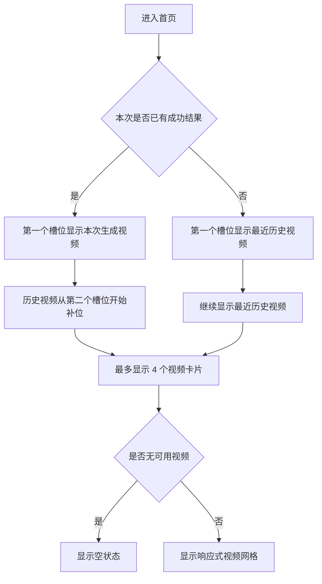

# 首页最近视频预览区响应式设计

## 背景

首页右侧的“生成视频”区域目前主要用于展示本次生成完成后的视频。未生成视频时，该区域下方会出现较大的空白，尤其在宽屏或页面滚动到中部时视觉重心不稳。History 页面已经保存了成功生成的视频，因此首页右侧可以复用最近历史视频，形成更连续的预览体验。

本设计只规划首页右侧区域的展示方式，不改变 History 页的完整列表能力，不改变视频生成流程，不引入新的视觉体系。

## 目标

- 在未生成新视频时，首页右侧展示最近成功生成的视频，减少空白。
- 本次生成成功后，新视频显示在蓝框区域左上角第一个卡片槽位。
- 历史视频从第二个槽位开始补位，并对本次生成视频去重。
- 在不同分辨率、左侧 sidebar 展开或折叠、Streamlit 三列压缩时，视频区域都能稳定显示。
- 保持整站现有工具型风格：浅色背景、细边框、轻量卡片、红色主按钮、蓝灰辅助文字。

## 非目标

- 不把 History 页的大卡片原样搬到首页。
- 不在首页提供删除历史视频能力。
- 不改动生成视频接口、任务持久化结构或 History 页分页逻辑。
- 不引入新的前端框架。
- 不同时保留“旧的单视频预览”和“新的最近视频网格”，避免生成成功后重复展示同一个视频。

## 两轮复审结论

两轮复审共发现 8 个需要在设计中明确的风险点，并已在下文修正：

1. 生成成功后如果继续调用旧的 `render_scaled_video_preview(...)`，会和最近视频网格重复展示。
2. 最近视频区需要在未点击生成按钮时也渲染，不能只放在生成成功分支内。
3. 生成失败时不能清空最近视频区，应保留历史视频并只显示失败提示。
4. History 前 4 条任务里可能存在缺失 `video_path` 或本地文件不存在的记录，需要过量拉取后过滤。
5. CSS 容器查询应以 1 列作为默认回退，再在容器足够宽时增强为 2 列。
6. 首页不能用纯 HTML `<video>` 直接替代 `st.video`，否则本地视频文件服务、下载和 Streamlit 状态会变复杂。
7. `查看` 动作需要明确跳转到 History 详情，而不是在首页展开复杂详情。
8. 批量生成路径保持现状，不在本次改动中强行改成最近视频网格。

## 推荐结构

首页右侧仍然保留现有外层容器：

```text
┌──────────────────────────────┐
│ 🎬 生成视频                   │
│ [生成视频按钮]                │
│                              │
│ 最近视频                      │
│ ┌──────────┐ ┌──────────┐    │
│ │ 视频 1   │ │ 视频 2   │    │
│ └──────────┘ └──────────┘    │
│ ┌──────────┐ ┌──────────┐    │
│ │ 视频 3   │ │ 视频 4   │    │
│ └──────────┘ └──────────┘    │
└──────────────────────────────┘
```

`视频 1` 的优先级最高：

1. 若本次生成已成功，显示本次生成结果。
2. 若本次还没有成功结果，显示 History 中最新的成功视频。
3. 若没有可用视频，显示统一风格的空状态。

## 响应式规则

适配依据使用组件容器宽度，而不是浏览器宽度。首页右栏会受到三列布局、页面 padding、左侧 sidebar 展开状态影响，浏览器宽度无法准确代表右侧可用空间。

```text
容器宽度 >= 460px
┌──────────┬──────────┐
│ 视频 1   │ 视频 2   │
├──────────┼──────────┤
│ 视频 3   │ 视频 4   │
└──────────┴──────────┘

容器宽度 < 460px
┌────────────────┐
│ 视频 1          │
├────────────────┤
│ 视频 2          │
└────────────────┘
```

建议 CSS 方向：

```css
.recent-video-gallery {
  container-type: inline-size;
}

.recent-video-grid {
  display: grid;
  grid-template-columns: 1fr;
  gap: 12px;
}

@container (min-width: 460px) {
  .recent-video-grid {
    grid-template-columns: repeat(2, minmax(0, 1fr));
  }
}
```

这样即使某些浏览器或 Streamlit DOM 结构导致容器查询没有生效，默认也会退回到 1 列，不会在窄容器中挤出溢出布局。

## 视频卡片尺寸

首页右栏不能按视频真实 9:16 比例完整展开，否则竖屏视频会把页面拉得很长。卡片应使用紧凑预览框：

- 卡片宽度跟随 grid。
- 视频框比例建议为 `3 / 4` 或 `4 / 5`。
- 视频框最大高度建议控制在约 `260px`。
- 视频内容使用 `object-fit: contain`，避免裁切竖屏内容。
- 标题最多 2 行，超出截断。
- 元信息保持 1 行，包括创建时间、时长、分镜数。
- `st.video` 的播放器宽度应由卡片容器控制，CSS 只在 keyed container 内作用，避免影响 History 页和其他视频预览。

卡片结构：

```text
┌──────────────┐
│ video preview│
├──────────────┤
│ ✅ 标题       │
│ 04-24 07:29 · 11.9s · 5 │
│ 👁 查看  ⬇ 下载          │
└──────────────┘
```

## 数据来源与排序

首页最近视频组件从 `pixelle_video.history.get_task_list(...)` 获取最近任务：

- `status` 过滤为 `completed`。
- 只展示 `video_path` 存在且本地文件存在的视频。
- 默认最多展示 4 个。
- 建议调用时使用 `page=1`、`page_size=12`、`status="completed"`、`sort_by="created_at"`、`sort_order="desc"`。
- 先过量拉取，再过滤缺失文件和去重，最后截断为 4 个卡片，避免前几条任务文件缺失时首页出现空洞。

本次生成完成后，将结果写入 `st.session_state`，例如保存 `video_path`、标题、时长、分镜数等必要展示字段。渲染时先读取本次结果，再读取 History 结果，并按 `video_path` 或可用的 `task_id` 去重。

建议 session state 结构：

```python
st.session_state["recent_generated_video"] = {
    "task_id": task_id_or_none,
    "title": result.storyboard.title,
    "video_path": result.video_path,
    "duration": result.duration,
    "n_frames": len(result.storyboard.frames),
    "created_at": completed_time_iso,
    "source": "current",
}
```

如果结果对象没有直接暴露 `task_id` 或 `duration`，实现时应使用可用字段降级，例如从 `result.storyboard.config.task_id`、`result.storyboard.total_duration` 或生成耗时信息中选择最接近展示语义的字段。

## 页面状态



生成失败时不清空最近视频区域，只显示失败提示并保留原有最近视频列表。

单视频生成区域的渲染顺序应为：

```text
生成视频标题
生成按钮
生成中：进度条与状态文本
生成成功/失败：结果提示
最近视频网格
```

最近视频网格应放在生成按钮分支之外，每次页面渲染都出现。生成成功后只更新 `st.session_state["recent_generated_video"]`，不再额外渲染旧的单个 `render_scaled_video_preview(...)`，下载入口由第一张视频卡片承担。

## 视觉一致性

- 外层继续使用 `st.container(border=True)`。
- 卡片边框使用浅灰细线，圆角控制在 8px 左右。
- 主按钮沿用当前红色 primary 样式。
- 空状态使用浅灰背景和简短提示，不使用强装饰图形。
- 首页只保留“查看”和“下载”动作，不放删除动作。
- 文案加入中英文 i18n，不写死在组件中。
- 视频卡片不自动播放，默认 `autoplay=False`，避免首页多个视频同时加载播放。
- `查看` 按钮优先使用 `st.switch_page("pages/2_📚_History.py")` 跳转到 History，并设置对应 `detail_{task_id}` 状态；如果当前任务缺少 `task_id`，则只保留下载和播放。

## 组件边界

建议新增首页专用组件：

```text
web/components/recent_video_gallery.py
```

职责：

- 获取最近成功视频。
- 合并本次生成结果。
- 去重并限制数量。
- 渲染响应式网格和空状态。

`web/components/output_preview.py` 只负责生成按钮、进度和生成结果写入 session state，然后调用最近视频组件。这样可以避免让 output preview 文件继续承担过多展示逻辑。

实施约束：

- 最近视频组件内部继续使用 `st.video` 渲染本地视频，不使用自定义 HTML `<video>` 直接引用本地路径。
- CSS 通过 `st.container(key="recent_video_gallery")` 生成的 `.st-key-recent_video_gallery` 作用域注入，避免污染 History 页。
- 如果需要控制播放器内部尺寸，优先定位 `.st-key-recent_video_gallery [data-testid="stVideo"]` 以及其内部 `video` 元素。
- 批量生成 `render_batch_output(...)` 保持现有完成摘要和 History 跳转行为，本次设计只落地到单视频生成路径。

## 错误处理

- History 获取失败时，页面不应崩溃，显示轻量提示并保留生成按钮。
- 某条任务的 `video_path` 缺失或文件不存在时跳过该卡片。
- 下载按钮只在文件存在时启用。
- 本次生成结果路径不存在时显示当前已有的错误提示，并不插入最近视频列表。
- History 返回空列表但 session state 中有有效本次结果时，仍显示本次结果卡片。
- 下载按钮应避免一次性为超过 4 个视频预读大文件；本设计通过最多 4 个卡片控制内存和渲染成本。

## 验收标准

- 首页未生成视频时，右侧区域显示最近成功视频或空状态，不出现大片空白。
- 本次生成完成后，新视频出现在最近视频网格左上角第一个槽位。
- 开启左侧 sidebar 后，右侧视频网格能从 2 列自动降为 1 列或保持不溢出。
- 常见宽屏下最多显示 4 个紧凑视频卡片，页面高度可控。
- 容器查询失效时默认显示 1 列，不产生横向溢出。
- 生成成功后页面不重复出现旧单视频预览和新网格预览。
- History 前若干条存在失效视频文件时，首页会跳过失效项并继续补足可用视频。
- 首页视频卡片不提供删除按钮。
- History 页现有列表和详情能力不回退。
- 中英文界面均有对应文案。

## 测试建议

- 单元测试：最近视频合并、去重、数量限制、缺失文件过滤。
- 单元测试：History 过量拉取后过滤，确保失效文件不会占用 4 个展示名额。
- 单元测试：本次生成结果与 History 第一条相同路径时只出现一次。
- 组件级手动验证：无历史视频、有历史视频、生成成功、生成失败四种状态。
- 浏览器验证：至少检查宽屏、普通笔记本、左侧 sidebar 展开、窄窗口四类视口。
- 浏览器验证：确认 460px 左右容器宽度附近不会出现横向滚动、文本重叠或按钮挤压。
