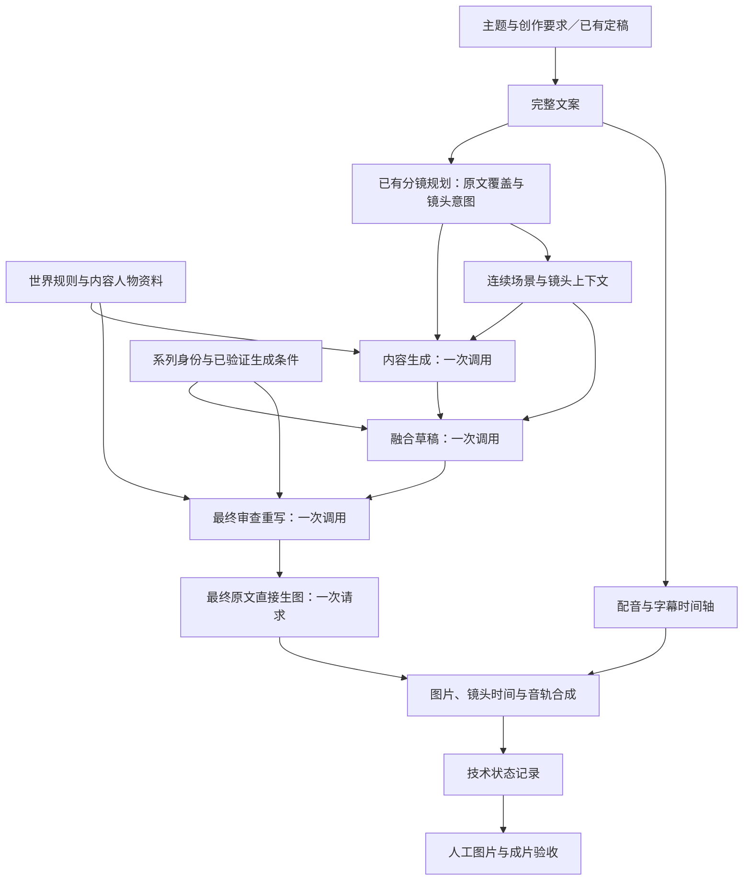

# 文案与视觉锚点视频生产改进产品需求文档

日期：2026-09-05。状态：改进提案，尚未实施；本文不自动替代已确认产品基线。

审查基线：开发分支提交 `939881be`。本次范围：最近提交、主题到文案、文案到分镜、角色与世界设定、三阶段图片提示词、首次生图、合成与验收。交付为诊断及需求文档，不代表改进后的样片已经生成。

## 1. 结论与第一性原理

视频可用于生产，需要观众听懂内容、画面提供证据、角色与世界保持一致、镜头推进信息，并且成片通过验收。这些条件互相依赖：空泛的文案没有给画面足够事实；缺少场景上下文会让每镜重新猜测；正确的文字要求也不等于图片模型已经做到。

**本次结论：先修复生成前的信息传递和产品规则冲突，再优化三阶段提示词，用真实首次成图与人工成片验收判断效果。继续增加锚点限制条款不能独立解决整条链路的问题。**

推荐顺序：

1. 建立固定样本与人工验收基线，明确失败发生在哪一层。
2. 将已有文案意图、分镜意图、世界设定完整传入对应调用。
3. 让锚点形态服从场景与身份，取消以镜头序号驱动形态选择的默认规则。
4. 改善文案的事实密度、分镜的信息推进与停留时间。
5. 分别验证文字身份模式、参考图身份模式与最终成片，不把文件生成成功当作内容合格。

## 2. 证据与审查边界

### 2.1 最近提交实际解决了什么

| 日期 | 提交 | 主要变化 | 本次判断 |
|---|---|---|---|
| 08-26 | `1b4530c0`、`ee393e49` | 明确当前文案优先级，从构图重写身份融合 | 方向正确，保护内容主体 |
| 08-26 | `c1abcb90`、`02b68621` | 统一最终审查与三阶段约束 | 已建立固定调用与原文传递边界 |
| 08-27 | `6b1a9203`、`6e7f454f` | 优化载体分布，增加身份类型适配与低显著性要求 | 从角色扩展到动物、植物、物品、图形等类型 |
| 08-27 | `f3c0d38b` | 场景准入、压缩输入、历史去重 | 避免无关实体参与剧情，但压缩后的上下文仍需核对完整性 |
| 08-27 | `b8491191` | 六类形态循环偏好、跨镜变化 | 序号轮换已进入程序逻辑，不只是提示词措辞 |
| 08-27 | `939881be` | 局部指代、实体数量与当前事件解析 | 最新内容阶段已修正部分主体解析问题；尚无本次新版真实生成复测 |

这里保留上述保护措施；不以恢复早期两阶段结构解决当前问题。

### 2.2 实际产物抽查

抽查本地任务 `d8530d6f-8d85-4174-9bb4-fa0e8aab1b78`，主题“乔布斯的一生”，完成于 08-27。查看了任务输入、完整十六镜旁白、分镜计划、三阶段记录中的第 3、6、16 镜、对应原图与合成探测记录。另看过一张更早的十四镜联系图，只作为历史背景。

最近任务使用内容提示词第 27 版，融合第 46 版，最终审查第 27 版；当前代码内容阶段为第 28 版。**因此以下画面问题归属于该历史样本，不能声称最新提交已经复现同样问题。**

| 样本证据 | 已观察到的问题 | 所属层 |
|---|---|---|
| 完整旁白开头连续使用“改变世界”“传奇色彩”“成功不是偶然” | 评价先于具体事件；不同句子缺少不同的可见证据 | 文案 |
| 结尾“只要……总有一天会成功” | 将方法建议写成结果保证；原稿需要编辑审核 | 文案 |
| 按句拆成十六镜，抽查分镜无景别、镜头目的、世界元素与连续性锚点 | 切句完成了文本分配，没有形成完整镜头设计 | 分镜 |
| 第 3 镜原图有两个外貌相同的主要人物，最终文本只要求一个讲述主体 | 单实例文字要求未在真实图片中实现 | 生图 |
| 第 6 镜最终文本把刺绣安排在设计图纸上 | 载体与工艺不匹配，最终审查未排除矛盾 | 融合与最终审查 |
| 第 6 镜要求黑白线稿，原图电路板为绿色 | 风格要求存在，图片执行偏离 | 生图 |
| 第 16 镜原文讲普遍困难，画面为一名青年组装电脑；最终文本含“去掉图案后……用途明确” | 泛化建议被压缩成固定职业场景，解释性审查语言泄漏到最终提示词 | 内容与最终审查 |
| 合成记录中元素运动关闭，末镜记录时长 10.08 秒 | 该样本存在长时间单镜停留，需按真实播放检查节奏 | 时间设计与合成 |

重新探测已有视频：时长约 63.933 秒，分辨率 1280×720，每秒 30 帧，具有视频和音频流。原有渲染探测记录显示技术检查通过。此次没有完整播放、听音或逐帧复查，不能据此报告音画同步、字幕体验和整片内容已通过。

本地产物在项目输出目录下按上述任务编号定位；不把原图、视频、真实配置或机器绝对路径提交到仓库。

### 2.3 当前代码的确定性发现

1. **锚点分支绕过了既有视觉叙事规划。** [标准生成链路](../../../pixelle_video/pipelines/standard.py)的视觉规划方法中，启用系列视觉签名时只登记三阶段策略；既有视觉叙事引擎位于另一分支。这个设计符合限制额外调用的要求，但不能用额外调用次数为零来代替世界与镜头输入。
2. **已有信息没有完整到达内容阶段。** [提示词编排服务](../../../pixelle_video/services/visual_prompt_composer.py)接收世界提示、镜头策略和逐镜覆盖，锚点路径最终调用[三阶段服务](../../../pixelle_video/services/visual_anchor_two_stage_service.py)。后者构造内容输入时只传当前文案、局部原文、前后文案、风格和语言，没有传已有镜头目的、视觉重点、主体名单及世界元素。连续性信息仅在后续融合阶段使用。
3. **世界规则与画风不是同一个输入。** [风格合同构造](../../../pixelle_video/services/visual_prompt_composer.py)可携带视觉档案说明，但三阶段服务的风格压缩在存在必需风格片段时不再传说明字段。不能依赖把全部世界规则塞进风格说明完成可靠传递。
4. **跨镜变化被简化为序号轮换与一镜历史。** 三阶段服务按序号在六类形态中循环，只给独立场景保留上一镜最终原文。连续场景优先读显式场景编号，否则根据相邻连续性锚点交集推导；共享人物标记不能独立证明地点、时间连续。
5. **记忆强化镜头并未按叙事重要性选择。** [强调节奏规划](../../../pixelle_video/services/visual_signature_emphasis_cadence.py)分配向上取整的十分之一镜头，通过摘要值选择窗口内位置。结果可复现，但不能解释成语义上的关键镜头。
6. **参考图已有真实接线机制，但不是所有任务都启用。** 当前支持文字档案与参考图两种条件，抽查样本使用文字档案。不能把该样本的身份表现归因于参考图失效，也不能声称当前所有任务都具有参考图约束。
7. **技术审计不检查画面语义。** [首次生成审计](../../../pixelle_video/services/visual_anchor_rendered_output_audit.py)验证请求绑定、文件、版本与执行证据；其范围是首次生成完整性。这一边界本身正确，需要在产品状态中明确。

### 2.4 旧需求与当前规则的冲突

[08-22 产品基线](2026-08-22-视觉锚点二次融合产品需求文档.md)允许按场景自由决定形态、大小、位置，要求真实参考条件；其中还包含旧结构化输出、本地内容确认和成图审计表述。当前[仓库规则](../../../AGENTS.md)已经明确三阶段原文直传、禁止本地内容判断和自动修复。执行时以当前仓库规则为准。

当前融合与最终审查模板统一要求中景边缘或背景、小于主要人物、不在主角身旁，且增加六类轮换。这是产品策略的收紧，不能仅描述为措辞优化。尤其当身份就是原文主体时，“必须次级”与“保留叙事中心”发生冲突。

本文提出将“内容人物”“系列身份”“世界规则”拆开表达；默认保留每张分镜一个可识别身份实例。是否改变每镜出现要求不在本期实施范围。

## 3. 用户、目标与非目标

目标用户是制作系列短视频的创作者及审核人员。核心任务是：输入主题或定稿文案，选择系列身份和世界设定，得到内容可信、身份可认、镜头连贯且能够人工确认交付的成片。

本期目标：

- 用户选择的世界与镜头要求在实际调用前完整可见。
- 主题文案有一个清楚的核心主张，提供具体事件、动作或例子，不用重复评价撑满时长。
- 分镜按信息变化和可见证据组织；字幕、配音句子与镜头边界分开设计。
- 系列身份自然出现，维持身份与场景连续性；换景不强制换工艺。
- 明确区分任务执行、图片质量、整片验收三种状态。

不在本期实施：新增第四个视觉创作阶段、自动审图与重生成、自动纠正模型输出、为具体名人或吉祥物增加专用分支、重建整套渲染后端、下载模型、承诺随机生图百分之百成功。

## 4. 目标链路

下图是数据流，不是新增大模型调用清单。

### 4.1 三类信息的职责

| 信息 | 决定什么 | 不能做什么 |
|---|---|---|
| 内容人物与事实 | 谁在何时何地做什么，哪些主体必须保留 | 不能被系列吉祥物替代 |
| 系列身份 | 唯一识别特征、允许变化、禁止变化、真实参考条件 | 不自动成为主角，不替原文承担动作 |
| 世界规则 | 时代、场所、物体尺度、物理规则、允许的表现方式 | 不改写历史事实，不等同于画风形容词 |

第一阶段可获得内容人物资料和世界规则，不能获得系列身份外观、载体或预留位置。原文本来就以该身份为主角时，其原文事实仍必须进入内容阶段；隔离的是无关品牌信息，不是删除原文主体。

## 5. 功能需求与验收

### 需求一：文案先成为能够拍摄的内容

当前[文案服务](../../../pixelle_video/services/script_generation.py)主要接收主题和篇幅；[文案模板](../../../pixelle_video/prompts/templates/script_generation.md)已有口语与禁编造要求，但统一采用一套推进顺序，未显式承接用户的受众、核心观点、资料与时长要求。

改进要求：

- 在既有文案调用前承接用户已有的受众、核心观点、依据资料、目标时长和语气；不要求用户填写所有字段。缺省值在创作界面可见。
- 按题材选择推进方式，人物故事围绕关键选择与后果，知识解释围绕问题与可见例证，不强制所有主题使用相同七段式。
- 在原有调用前提示中要求每个信息段提供事件、动作、对比或物证；删除只重复评价的句子，不编造数据、引语或成功保证。
- 用户提供定稿时保持原文。人工发现事实问题时由用户修改原稿或标记不通过，程序不得静默润色后继续。
- 先支持用户提供资料与人工核验，不把本期扩展成自动检索项目。

验收：三类题材各人工检查一份完整文案；都能写出一句核心主张，每段承担新信息，具体引语和数字能回溯用户资料；无依据的结果保证直接不通过。验收要求写进调用前提示，人工作出评分，运行时不解析模型文案执行自动评分或修复。

### 需求二：补齐现有镜头与世界输入

复用[分镜计划](../../../pixelle_video/models/storyboard_plan.py)已有视觉重点、镜头目的、主体、世界元素、连续性锚点与覆盖信息，向三阶段提供必要输入；世界规则使用独立输入，不混入风格片段。仅搬运既有数据与用户资料，不从三阶段输出反向抽取“事实卡”。

- 内容阶段看到原文事实、相关上下文、当前镜头意图、内容主体及世界规则。
- 融合与最终审查继续获得同一份原文边界、镜头与世界上下文，避免只依赖前阶段画面描述恢复事实。
- 已有结构化分镜规划继续沿用现有输出契约；本期不新增要求大模型输出的结构化创作字段，不增加额外导演调用。
- 当前分镜规划未提供的信息保留为空；输入缺失在预览中可见，不生成虚假的默认导演意图。
- 仅改变世界设定或逐镜覆盖后，实际调用前的对应输入必须变化；模板版本、输入快照和任务记录可以回溯。

验收：用固定输入替身验证传递，分别更改地点时代、镜头目的、逐镜覆盖，确认目标阶段收到变化；系列身份外观不进入第一阶段；最终原文在生成请求中逐字保持一致。测试不依据模型生成的创作文本执行语义判断。

### 需求三：连续性服务叙事，而不是制造变化

- 有明确连续场景编号时按编号承接；没有编号时，把原有连续性锚点作为模型判断的线索，不把共享人物名称当成同一物理场景的充分条件。
- 同一场景保留真正连续的角色、载体、地点和关键物品；跨时代、跨地点可以改变表现方式，不无故继承上一镜办公室。
- 生产创作默认推荐已有智能分镜；按句拆分继续保留并显示“按句分配，未生成完整镜头规划”。智能分镜本身不等于镜头信息已经完整传入，仍须完成需求二。
- 六类形态保留为调用前的候选知识，取消按镜头序号循环选择以及“不重复全部形态、载体、工艺、方位”的硬要求。重复画面的判定依据是内容与构图是否重复，不是印刷工艺是否重复。
- 第一版继续保留上一镜完整原文供参考，不增加本地摘要器；长跨度连续性依靠已有场景信息及用户资料。全片自动记忆提取不在本期范围。

验收：同一人物跨地点不被当成同一空间；同一场景切换远近景不凭空更换载体；在其他输入相同的条件下，调整镜头序号不会强迫改变身份工艺。后两项分别通过输入路由测试与人工样图比较验收。

### 需求四：融合按身份职责分配视觉注意力

调用前的决策顺序统一为：保护内容事实 → 判断身份是否为原文主体 → 判断场景准入 → 选择合法载体与材质 → 保留识别特征 → 安排构图与连续性。

- 身份为原文主体时，允许承担原文动作和主体视觉位置；否则保持次级，不新增陪伴、展示或对视关系。
- 次级不等于不可辨认。取消统一中背景位置与统一遮挡要求，由场景、分辨率和身份特征共同确定；不增加固定面积阈值。
- 保留单实例、原生接触、透视光照、平面形态共面关系、文字授权及不得替换内容人物等要求。
- 身份关键特征优先保护；辅助特征按档案允许变化。裁切不能截掉唯一识别特征，雕刻不能被要求精确呈现与材质冲突的多种颜色。
- 材质选择须匹配载体；纸面使用印刷等相容工艺，织物使用刺绣或织纹等相容工艺。要求写在融合与最终审查调用前，不用本地关键词修复。
- 最终审查只输出可见画面事实。“去掉身份后仍有用途”等属于内部判断，不得写入成像文本。
- 先保留现有强调节奏数据用于兼容，但不得向用户宣称其已识别叙事重点。后续采用用户指定记忆镜头或已有镜头目的作为输入；不新增模型事后选镜。

验收：人物、动物、植物、功能物品、标志图形、抽象符号各有样例；含原文主体与次级身份两类。人工检验单实例、可识别、职责正确、材质合理和视觉层级，不以“出现了锚点名称”代替成功。

### 需求五：明确身份生成能力

- 任务预览显示本次实际使用文字身份还是参考图身份，并记录所选工作流、资源版本和首次请求绑定。
- 文字模式保留可用性，但完成状态不能宣称已通过严格身份一致性验收。
- 参考图模式必须验证资源实际连接到生成链路；不能以文件存在或文字中提到参考图代替。
- 若用户选择严格身份交付，先检查所选工作流具备且启用有效参考条件；不满足时在生成前返回具体能力缺口，不静默退回文字模式。参考条件满足后仍须人工检查真实图像。
- 对平面图案与完整实体分别验证参考条件，防止参考图强行带入完整身体或背景。先使用现有可用工作流比较，暂不采购、下载或更换模型。

验收：文字模式与参考图模式分别出具结果，不能混合计算成功率；参考接线缺失在调用前暴露；图片身份质量由人工判定。

### 需求六：视频有信息节奏，完成状态有含义

- 配音、字幕单元继续由完整文案生成，不强制一句对应一镜。使用已有时间规划与渲染能力，不改建后端。
- 生成前展示镜头预计时长；音轨生成后展示实际时长。单镜超过 8 秒作为人工查看的提示线，不自动切镜、不自动生成补图；有持续动作或刻意停顿的镜头可以由审核人接受。
- 对比镜头承担前后变化，因果镜头交代动作和结果，知识镜头展示可读的物证。推拉移动只是表现手段，不能代替信息推进。
- 预设裁切与运动不得遮掉主体、物证和锚点；使用用户已有区域标注或安全构图，不从最终文字输出自动解析位置。
- 状态至少区分“生成完成”“等待人工验收”“人工验收通过”“人工验收不通过”“执行失败”；最终用户文案不暴露无关内部字段。
- 人工不通过时保留原产物、原因和版本，不自动追加调用。用户修改后主动发起的是新任务，不得复用失败任务进行隐藏重试。

验收：人工查看实际成片，包括首次正常观看和静音观看；抽查字幕、声音、画面顺序及末镜时长。技术检查通过但没有人工验收的任务只能标为生成完成或等待验收。

## 6. 三阶段提示词改进示例

以下是拟加入对应调用前提示的职责段落，不是完整替换模板；实施时统一整理现有同义条款，不继续在末尾堆叠。

**内容阶段：**

> 以当前原文为事实边界，使用镜头目的、内容人物资料和世界规则确定一个观众可看懂的静止瞬间。前后镜只帮助理解指代和信息推进。用具体物证与动作表达本镜新增的信息；相邻原句只是重复评价时，不凭空创造新的历史事件。世界设定与原文事实冲突时保留原文事实。只输出完整画面原文。

**融合阶段：**

> 先判断该身份是否已经是原文主体；是则保留其内容职责，否则只作为场景次级身份。选择与当前场景和材料相容的唯一表现方式，连续关系成立时保持原载体，不按序号强制换形态。安排可辨认但符合叙事层级的位置和尺度。只输出一个完整融合画面原文。

**最终审查：**

> 依据同一份原文、镜头目的、世界规则、身份与生成能力输入，内部检查事实、主体数量、物理关系、身份职责、识别特征、风格和连续性。在本次输出内完成必要重写，仅留下可直接成像的事实；审查理由、用途论证、比较过程与候选均不进入输出。输出将原样进入首次生图。

三个阶段每镜各一次调用，完成一镜共三次；最后原文直接进入一次图片请求。文案和既有分镜服务的调用单独记录，不把它们冒充为三次总预算，也不借上游规划增加新的视觉修复阶段。

## 7. 文案到分镜的说明性样例

这是人为编写的通用表达示例，不是历史事实、新模型输出或已生成样片。

题目：为什么整理桌面后仍然找不到东西。

旁白：

> 你把桌面收得很干净，第二天却又找不到充电线。问题出在收纳的位置：用的时候在桌边，用完却塞进远处的抽屉。先给每天用的东西固定一个顺手的位置，再决定盒子长什么样。好的整理，是下次用时伸手就能拿到。

世界规则：同一间当代书房、同一张桌子、同一名成年人、黑白线稿。系列身份是一个用户已确认的图形，位于同一收纳袋的印花上，每镜保留一个可识别实例。

| 镜头 | 新信息与物证 | 镜头组织 | 身份与连续性 |
|---|---|---|---|
| 一 | 干净桌面，手机旁的手正在寻找充电线 | 中景交代桌面和动作 | 收纳袋处在日常使用位置 |
| 二 | 线在远处抽屉，用物位置与存放位置分离 | 侧向全景呈现距离和空间关系 | 同一收纳袋、同一地点，不强制换工艺 |
| 三 | 使用者把线放入桌边收纳袋 | 近景集中呈现归位动作与入口 | 印花随载体自然存在，仍保持可辨认 |
| 四 | 再次使用时伸手直接拿到线 | 与第一镜相呼应，结果可见 | 保留同一载体与身份，完成前后对比 |

示例展示的是“每镜增加证据”和“世界连续”；生产时保留用户选定身份并据实际构图调整，不能把这一收纳袋模板推广到所有主题。

## 8. 验收方法与目标值

下列数值是拟定的首轮发布门槛，不是已经测得的质量。

### 8.1 固定样本

选择六组场景，每组四镜：具名人物跨年龄、多人协作、跨地点同一人物、无人物产品、抽象观点的生活例证、同场景连续动作。六类身份在样本中覆盖；加入原文主体身份、极简画风、平面参考条件等组合。

每组预先登记两个种子组，每个版本共 48 张首次成图。比较四个隔离版本：当前基线、仅提示词调整、仅上下文传递调整、两者结合。保持原文、模型、工作流、画幅和种子相同；不选择性删除失败样本，不把第二次生成算成首次通过。运行失败也计入尝试分母。

对应 192 次图片首次请求与 576 次视觉阶段调用；上游文案与分镜单独计数。当前没有单价和耗时实测，本次不填写虚假预算；正式执行前先记录单次成本与耗时。参考图实验另列，不与文字模式混算；文案质量另用三类主题比较完整稿件。

### 8.2 人工评分

| 维度 | 判定方式 | 拟定门槛 |
|---|---|---|
| 核心事实与人物数量 | 对照原文逐镜核对，不改变必要事实或实例 | 进入交付的镜头全部通过 |
| 身份存在、唯一、可辨 | 以目标展示尺寸查看，不只看放大的局部 | 进入交付的镜头全部通过 |
| 材质与物理关系 | 支撑、遮挡、工艺、手部动作无明显矛盾 | 进入交付的镜头全部通过 |
| 内容表达、融合自然、风格、连续性 | 每项 1—5 分；1 为失败，3 为需修改，4 为可交付，5 为优秀 | 每组各项平均至少 4 分，无硬失败 |
| 首次可用率 | 人工无需修改即可接受的首次图数／全部计划首次请求数 | 文字与参考图各自统计，目标至少 90% |
| 成片体验 | 正常观看能复述主张，静音观看能识别主要推进；字幕、音轨与画面无明显错位 | 六组人工全部签认后才标记版本可交付 |

由两名审核人独立记录，分歧共同复核。这是人工质量流程，不是子代理任务或自动审图。样本规模只支撑当前测试范围，不能外推所有题材和工作流。

### 8.3 工程验证与创作验收分开

- 自动验证仅覆盖输入投递、资源绑定、版本、调用次数、失败终止、原文字节一致性和既有技术渲染合同。
- 三阶段输出不做本地内容解析、关键词通过判定、自动评分、自动修复或重试。
- 真实创作质量由人工看原图、提示词记录及成片验证；人工结论保存为验收记录，不反馈触发额外模型调用。
- 同一版本有两组以上样本出现相同硬失败时，停止扩大量产，定位归属层再修改下一版本；不能靠换种子筛出成功结果宣称修复。

## 9. 实施顺序与改动边界

| 顺序 | 交付项 | 主要事实源 | 完成条件 |
|---|---|---|---|
| 一 | 固定样本、状态说明、输入差异证据 | [首次生成审计](../../../pixelle_video/services/visual_anchor_rendered_output_audit.py)、[人工验收服务](../../../pixelle_video/services/visual_anchor_manual_acceptance.py) | 已有技术通过不再被解释为视觉通过；基线人工结果齐全 |
| 二 | 镜头与世界上下文贯通 | [标准链路](../../../pixelle_video/pipelines/standard.py)、[提示词编排](../../../pixelle_video/services/visual_prompt_composer.py)、[阶段输入模型](../../../pixelle_video/models/visual_anchor_two_stage.py)、[三阶段服务](../../../pixelle_video/services/visual_anchor_two_stage_service.py) | 输入变化可追踪；不增加视觉调用；原文直传 |
| 三 | 统一融合优先级与连续性 | [内容模板](../../../pixelle_video/prompts/templates/visual_anchor_content_stage.md)、[融合模板](../../../pixelle_video/prompts/templates/visual_anchor_fusion_stage.md)、[最终审查模板](../../../pixelle_video/prompts/templates/visual_anchor_finalization_stage.md) | 完成隔离对比；人工验证优于基线；无主体职责冲突 |
| 四 | 文案要求与分镜节奏承接 | [文案服务](../../../pixelle_video/services/script_generation.py)、[分镜服务](../../../pixelle_video/services/storyboard_generation.py)、[文案模板](../../../pixelle_video/prompts/templates/script_generation.md) | 三类文案通过人工检查；镜头新增信息和实际时长可审查 |
| 五 | 参考条件与成片交付验收 | [参考工作流检查](../../../pixelle_video/services/visual_anchor_reference_workflow.py)、[生成绑定](../../../pixelle_video/services/visual_anchor_generation_binding.py)、[结果预览](../../../web/components/output_preview.py) | 分模式统计首次可用率；成片人工验收完整 |

每次实现只提交一个独立变更。先完成输入投递测试，再更新模板与版本；避免同时更换模型、画风、文案和工作流而无法归因。旧记录继续可读，新任务保存新版本。提案正式采用后，再同步旧产品基线及方案说明中的冲突段落。

项目说明中的批量归属、静音、失败提示、并发限制等旧待修复项目另行跟踪；本次未复测，不作为已经确认仍存在的缺陷，也不混入本次文案与锚点实施。

## 10. 本次已执行的验证

- 核对最近十八条提交及重点差异，确认审查基线和实际调用路径。
- 在独立任务工作区完成仓库初始化与基础校验。
- 使用现有项目环境运行三组相关测试：三阶段服务、人物故事回归、首次生成审计，共 **101 项通过**。禁用测试缓存插件产生一项缓存配置警告，不影响测试通过；这些测试没有调用真实生成模型。
- 重新探测上述历史视频的媒体流和时长；人工查看第 3、6、16 镜原图与对应记录。
- 本次没有修改应用代码、调用真实模型、生成新样片、完整播放听音、执行 48 张基线或四版本对比。本文目标值全部等待后续真实验收。

文档已通过严格 UTF-8（统一字符编码）解码检查，26 处相对链接全部可定位，无机器绝对路径和异常替换字符。提交结果以本次任务最终报告为准。
